# Biểu Đồ Hoạt Động (Activity Diagrams) - 20 Use Cases

Tài liệu này cung cấp các biểu đồ hoạt động (Activity Diagrams) sử dụng cú pháp `flowchart TD` của Mermaid để mô tả luồng nghiệp vụ chính của 20 Use Cases trong hệ thống Railway Booking System.
Các biểu đồ này được ánh xạ từ đặc tả Use Case và trạng thái triển khai hiện tại của project.

---

## 1. Khách Hàng (Customer)

### UC-01: Đăng ký tài khoản
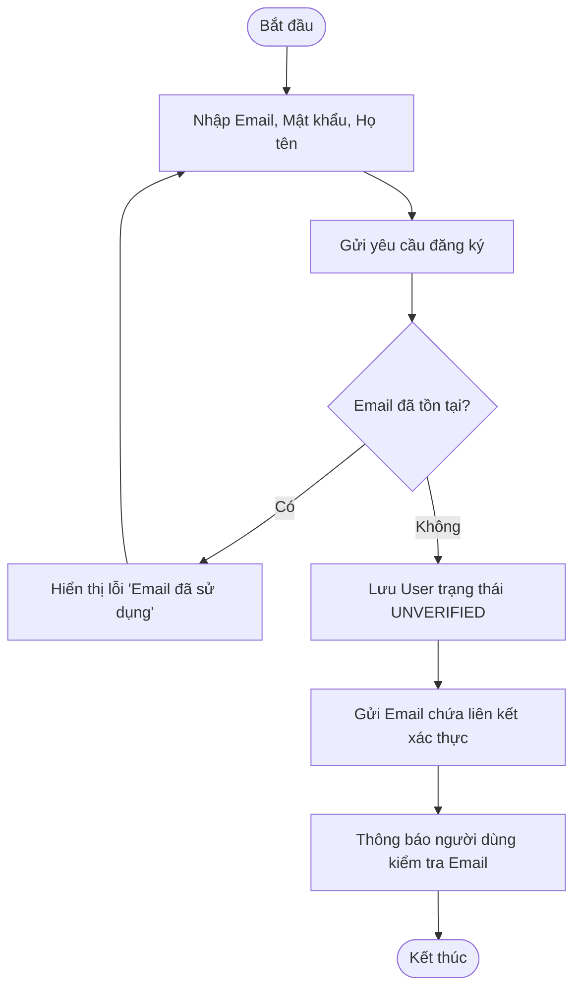

### UC-02: Đăng nhập hệ thống
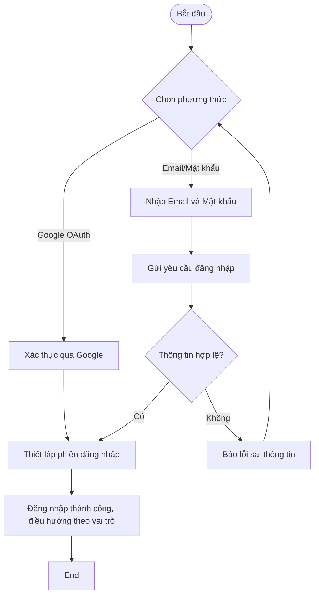

### UC-03: Quản lý hồ sơ
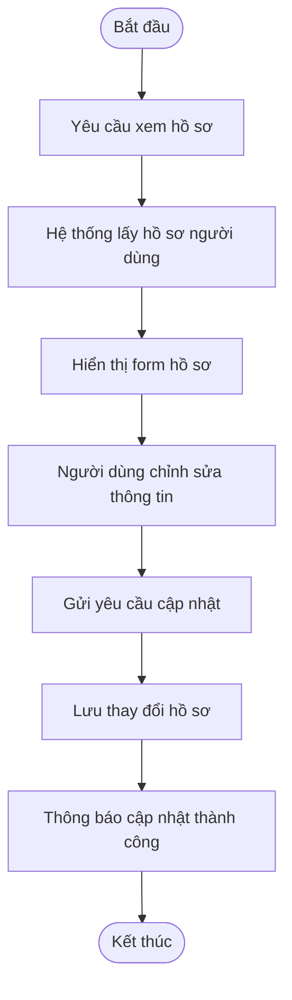

### UC-04: Xác nhận đổi ghế (khi ghế bị hỏng)
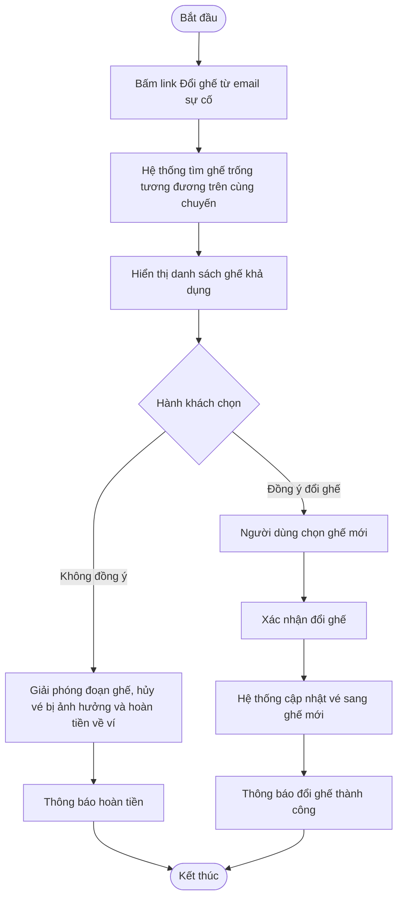

### UC-05: Chat với Chatbot
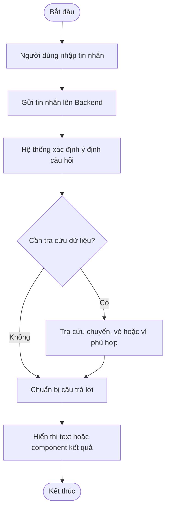

### UC-06: Tìm kiếm chuyến tàu


### UC-07: Xem chuyến đang chạy


### UC-08: Quản lý ví điện tử
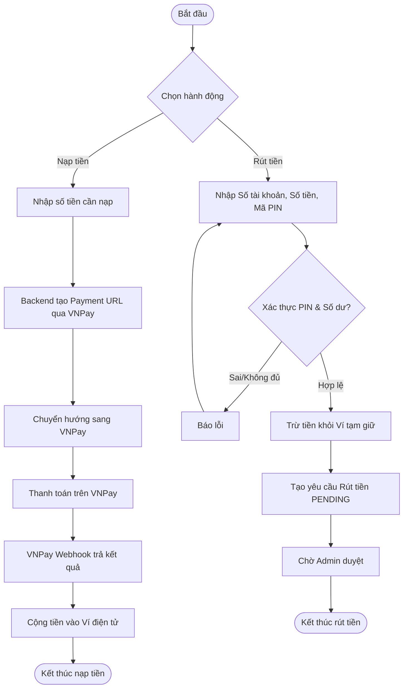

### UC-09: Đặt vé tàu
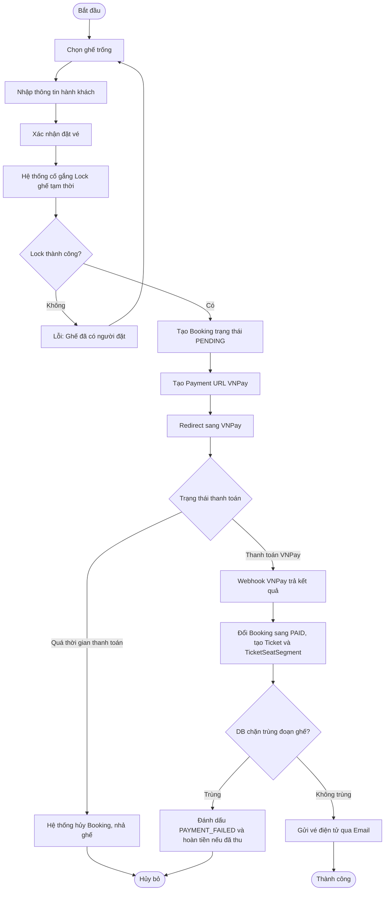

### UC-10: Xem lịch sử đặt vé
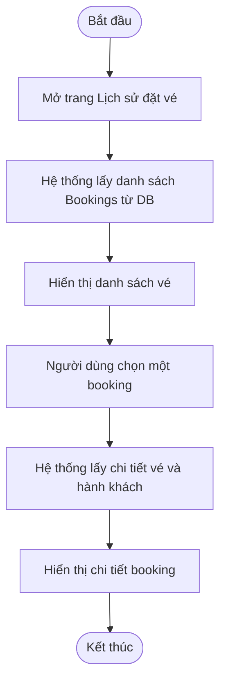

---

## 2. Quản Trị Viên (Admin)

### UC-11: Xem dashboard và báo cáo
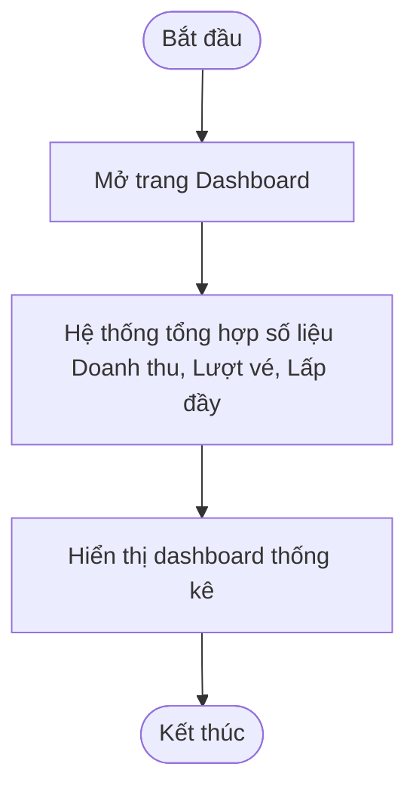

### UC-12: Quản lý người dùng
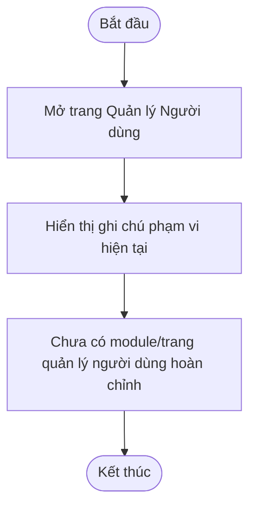

### UC-13: Quản lý trạng thái ghế
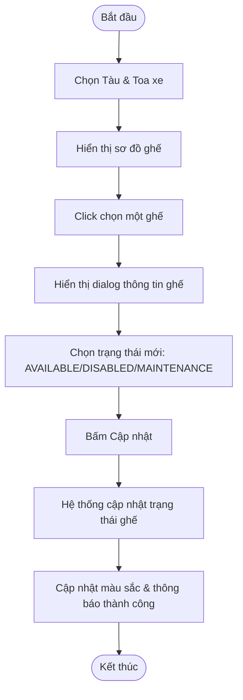

### UC-21: Xử lý sự cố ghế hỏng
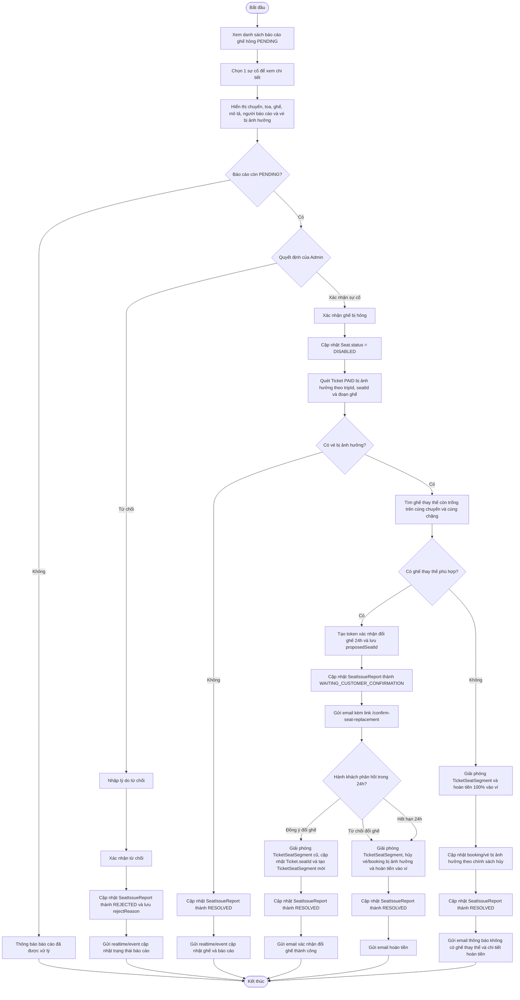

### UC-14: Quản lý tàu
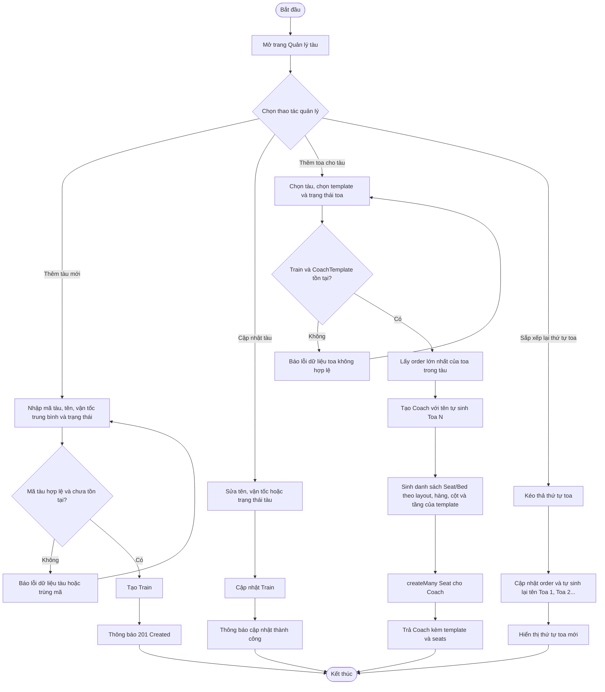

### UC-19: Quản lý chuyến tàu
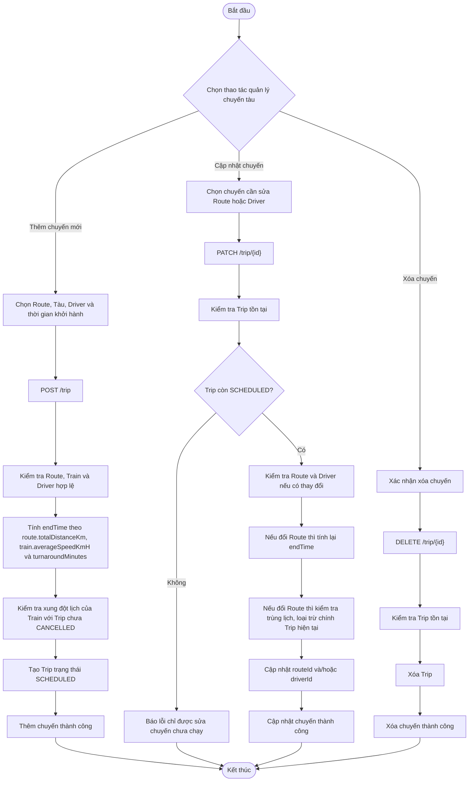

### UC-20: Quản lý cơ sở hạ tầng
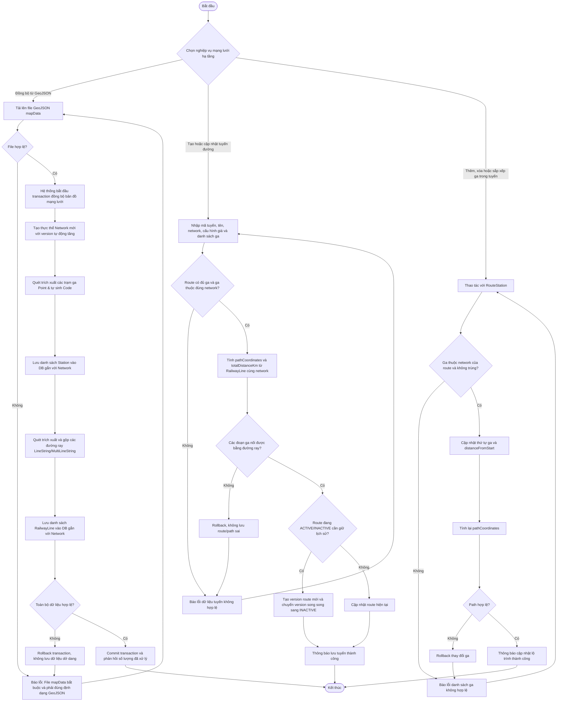


---

## 3. Lái Tàu (Driver)

### UC-15: Yêu cầu hủy chuyến khẩn cấp
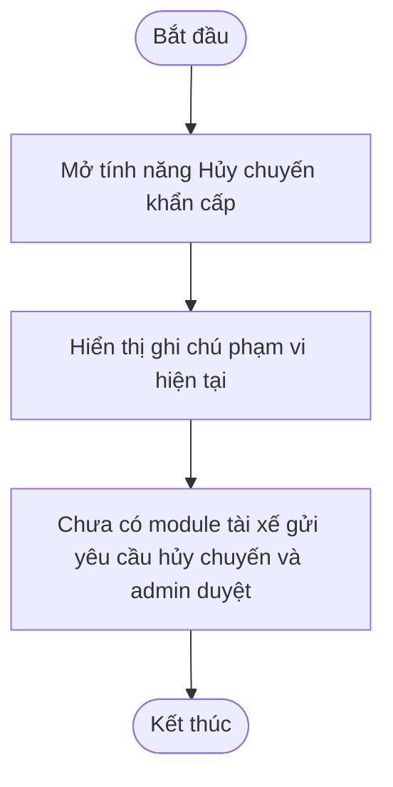

### UC-16: Xem chuyến được phân công
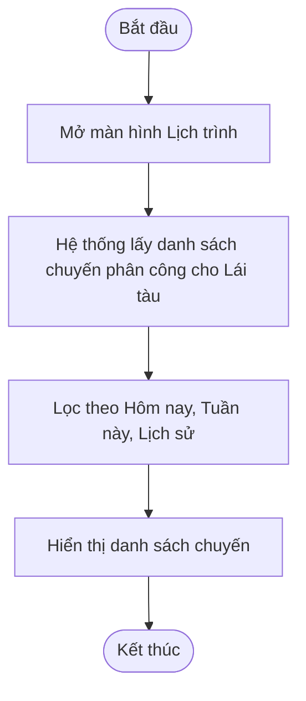

### UC-17: Báo cáo delay
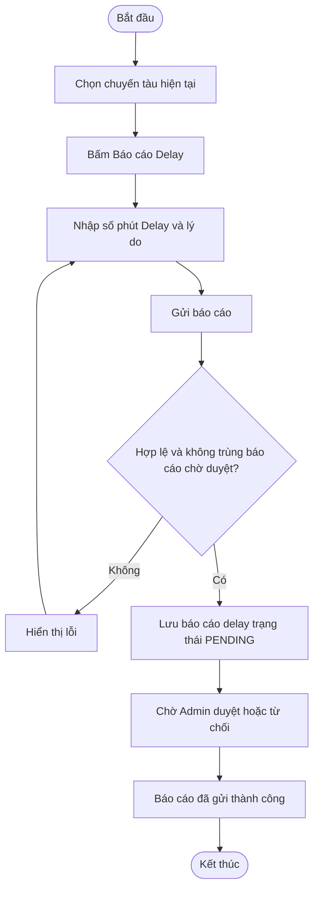

### UC-18: Báo cáo ghế hỏng
```mermaid
flowchart TD
    Start([Bắt đầu]) --> SelectTrip[Chọn chuyến tàu]
    SelectTrip --> CheckTrip{Chuyến còn hoạt động và chưa kết thúc?}
    CheckTrip -- Không --> Locked[Khóa thao tác báo cáo ghế hỏng]
    Locked --> End([Kết thúc])
    CheckTrip -- Có --> ClickIssue[Bấm Báo sự cố ghế]
    ClickIssue --> InputDetails[Chọn ghế, loại sự cố và nhập mô tả]
    InputDetails --> Submit[Gửi yêu cầu]
    Submit --> CheckDuplicate{Ghế đã có báo cáo đang mở?}
    CheckDuplicate -- Có --> DuplicateError[Báo lỗi không thể gửi trùng] --> End
    CheckDuplicate -- Không --> SaveIssue[Lưu yêu cầu trạng thái PENDING]
    SaveIssue --> Success[Thông báo gửi thành công chờ Admin duyệt]
    Success --> End([Kết thúc])
```
