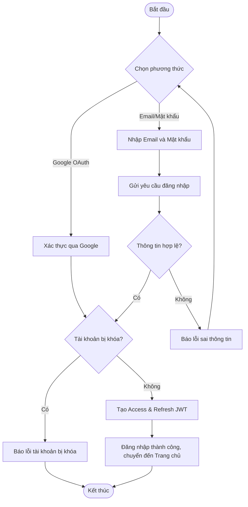
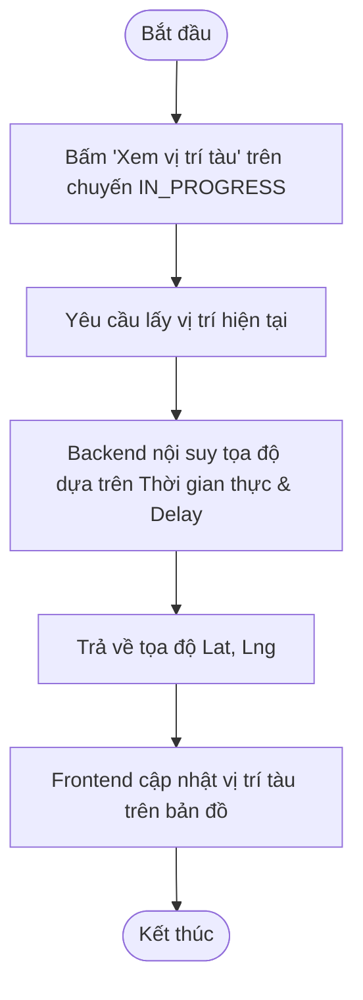
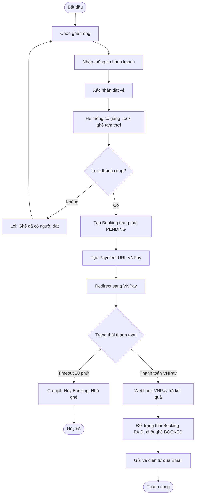
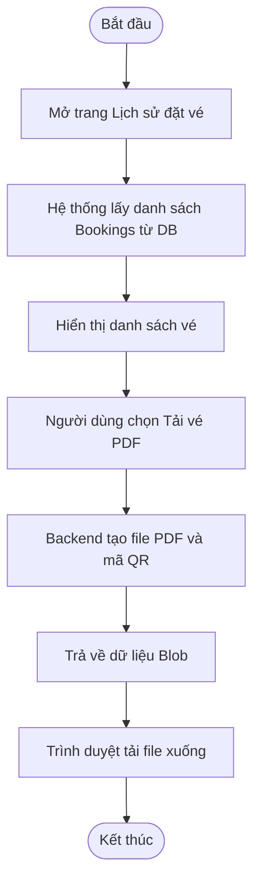
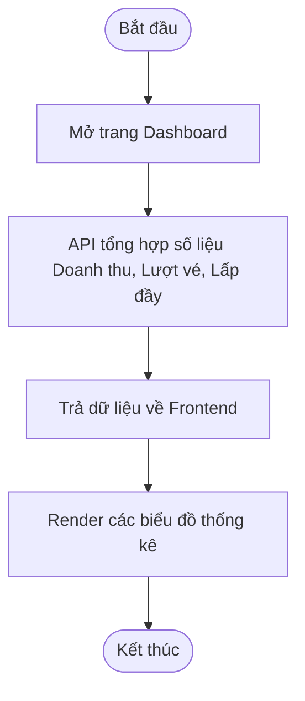
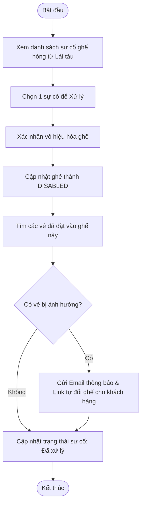
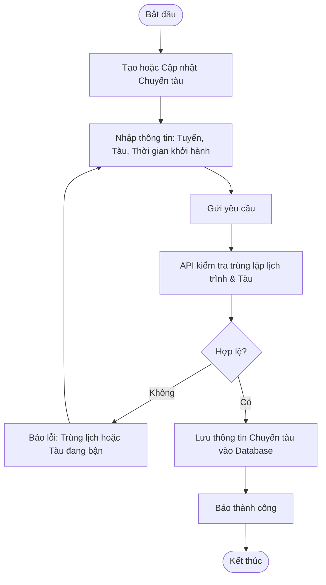
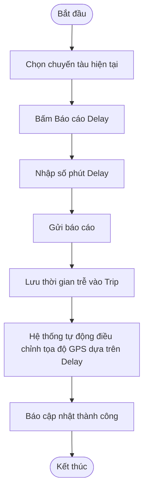
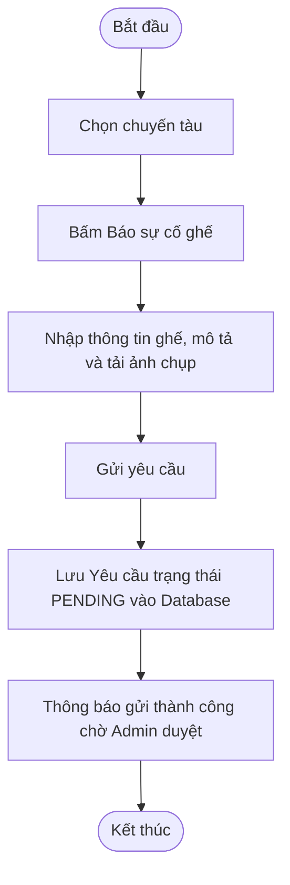

# Biểu Đồ Hoạt Động (Activity Diagrams) - 18 Use Cases

Tài liệu này cung cấp các biểu đồ hoạt động (Activity Diagrams) sử dụng cú pháp `flowchart TD` của Mermaid để mô tả luồng thực thi nghiệp vụ chi tiết của 18 Use Cases trong hệ thống Railway Booking System.
Các biểu đồ này được ánh xạ trực tiếp từ Biểu Đồ Tuần Tự (Sequence Diagrams), Use Cases, và mô hình dữ liệu (Prisma Schema).

---

## 1. Khách Hàng (Customer)

### UC-01: Đăng ký tài khoản

### UC-02: Đăng nhập hệ thống

### UC-03: Quản lý hồ sơ

### UC-04: Xác nhận đổi ghế (khi ghế bị hỏng)

### UC-05: Chat với Chatbot

### UC-06: Tìm kiếm chuyến tàu

### UC-07: Xem chuyến đang chạy

### UC-08: Quản lý ví điện tử

### UC-09: Đặt vé tàu

### UC-10: Xem lịch sử đặt vé

---

## 2. Quản Trị Viên (Admin)

### UC-11: Xem dashboard và báo cáo

### UC-12: Quản lý người dùng

### UC-13: Xử lý ghế hỏng

### UC-14: Quản lý tàu (Tuyến, Chuyến)

---

## 3. Lái Tàu (Driver)

### UC-15: Yêu cầu hủy chuyến khẩn cấp

### UC-16: Xem chuyến được phân công

### UC-17: Báo cáo delay

### UC-18: Báo cáo ghế hỏng

