# Biểu Đồ Hoạt Động (Activity Diagrams) - 20 Use Cases

Tài liệu này cung cấp các biểu đồ hoạt động (Activity Diagrams) sử dụng cú pháp `flowchart TD` của Mermaid để mô tả luồng thực thi nghiệp vụ chi tiết của 18 Use Cases trong hệ thống Railway Booking System.
Các biểu đồ này được ánh xạ trực tiếp từ Biểu Đồ Tuần Tự (Sequence Diagrams), Use Cases, và mô hình dữ liệu (Prisma Schema).

---

## 1. Khách Hàng (Customer)

### UC-01: Đăng ký tài khoản
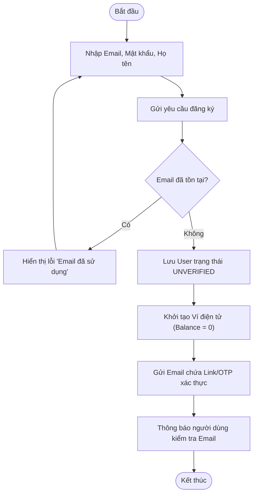

### UC-02: Đăng nhập hệ thống


### UC-03: Quản lý hồ sơ
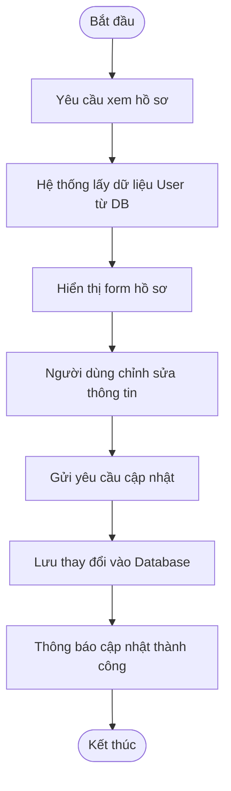

### UC-04: Xác nhận đổi ghế (khi ghế bị hỏng)
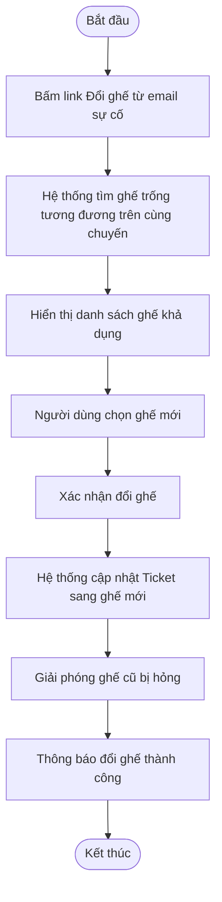

### UC-05: Chat với Chatbot
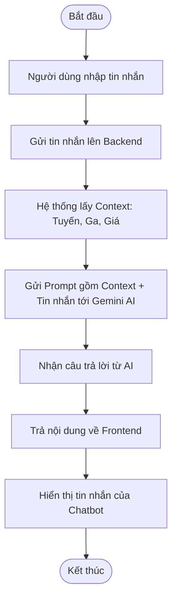

### UC-06: Tìm kiếm chuyến tàu
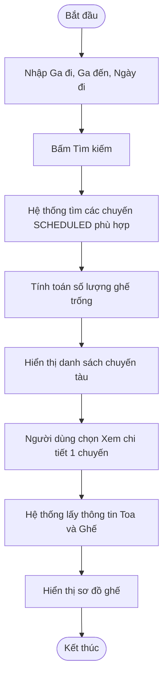

### UC-07: Xem chuyến đang chạy


### UC-08: Quản lý ví điện tử


### UC-09: Đặt vé tàu


### UC-10: Xem lịch sử đặt vé


---

## 2. Quản Trị Viên (Admin)

### UC-11: Xem dashboard và báo cáo


### UC-12: Quản lý người dùng
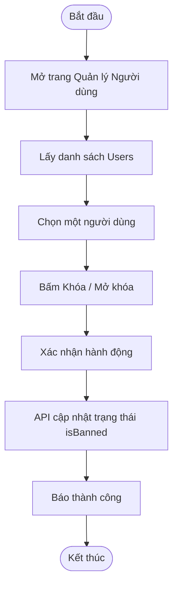

### UC-13: Quản lý trạng thái ghế
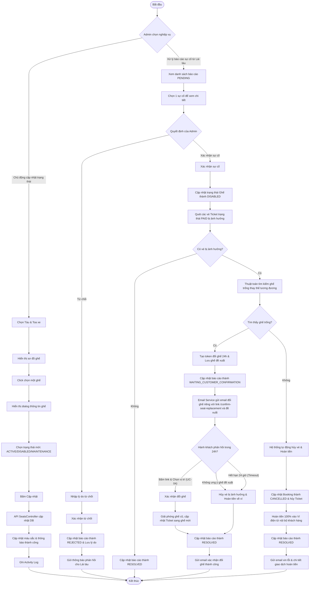

### UC-14: Quản lý tàu
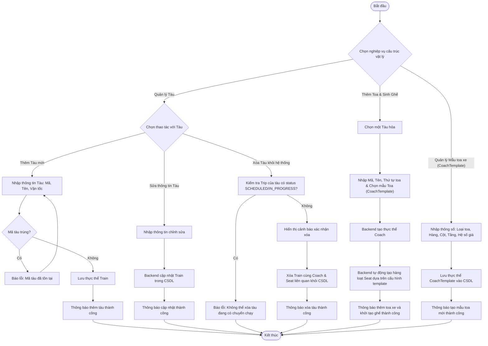

### UC-19: Quản lý chuyến tàu
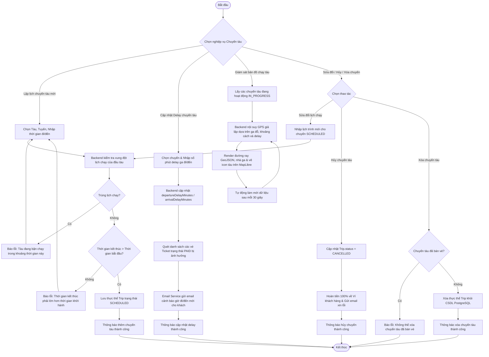

### UC-20: Quản lý cơ sở hạ tầng
```mermaid
flowchart TD
    Start([Bắt đầu]) --> ChooseOption{Chọn nghiệp vụ mạng lưới hạ tầng}
    
    %% Đồng bộ GeoJSON
    ChooseOption -->|Đồng bộ từ GeoJSON| UploadFile[Tải lên file GeoJSON mapData]
    UploadFile --> ParseJSON{File hợp lệ?}
    
    ParseJSON -->|Không| ShowJSONError[Báo lỗi: File mapData bắt buộc và phải đúng định dạng GeoJSON]
    ShowJSONError --> UploadFile
    
    ParseJSON -->|Có| PostSync[API POST /geojson/sync]
    PostSync --> CreateNetwork[Tạo thực thể Network mới với version tự động tăng]
    CreateNetwork --> ExtractStations[Quét trích xuất các trạm ga Point & tự sinh Code]
    ExtractStations --> SaveStations[Lưu danh sách Station vào DB gắn với Network]
    SaveStations --> ExtractLines[Quét trích xuất và gộp các đường ray LineString/MultiLineString]
    ExtractLines --> SaveLines[Lưu danh sách RailwayLine vào DB gắn với Network]
    SaveLines --> SuccessSync[Phản hồi kết quả đồng bộ thành công & số lượng đã xử lý]
    SuccessSync --> UpdateMap[Cập nhật bản vẽ vector ga và ray lên bản đồ GIS]
    UpdateMap --> End([Kết thúc])
    
    %% Xem danh sách Network
    ChooseOption -->|Xem danh sách mạng lưới| GetNetworks[API GET /geojson/networks]
    GetNetworks --> RenderNetworkList[Hiển thị danh sách các Network đã đồng bộ]
    RenderNetworkList --> End
    
    %% Chi tiết Network
    ChooseOption -->|Xem chi tiết mạng lưới| SelectNetwork[Chọn một Network]
    SelectNetwork --> FetchNetworkData[API GET /geojson/network?networkId={id}]
    FetchNetworkData --> RenderMapGIS[Hiển thị chi tiết ga và uốn lượn đường ray lên bản đồ GIS]
    RenderMapGIS --> End
```


---

## 3. Lái Tàu (Driver)

### UC-15: Yêu cầu hủy chuyến khẩn cấp
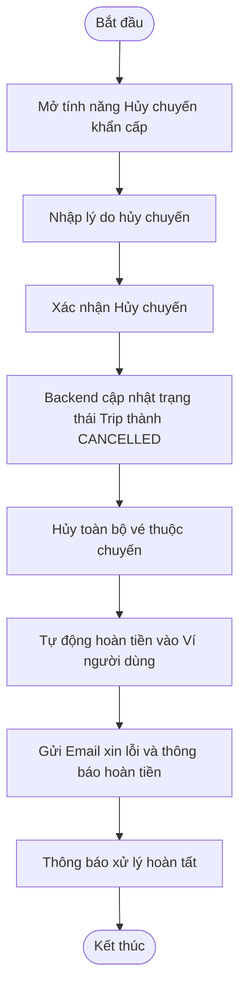

### UC-16: Xem chuyến được phân công
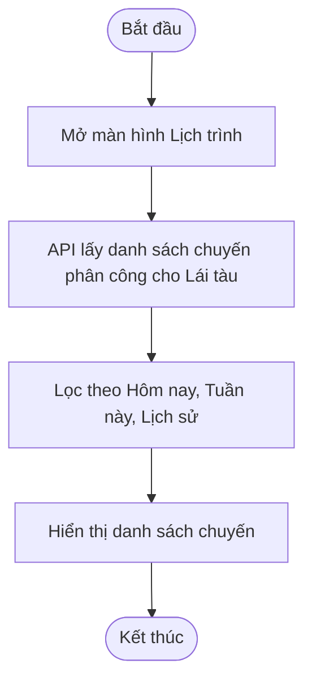

### UC-17: Báo cáo delay


### UC-18: Báo cáo ghế hỏng
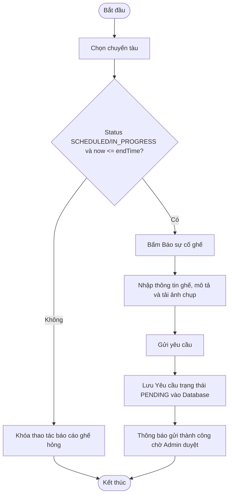
