# Hình 2.5: Biểu đồ phân rã chức năng hệ thống RailFlow

## Mô tả

Biểu đồ phân rã chức năng thể hiện các chức năng của hệ thống theo cấu trúc phân cấp. Cấp cao nhất là hệ thống RailFlow; cấp tiếp theo gồm phân hệ khách hàng, phân hệ quản trị và phân hệ lái tàu; cấp cuối thể hiện các nhóm chức năng nghiệp vụ đang được triển khai trong mã nguồn.

## Biểu đồ BFD

```mermaid
flowchart TB
    SYS[HỆ THỐNG QUẢN LÝ VÀ ĐẶT VÉ TÀU RAILFLOW]

    CUS[1. PHÂN HỆ KHÁCH HÀNG]
    ADM[2. PHÂN HỆ QUẢN TRỊ]
    DRI[3. PHÂN HỆ LÁI TÀU]

    SYS --- CUS
    SYS --- ADM
    SYS --- DRI

    C_AUTH[1.1 Quản lý tài khoản]
    C_BOOK[1.2 Tra cứu và đặt vé]
    C_WALLET[1.3 Quản lý ví điện tử]
    C_SUPPORT[1.4 Hỗ trợ tra cứu]

    CUS --- C_AUTH
    CUS --- C_BOOK
    CUS --- C_WALLET
    CUS --- C_SUPPORT

    C_AUTH --- C_AUTH_1[1.1.1 Đăng ký và xác thực email]
    C_AUTH --- C_AUTH_2[1.1.2 Đăng nhập và khôi phục mật khẩu]
    C_AUTH --- C_AUTH_3[1.1.3 Cập nhật hồ sơ cá nhân]

    C_BOOK --- C_BOOK_1[1.2.1 Tìm kiếm chuyến tàu]
    C_BOOK --- C_BOOK_2[1.2.2 Chọn chặng, toa và ghế]
    C_BOOK --- C_BOOK_3[1.2.3 Tạo đơn và thanh toán]
    C_BOOK --- C_BOOK_4[1.2.4 Xem lịch sử và hủy đơn]
    C_BOOK --- C_BOOK_5[1.2.5 Theo dõi chuyến đang chạy]
    C_BOOK --- C_BOOK_6[1.2.6 Xác nhận đổi ghế]

    C_WALLET --- C_WALLET_1[1.3.1 Xem số dư và lịch sử giao dịch]
    C_WALLET --- C_WALLET_2[1.3.2 Nạp tiền vào ví]
    C_WALLET --- C_WALLET_3[1.3.3 Gửi yêu cầu rút tiền]
    C_WALLET --- C_WALLET_4[1.3.4 Quản lý mã PIN ví]

    C_SUPPORT --- C_SUPPORT_1[1.4.1 Tra cứu bằng chatbot]

    A_DASH[2.1 Tổng hợp và thống kê]
    A_INFRA[2.2 Quản lý cơ sở hạ tầng]
    A_TRAIN[2.3 Quản lý tàu, toa và ghế]
    A_TRIP[2.4 Quản lý chuyến tàu]
    A_REPORT[2.5 Xử lý báo cáo vận hành]
    A_FINANCE[2.6 Quản lý yêu cầu rút tiền]

    ADM --- A_DASH
    ADM --- A_INFRA
    ADM --- A_TRAIN
    ADM --- A_TRIP
    ADM --- A_REPORT
    ADM --- A_FINANCE

    A_DASH --- A_DASH_1[2.1.1 Thống kê người dùng, vé và chuyến]
    A_DASH --- A_DASH_2[2.1.2 Thống kê doanh thu]

    A_INFRA --- A_INFRA_1[2.2.1 Đồng bộ mạng lưới và GeoJSON]
    A_INFRA --- A_INFRA_2[2.2.2 Quản lý ga]
    A_INFRA --- A_INFRA_3[2.2.3 Thiết lập tuyến và thứ tự ga]

    A_TRAIN --- A_TRAIN_1[2.3.1 Quản lý tàu]
    A_TRAIN --- A_TRAIN_2[2.3.2 Quản lý mẫu toa và toa]
    A_TRAIN --- A_TRAIN_3[2.3.3 Quản lý sơ đồ và trạng thái ghế]

    A_TRIP --- A_TRIP_1[2.4.1 Tạo chuyến và tính thời gian]
    A_TRIP --- A_TRIP_2[2.4.2 Phân công lái tàu]
    A_TRIP --- A_TRIP_3[2.4.3 Cập nhật chuyến chưa khởi hành]
    A_TRIP --- A_TRIP_4[2.4.4 Xóa chuyến khi đủ điều kiện]
    A_TRIP --- A_TRIP_5[2.4.5 Xem chi tiết và thống kê chuyến]

    A_REPORT --- A_REPORT_1[2.5.1 Xử lý sự cố ghế]
    A_REPORT --- A_REPORT_2[2.5.2 Đổi ghế hoặc hoàn tiền]
    A_REPORT --- A_REPORT_3[2.5.3 Duyệt hoặc từ chối báo cáo delay]

    A_FINANCE --- A_FINANCE_1[2.6.1 Xem yêu cầu rút tiền]
    A_FINANCE --- A_FINANCE_2[2.6.2 Duyệt hoặc từ chối yêu cầu]

    D_ASSIGN[3.1 Theo dõi chuyến được phân công]
    D_REPORT[3.2 Báo cáo vận hành]

    DRI --- D_ASSIGN
    DRI --- D_REPORT

    D_ASSIGN --- D_ASSIGN_1[3.1.1 Xem danh sách và lịch sử chuyến]
    D_ASSIGN --- D_ASSIGN_2[3.1.2 Xem chi tiết chuyến và sơ đồ ghế]

    D_REPORT --- D_REPORT_1[3.2.1 Báo cáo sự cố ghế]
    D_REPORT --- D_REPORT_2[3.2.2 Báo cáo delay]
    D_REPORT --- D_REPORT_3[3.2.3 Xem lịch sử báo cáo]

    classDef root fill:#ffffff,stroke:#000000,stroke-width:2px,font-weight:bold;
    classDef level1 fill:#ffffff,stroke:#000000,stroke-width:2px,font-weight:bold;
    classDef level2 fill:#ffffff,stroke:#000000,stroke-width:1.5px,font-weight:bold;
    classDef level3 fill:#ffffff,stroke:#000000,stroke-width:1px;

    class SYS root;
    class CUS,ADM,DRI level1;
    class C_AUTH,C_BOOK,C_WALLET,C_SUPPORT,A_DASH,A_INFRA,A_TRAIN,A_TRIP,A_REPORT,A_FINANCE,D_ASSIGN,D_REPORT level2;
    class C_AUTH_1,C_AUTH_2,C_AUTH_3,C_BOOK_1,C_BOOK_2,C_BOOK_3,C_BOOK_4,C_BOOK_5,C_BOOK_6,C_WALLET_1,C_WALLET_2,C_WALLET_3,C_WALLET_4,C_SUPPORT_1,A_DASH_1,A_DASH_2,A_INFRA_1,A_INFRA_2,A_INFRA_3,A_TRAIN_1,A_TRAIN_2,A_TRAIN_3,A_TRIP_1,A_TRIP_2,A_TRIP_3,A_TRIP_4,A_TRIP_5,A_REPORT_1,A_REPORT_2,A_REPORT_3,A_FINANCE_1,A_FINANCE_2,D_ASSIGN_1,D_ASSIGN_2,D_REPORT_1,D_REPORT_2,D_REPORT_3 level3;
```

## Phạm vi chức năng

- Phân hệ khách hàng tương ứng với các module xác thực, đặt vé, thanh toán, ví điện tử, theo dõi chuyến và chatbot.
- Phân hệ quản trị tương ứng với dashboard, dữ liệu mạng lưới, ga, tuyến, tàu, toa, ghế, chuyến tàu, xử lý sự cố, báo cáo delay và yêu cầu rút tiền.
- Phân hệ lái tàu tương ứng với danh sách chuyến được phân công, chi tiết chuyến, báo cáo sự cố ghế và báo cáo delay.
- BFD chỉ biểu diễn quan hệ phân rã chức năng; tác nhân, trình tự xử lý và quan hệ dữ liệu được trình bày trong các sơ đồ Use Case, Sequence, Activity và ERD.
