# Hình 2.5: Biểu đồ Phân rã Chức năng (BFD - Business Function Diagram)

## 1. Giới Thiệu
Biểu đồ phân rã chức năng (BFD) thể hiện cấu trúc cây phân cấp của toàn bộ các chức năng nghiệp vụ trong hệ thống **Đặt Vé Tàu Hỏa Tuyến Bắc - Nam (Railway Booking System)**. Sơ đồ này cung cấp cái nhìn trực quan về cách các chức năng lớn được chia nhỏ thành các phân hệ và chức năng hạt nhân, làm cơ sở xây dựng mã nguồn thực tế và thiết kế giao diện.

---

## 2. Biểu Đồ Phân Rã Chức Năng (Mermaid Tree)

```mermaid
graph TD
    %% Root Node
    SYS[HỆ THỐNG ĐẶT VÉ TÀU HỎA TUYẾN BẮC-NAM]
    
    %% Level 1: Main Portals
    CUS[1. PHÂN HỆ KHÁCH HÀNG]
    ADM[2. PHÂN HỆ QUẢN TRỊ - ADMIN]
    DRI[3. PHÂN HỆ LÁI TÀU - DRIVER]
    
    SYS --> CUS
    SYS --> ADM
    SYS --> DRI
    
    %% Level 2: Customer Subsections
    C_AUTH[1.1 Quản lý Tài khoản & Hồ sơ]
    C_BOOK[1.2 Tra cứu & Đặt vé tàu]
    C_WALL[1.3 Quản lý Ví điện tử]
    C_SUPP[1.4 Hỗ trợ khách hàng]
    
    CUS --> C_AUTH
    CUS --> C_BOOK
    CUS --> C_WALL
    CUS --> C_SUPP
    
    %% Level 3: Customer Details
    C_AUTH_REG[1.1.1 Đăng ký tài khoản]
    C_AUTH_LOG[1.1.2 Đăng nhập hệ thống]
    C_AUTH_PRF[1.1.3 Quản lý hồ sơ cá nhân]
    C_AUTH --> C_AUTH_REG
    C_AUTH --> C_AUTH_LOG
    C_AUTH --> C_AUTH_PRF
    
    C_BOOK_SCH[1.2.1 Tìm kiếm chuyến tàu]
    C_BOOK_ADD[1.2.2 Chọn ghế & Đặt vé]
    C_BOOK_GPS[1.2.3 Theo dõi live GPS tàu chạy]
    C_BOOK_HIS[1.2.4 Xem lịch sử & Tải vé PDF/QR]
    C_BOOK_SWP[1.2.5 Xác nhận tự đổi ghế hỏng]
    C_BOOK --> C_BOOK_SCH
    C_BOOK --> C_BOOK_ADD
    C_BOOK --> C_BOOK_GPS
    C_BOOK --> C_BOOK_HIS
    C_BOOK --> C_BOOK_SWP
    
    C_WALL_TX[1.3.1 Nạp & Rút tiền ví]
    C_WALL_PIN[1.3.2 Thiết lập & Quản lý mã PIN]
    C_WALL --> C_WALL_TX
    C_WALL --> C_WALL_PIN
    
    C_SUPP_BOT[1.4.1 Chat tư vấn với Chatbot AI]
    C_SUPP --> C_SUPP_BOT
    
    %% Level 2: Admin Subsections
    A_REP[2.1 Dashboard & Báo cáo]
    A_USER[2.2 Quản lý Tài khoản]
    A_TRAIN[2.3 Quản lý Tàu & Toa xe]
    A_SEAT[2.4 Quản lý Trạng thái ghế]
    A_TRIP[2.5 Quản lý Chuyến tàu chạy]
    A_INFRA[2.6 Quản lý Cơ sở hạ tầng]
    
    ADM --> A_REP
    ADM --> A_USER
    ADM --> A_TRAIN
    ADM --> A_SEAT
    ADM --> A_TRIP
    ADM --> A_INFRA
    
    %% Level 3: Admin Details
    A_REP_VIEW[2.1.1 Thống kê doanh thu & lấp đầy]
    A_REP --> A_REP_VIEW
    
    A_USER_MNG[2.2.1 Khóa/Mở khóa tài khoản & phân quyền]
    A_USER --> A_USER_MNG
    
    A_TRAIN_MNG[2.3.1 Thêm/Sửa/Xóa Tàu hỏa]
    A_TRAIN_COA[2.3.2 Thêm Toa & Cấu hình mẫu sinh ghế]
    A_TRAIN --> A_TRAIN_MNG
    A_TRAIN --> A_TRAIN_COA
    
    A_SEAT_STS[2.4.1 Khóa/Mở/Bảo trì ghế thủ công]
    A_SEAT_RES[2.4.2 Phê duyệt & Tự động đổi ghế hỏng]
    A_SEAT --> A_SEAT_STS
    A_SEAT --> A_SEAT_RES
    
    A_TRIP_SCH[2.5.1 Lập lịch chuyến đi mới]
    A_TRIP_DLY[2.5.2 Cấu hình số phút delay ga]
    A_TRIP_GPS[2.5.3 Giám sát vị trí tàu trên bản đồ]
    A_TRIP --> A_TRIP_SCH
    A_TRIP --> A_TRIP_DLY
    A_TRIP --> A_TRIP_GPS
    
    A_INFRA_STA[2.6.1 Cấu hình danh mục Nhà ga GIS]
    A_INFRA_RTE[2.6.2 Lập tuyến và thứ tự ga đỗ]
    A_INFRA_GEO[2.6.3 Số hóa GeoJSON đường ray]
    A_INFRA --> A_INFRA_STA
    A_INFRA --> A_INFRA_RTE
    A_INFRA --> A_INFRA_GEO
    
    %% Level 2: Driver Subsections
    D_SCH[3.1 Xem chuyến được giao]
    D_REP[3.2 Báo cáo hành trình]
    
    DRI --> D_SCH
    DRI --> D_REP
    
    %% Level 3: Driver Details
    D_SCH_VIEW[3.1.1 Xem chi tiết lịch trình được giao]
    D_SCH --> D_SCH_VIEW
    
    D_REP_CAN[3.2.1 Yêu cầu hủy chuyến khẩn cấp]
    D_REP_DLY[3.2.2 Báo cáo số phút delay chạy thực]
    D_REP_SAD[3.2.3 Báo cáo ghế hỏng phát sinh]
    D_REP --> D_REP_CAN
    D_REP --> D_REP_DLY
    D_REP --> D_REP_SAD

    %% Styling
    classDef root fill:#f1f5f9,stroke:#0f172a,stroke-width:2px,font-weight:bold;
    classDef level1 fill:#ffffff,stroke:#0f172a,stroke-width:2px,font-weight:bold;
    classDef level2 fill:#ffffff,stroke:#334155,stroke-width:1.5px,font-weight:bold;
    classDef level3 fill:#ffffff,stroke:#64748b,stroke-width:1px;
    
    class SYS root;
    class CUS,ADM,DRI level1;
    class C_AUTH,C_BOOK,C_WALL,C_SUPP,A_REP,A_USER,A_TRAIN,A_SEAT,A_TRIP,A_INFRA,D_SCH,D_REP level2;
    class C_AUTH_REG,C_AUTH_LOG,C_AUTH_PRF,C_BOOK_SCH,C_BOOK_ADD,C_BOOK_GPS,C_BOOK_HIS,C_BOOK_SWP,C_WALL_TX,C_WALL_PIN,C_SUPP_BOT,A_REP_VIEW,A_USER_MNG,A_TRAIN_MNG,A_TRAIN_COA,A_SEAT_STS,A_SEAT_RES,A_TRIP_SCH,A_TRIP_DLY,A_TRIP_GPS,A_INFRA_STA,A_INFRA_RTE,A_INFRA_GEO,D_SCH_VIEW,D_REP_CAN,D_REP_DLY,D_REP_SAD level3;
```

---

## 3. Khớp 100% Các Module Mã Nguồn Thực Tế

Biểu đồ BFD trên được xây dựng bám sát và phản ánh trực quan cấu trúc module của mã nguồn dự án:
- **1.1 Quản lý Tài khoản & Hồ sơ:** Tương ứng với module backend `auth` và frontend `web/features/auth`.
- **1.2 Tra cứu & Đặt vé tàu:** Tương ứng với module backend `ticket`, `booking` và frontend `web/features/booking`.
- **1.3 Quản lý Ví điện tử:** Tương ứng với module backend `wallet` và frontend `web/features/wallet`.
- **1.4 Hỗ trợ khách hàng:** Tương ứng với module backend `chatbot` và frontend `web/features/chatbot`.
- **2.1 Dashboard & Báo cáo:** Tương ứng với module backend `dashboard` và frontend `web/features/dashboard`.
- **2.3 Quản lý Tàu & Toa xe:** Tương ứng với các module backend `train`, `coaches`, `coach-template` và frontend `web/features/trains`.
- **2.4 Quản lý Trạng thái ghế:** Tương ứng với module backend `seats` và các component quản trị ghế.
- **2.5 Quản lý Chuyến tàu chạy:** Tương ứng với module backend `trip` và frontend `web/features/trips`.
- **2.6 Quản lý Cơ sở hạ tầng:** Tương ứng với các module backend `station`, `route`, `railway-network`, `geojson` và frontend `web/features/stations` & `web/features/routes`.
