# Biểu Đồ Lớp (Class Diagram) - Miền Dữ Liệu Hệ Thống

Biểu đồ lớp dưới đây mô tả các lớp thực thể chính, thuộc tính, enum và quan hệ trong hệ thống RailFlow. Nội dung được đối chiếu với `api/prisma/schema.prisma` hiện tại và được trình bày theo hướng **biểu đồ lớp mức phân tích/thiết kế dữ liệu miền nghiệp vụ**.

Do hệ thống sử dụng NestJS và Prisma, các lớp trong biểu đồ đại diện cho **domain entities/models** thay vì controller/service. Để phân biệt với ERD, biểu đồ có bổ sung một số phương thức nghiệp vụ tiêu biểu cho các lớp chính. Các phương thức này không liệt kê toàn bộ mã nguồn, mà thể hiện các hành vi quan trọng của đối tượng trong hệ thống.

```mermaid
classDiagram
    %% ENUMS
    class UserRole {
        <<enumeration>>
        USER
        ADMIN
        DRIVER
    }
    class TransactionType {
        <<enumeration>>
        DEPOSIT
        WITHDRAW
        PAYMENT
        REFUND
    }
    class TransactionStatus {
        <<enumeration>>
        PENDING
        COMPLETED
        FAILED
        CANCELLED
    }
    class TripStatus {
        <<enumeration>>
        SCHEDULED
        IN_PROGRESS
        COMPLETED
        CANCELLED
    }
    class TrainStatus {
        <<enumeration>>
        ACTIVE
        INACTIVE
        MAINTENANCE
    }
    class CoachStatus {
        <<enumeration>>
        ACTIVE
        INACTIVE
        MAINTENANCE
    }
    class RouteStatus {
        <<enumeration>>
        DRAFT
        ACTIVE
        INACTIVE
    }
    class BookingStatus {
        <<enumeration>>
        PENDING
        PAID
        CANCELLED
        PAYMENT_FAILED
    }
    class SeatStatus {
        <<enumeration>>
        AVAILABLE
        DISABLED
        MAINTENANCE
    }
    class SeatType {
        <<enumeration>>
        VIP
        STANDARD
        ECONOMY
        OTHER
    }
    class CoachLayout {
        <<enumeration>>
        SEAT
        BED
    }
    class SeatIssueStatus {
        <<enumeration>>
        PENDING
        WAITING_CUSTOMER_CONFIRMATION
        RESOLVED
        REJECTED
    }
    class TripDelayReportStatus {
        <<enumeration>>
        PENDING
        APPROVED
        REJECTED
    }
    class TripDelayType {
        <<enumeration>>
        DEPARTURE
        ARRIVAL
    }

    %% USER & WALLET
    class User {
        <<entity>>
        +String id
        +String email
        +String phone
        +String password
        +String name
        +String profilePic
        +String googleId
        +UserRole role
        +Boolean isEmailVerified
        +String verificationToken
        +String passwordResetToken
        +String walletPinResetToken
        +Int balance
        +String walletPin
        +Boolean isBanned
        +DateTime createdAt
        +DateTime updatedAt
        +verifyEmail()
        +updateProfile()
        +resetPassword()
        +setupWalletPin()
        +resetWalletPin()
    }
    class RefreshToken {
        <<entity>>
        +String id
        +String token
        +String userId
        +DateTime expiresAt
        +DateTime createdAt
    }
    class Transaction {
        <<entity>>
        +String id
        +String userId
        +Int amount
        +TransactionType type
        +String paymentMethod
        +TransactionStatus status
        +String referenceId
        +String idempotencyKey
        +String description
        +String bankName
        +String bankAccount
        +String accountName
        +DateTime createdAt
        +DateTime updatedAt
        +createDeposit()
        +requestWithdraw()
        +approveWithdraw()
        +rejectWithdraw()
        +markCompleted()
        +markFailed()
    }

    %% NETWORK, STATION, ROUTE
    class Network {
        <<entity>>
        +String id
        +Int version
        +String name
        +DateTime createdAt
        +DateTime updatedAt
        +syncFromGeoJson()
        +getLatestVersion()
    }
    class Station {
        <<entity>>
        +String id
        +String code
        +String name
        +Float latitude
        +Float longitude
        +String networkId
        +DateTime createdAt
        +DateTime updatedAt
    }
    class RailwayLine {
        <<entity>>
        +String id
        +String name
        +Json pathCoordinates
        +String networkId
        +DateTime createdAt
        +DateTime updatedAt
    }
    class Route {
        <<entity>>
        +String id
        +String code
        +Int version
        +String networkId
        +String name
        +RouteStatus status
        +Int durationMinutes
        +Int turnaroundMinutes
        +Float totalDistanceKm
        +Int basePricePerKm
        +Int stationFee
        +Json pathCoordinates
        +DateTime createdAt
        +DateTime updatedAt
        +addStation()
        +removeStation()
        +reorderStations()
        +calculatePath()
        +recalculatePath()
        +activateVersion()
    }
    class RouteStation {
        <<association>>
        +String routeId
        +String stationId
        +Int index
        +Float distanceFromStart
        +Int durationFromStart
        +DateTime createdAt
        +DateTime updatedAt
    }

    %% TRAIN, COACH, SEAT
    class Train {
        <<entity>>
        +String id
        +String code
        +String name
        +TrainStatus status
        +Int averageSpeedKmH
        +DateTime createdAt
        +DateTime updatedAt
        +createTrip()
        +updateStatus()
    }
    class CoachTemplate {
        <<entity>>
        +String id
        +String code
        +String name
        +String description
        +CoachLayout layout
        +Int totalRows
        +Int totalCols
        +Int tiers
        +Float coachMultiplier
        +Json tierMultipliers
        +DateTime createdAt
        +DateTime updatedAt
    }
    class Coach {
        <<entity>>
        +String id
        +String name
        +Int order
        +CoachStatus status
        +String trainId
        +String templateId
        +DateTime createdAt
        +DateTime updatedAt
        +generateSeats()
        +reorder()
        +updateStatus()
    }
    class Seat {
        <<entity>>
        +String id
        +String name
        +Int rowIndex
        +Int colIndex
        +SeatStatus status
        +SeatType type
        +Int tier
        +String coachId
        +DateTime createdAt
        +DateTime updatedAt
        +updateStatus()
        +isAvailableForSegment()
    }

    %% TRIP, BOOKING, TICKET
    class Trip {
        <<entity>>
        +String id
        +String routeId
        +String trainId
        +DateTime departureTime
        +DateTime endTime
        +TripStatus status
        +Int departureDelayMinutes
        +Int arrivalDelayMinutes
        +String driverId
        +DateTime createdAt
        +DateTime updatedAt
        +assignDriver()
        +setDepartureDelay()
        +setArrivalDelay()
        +getLiveLocation()
        +autoUpdateStatus()
        +getStats()
    }
    class Booking {
        <<entity>>
        +String id
        +String code
        +String tripId
        +String userId
        +String contactName
        +String contactPhone
        +String contactEmail
        +BookingStatus status
        +Int totalPrice
        +Json metadata
        +DateTime createdAt
        +DateTime updatedAt
        +createBooking()
        +confirmBooking()
        +cancelBooking()
        +expireBooking()
        +updatePassengers()
    }
    class Ticket {
        <<entity>>
        +String id
        +String bookingId
        +String tripId
        +String seatId
        +String passengerName
        +String passengerId
        +String passengerGroupId
        +Int fromStationIndex
        +Int toStationIndex
        +Int price
        +DateTime createdAt
        +DateTime updatedAt
        +calculatePrice()
        +generateQRCode()
        +generatePdf()
    }
    class TicketSeatSegment {
        <<entity>>
        +String id
        +String ticketId
        +String tripId
        +String seatId
        +Int segmentIndex
        +DateTime createdAt
        +occupySegment()
    }
    class PassengerGroup {
        <<entity>>
        +String id
        +String code
        +String name
        +Float discountRate
        +String description
        +Int minAge
        +Int maxAge
        +DateTime createdAt
        +DateTime updatedAt
    }

    %% OPERATION REPORTS
    class SeatIssueReport {
        <<entity>>
        +String id
        +String tripId
        +String seatId
        +String issueType
        +String description
        +String reportedById
        +SeatIssueStatus status
        +String rejectReason
        +String token
        +DateTime tokenExpires
        +String proposedSeatId
        +DateTime createdAt
        +DateTime updatedAt
        +createReport()
        +confirmIssue()
        +rejectIssue()
        +findAlternativeSeat()
        +confirmReplacement()
        +rejectReplacement()
        +refundExpiredReplacement()
    }
    class TripDelayReport {
        <<entity>>
        +String id
        +String tripId
        +String reportedById
        +TripDelayType type
        +Int minutes
        +String reason
        +TripDelayReportStatus status
        +String rejectReason
        +DateTime reviewedAt
        +DateTime createdAt
        +DateTime updatedAt
        +createReport()
        +approveReport()
        +rejectReport()
    }

    %% RELATIONSHIPS: User
    User "1" *-- "0..*" RefreshToken : refreshTokens
    User "1" --> "0..*" Transaction : transactions
    User "0..1" <-- "0..*" Booking : user
    User "0..1" <-- "0..*" Trip : driver
    User "1" <-- "0..*" SeatIssueReport : reportedBy
    User "1" <-- "0..*" TripDelayReport : reportedBy

    %% RELATIONSHIPS: Network and Route
    Network "1" *-- "0..*" Station : stations
    Network "1" *-- "0..*" RailwayLine : lines
    Network "1" --> "0..*" Route : routes
    Route "1" *-- "0..*" RouteStation : stations
    Station "1" <-- "0..*" RouteStation : station

    %% RELATIONSHIPS: Fleet
    Train "1" *-- "0..*" Coach : coaches
    CoachTemplate "1" <-- "0..*" Coach : template
    Coach "1" *-- "0..*" Seat : seats

    %% RELATIONSHIPS: Trip and Booking
    Route "1" <-- "0..*" Trip : route
    Train "1" <-- "0..*" Trip : train
    Trip "1" <-- "0..*" Booking : bookings
    Booking "1" *-- "0..*" Ticket : tickets
    Trip "1" <-- "0..*" Ticket : tickets
    Seat "1" <-- "0..*" Ticket : tickets
    PassengerGroup "1" <-- "0..*" Ticket : passengerGroup
    Ticket "1" *-- "1..*" TicketSeatSegment : occupiedSegments
    Trip "1" <-- "0..*" TicketSeatSegment : segmentTrip
    Seat "1" <-- "0..*" TicketSeatSegment : segmentSeat

    %% RELATIONSHIPS: Operation reports
    Trip "1" <-- "0..*" SeatIssueReport : seatIssues
    Seat "1" <-- "0..*" SeatIssueReport : seat
    Seat "0..1" <-- "0..*" SeatIssueReport : proposedSeat
    Trip "1" <-- "0..*" TripDelayReport : delayReports
```

## Ghi Chú Lý Thuyết

- Sơ đồ này là **class diagram mức entity/domain**, phù hợp để mô tả cấu trúc và hành vi nghiệp vụ chính của hệ thống. Với kiến trúc NestJS + Prisma, controller và service không được đưa vào sơ đồ này để tránh biến class diagram thành sơ đồ module kỹ thuật.
- Các phương thức trong lớp là **hành vi nghiệp vụ tiêu biểu**, được rút ra từ các service hiện có như `AuthService`, `WalletService`, `BookingService`, `TripService`, `RouteService`, `CoachesService`, `SeatIssuesService` và `TripDelayReportsService`. Chúng không đại diện cho đầy đủ chữ ký hàm trong mã nguồn.
- Các lớp có stereotype `<<entity>>` tương ứng với model chính trong Prisma schema. `RouteStation` được đánh dấu `<<association>>` vì đây là lớp liên kết giữa `Route` và `Station` có thuộc tính riêng như `index`, `distanceFromStart` và `durationFromStart`.
- Quan hệ `*--` được dùng cho các quan hệ phụ thuộc vòng đời rõ ràng hoặc có cascade trong schema, ví dụ `Network - Station`, `Train - Coach`, `Coach - Seat`, `Ticket - TicketSeatSegment`.
- Quan hệ `-->` hoặc `<--` được dùng cho association thông thường, khi thực thể liên kết vẫn có ý nghĩa nghiệp vụ độc lập hoặc không nên hiểu là bị sở hữu tuyệt đối.
- Enum được biểu diễn bằng `<<enumeration>>` để thể hiện các tập giá trị điều khiển trạng thái trong hệ thống như `TripStatus`, `BookingStatus`, `SeatIssueStatus` và `TripDelayReportStatus`.

## Các Thay Đổi So Với Bản Trước

- Đổi các trường tiền từ `Float` sang `Int` để lưu số tiền theo đơn vị VND, gồm `User.balance`, `Transaction.amount`, `Booking.totalPrice`, `Ticket.price`, `Route.basePricePerKm` và `Route.stationFee`.
- Bổ sung `Transaction.idempotencyKey` để thể hiện cơ chế chống xử lý trùng giao dịch thanh toán, nạp tiền và hoàn tiền.
- Bổ sung lớp `TicketSeatSegment`. Lớp này biểu diễn từng đoạn ghế bị vé chiếm dụng, giúp hệ thống chặn bán trùng ghế theo chặng bằng ràng buộc dữ liệu.
- Điều chỉnh quan hệ `SeatIssueReport` và `TripDelayReport` từ composition sang association thông thường, vì báo cáo vận hành là dữ liệu lịch sử cần được bảo toàn, không bị hiểu là tự động mất theo `Trip`.
- Ghi chú lại `*--` chỉ dành cho quan hệ phụ thuộc vòng đời rõ ràng, tránh hiểu nhầm mọi quan hệ cha-con đều được phép xóa dây chuyền.
