# Biểu Đồ Lớp (Class Diagram) - Cơ Sở Dữ Liệu (Prisma Schema)

Dưới đây là Biểu đồ Lớp (Class Diagram) biểu diễn toàn bộ cấu trúc thực thể (Entities), thuộc tính (Attributes), kiểu liệt kê (Enums) và các mối quan hệ (Relationships) của hệ thống Railway Booking System. 

Biểu đồ này được trích xuất và ánh xạ **chính xác 100% từ mã nguồn `schema.prisma`** hiện tại của dự án.

```mermaid
classDiagram
    %% ENUMS
    class UserRole {
        <<enumeration>>
        USER
        ADMIN
        DRIVER
    }
    class TransactionType {
        <<enumeration>>
        DEPOSIT
        WITHDRAW
        PAYMENT
        REFUND
    }
    class TransactionStatus {
        <<enumeration>>
        PENDING
        COMPLETED
        FAILED
        CANCELLED
    }
    class TripStatus {
        <<enumeration>>
        SCHEDULED
        IN_PROGRESS
        COMPLETED
        CANCELLED
    }
    class TrainStatus {
        <<enumeration>>
        ACTIVE
        INACTIVE
        MAINTENANCE
    }
    class CoachStatus {
        <<enumeration>>
        ACTIVE
        INACTIVE
        MAINTENANCE
    }
    class RouteStatus {
        <<enumeration>>
        DRAFT
        ACTIVE
        INACTIVE
    }
    class BookingStatus {
        <<enumeration>>
        PENDING
        PAID
        CANCELLED
        PAYMENT_FAILED
    }
    class SeatStatus {
        <<enumeration>>
        AVAILABLE
        DISABLED
    }
    class SeatType {
        <<enumeration>>
        VIP
        STANDARD
        ECONOMY
        OTHER
    }
    class CoachLayout {
        <<enumeration>>
        SEAT
        BED
    }

    %% ENTITIES: User & Payment
    class User {
        +String id
        +String email
        +String password
        +String name
        +String googleId
        +UserRole role
        +Boolean isEmailVerified
        +Float balance
        +String walletPin
        +Boolean isBanned
        +DateTime createdAt
        +DateTime updatedAt
    }
    class RefreshToken {
        +String id
        +String token
        +DateTime expiresAt
        +DateTime createdAt
    }
    class Transaction {
        +String id
        +Float amount
        +TransactionType type
        +TransactionStatus status
        +String paymentMethod
        +String referenceId
        +String description
        +String bankName
        +String bankAccount
        +String accountName
        +DateTime createdAt
    }
    
    %% ENTITIES: Infrastructure
    class Station {
        +String id
        +String name
        +Float latitude
        +Float longitude
    }
    class Route {
        +String id
        +String name
        +RouteStatus status
        +Int durationMinutes
        +Int turnaroundMinutes
        +Float totalDistanceKm
        +Float basePricePerKm
        +Float stationFee
        +Json pathCoordinates
    }
    class RouteStation {
        +Int index
        +Float distanceFromStart
        +Int durationFromStart
    }
    class RailwayLine {
        +String id
        +String name
        +Json pathCoordinates
    }

    %% ENTITIES: Fleet & Equipment
    class Train {
        +String id
        +String code
        +String name
        +TrainStatus status
        +Int averageSpeedKmH
    }
    class CoachTemplate {
        +String id
        +String code
        +String name
        +CoachLayout layout
        +Int totalRows
        +Int totalCols
        +Int tiers
        +Float coachMultiplier
        +Json tierMultipliers
    }
    class Coach {
        +String id
        +String name
        +Int order
        +CoachStatus status
    }
    class Seat {
        +String id
        +String name
        +Int rowIndex
        +Int colIndex
        +SeatStatus status
        +SeatType type
        +Int tier
    }

    %% ENTITIES: Schedule & Booking
    class Trip {
        +String id
        +DateTime departureTime
        +DateTime endTime
        +TripStatus status
        +Int departureDelayMinutes
        +Int arrivalDelayMinutes
    }
    class Booking {
        +String id
        +String code
        +BookingStatus status
        +Float totalPrice
        +Json metadata
        +DateTime createdAt
    }
    class Ticket {
        +String id
        +String passengerName
        +String passengerId
        +Int fromStationIndex
        +Int toStationIndex
        +Float price
    }
    class PassengerGroup {
        +String id
        +String code
        +String name
        +Float discountRate
        +Int minAge
        +Int maxAge
    }

    %% RELATIONSHIPS
    User "1" *-- "0..*" RefreshToken : sở hữu
    User "1" *-- "0..*" Transaction : thực hiện
    User "1" *-- "0..*" Booking : tạo
    
    Route "1" *-- "1..*" RouteStation : bao gồm
    Station "1" <-- "0..*" RouteStation : dừng tại
    
    Train "1" *-- "1..*" Coach : bao gồm
    CoachTemplate "1" <-- "0..*" Coach : khởi tạo từ
    Coach "1" *-- "1..*" Seat : chứa
    
    Route "1" <-- "0..*" Trip : đi theo tuyến
    Train "1" <-- "0..*" Trip : vận hành bởi
    
    Trip "1" <-- "0..*" Booking : có
    Booking "1" *-- "1..*" Ticket : bao gồm
    Trip "1" <-- "0..*" Ticket : áp dụng cho
    Seat "1" <-- "0..*" Ticket : chỉ định ghế
    PassengerGroup "1" <-- "0..*" Ticket : phân loại thành
```

### Ý nghĩa của các mối quan hệ (Relationships)
- **1 *-- 0..\*** (Composition): Mối quan hệ "Một - Nhiều" (Mẹ - Con). Khi thực thể mẹ bị xóa, các thực thể con thường sẽ bị xóa theo (Cascade Delete). Ví dụ: `Booking` bị hủy thì các `Ticket` bên trong cũng bị hủy.
- **1 <-- 0..\*** (Association/Aggregation): Mối quan hệ "Thuộc về / Liên kết". Các thực thể tồn tại độc lập. Ví dụ: `Ticket` gán cho một `Seat`, nhưng nếu `Ticket` bị xóa thì `Seat` vẫn tồn tại bình thường.

### Ghi chú tích hợp
- Sơ đồ này phản ánh trực tiếp cấu trúc của `c:\Study\train-booking\api\prisma\schema.prisma`.
- Các Enums (`TripStatus`, `BookingStatus`, `TransactionStatus`, ...) chính là cơ sở dữ liệu để thực hiện logic rẽ nhánh (`alt/else`) trong các Biểu đồ Tuần tự (Sequence Diagrams) mà chúng ta đã thiết kế ở phần trước.
