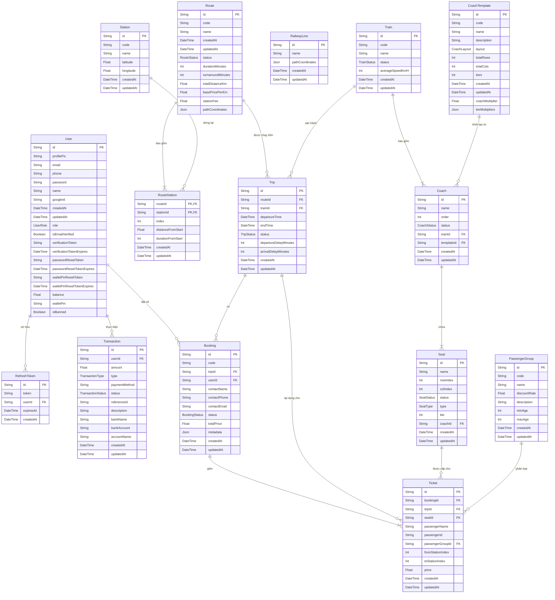

# Biểu Đồ Quan Hệ Thực Thể (ERD) - Cơ Sở Dữ Liệu

Tài liệu này cung cấp Biểu đồ Quan hệ Thực thể (Entity-Relationship Diagram - ERD) sử dụng cú pháp `erDiagram` của Mermaid.
Biểu đồ này biểu diễn các thực thể, thuộc tính khóa, và mối quan hệ theo chuẩn Database Relational Design, được ánh xạ trực tiếp từ `schema.prisma`.

---

## Biểu Đồ ERD

### Ý Nghĩa Các Mối Quan Hệ (Crow's Foot Notation)
- **`||--o{` (Một - Nhiều):** Một thực thể bên trái có thể liên kết với KHÔNG hoặc NHIỀU thực thể bên phải. Ví dụ: Một `User` có thể thực hiện nhiều `Transaction` hoặc chưa thực hiện `Transaction` nào.
- **`||--|{` (Một - Một hoặc Nhiều):** Một thực thể bên trái phải liên kết với MỘT hoặc NHIỀU thực thể bên phải. Ví dụ: Một `Booking` (Đơn hàng) bắt buộc phải chứa ít nhất một `Ticket` (Vé lẻ).
- **PK (Primary Key):** Khóa chính, định danh duy nhất cho thực thể.
- **FK (Foreign Key):** Khóa ngoại, tham chiếu đến một thực thể khác để tạo mối quan hệ.
- **PK,FK:** Thuộc tính vừa là khóa chính vừa là khóa ngoại (thường gặp trong các bảng trung gian như `RouteStation`).

### Ghi Chú Tích Hợp
- Biểu đồ này phản ánh chính xác cấu trúc CSDL từ `schema.prisma`.
- Thực thể `RailwayLine` lưu trữ tọa độ địa lý dạng GeoJSON và không có liên kết trực tiếp (Foreign Key) cứng với các bảng khác trong cơ sở dữ liệu (tọa độ sẽ được thuật toán Snap-to-Road xử lý ở tầng Application).
- Cấu trúc giá và đa tầng (tiers) của `Seat` phụ thuộc vào `CoachTemplate` và `PassengerGroup`.
