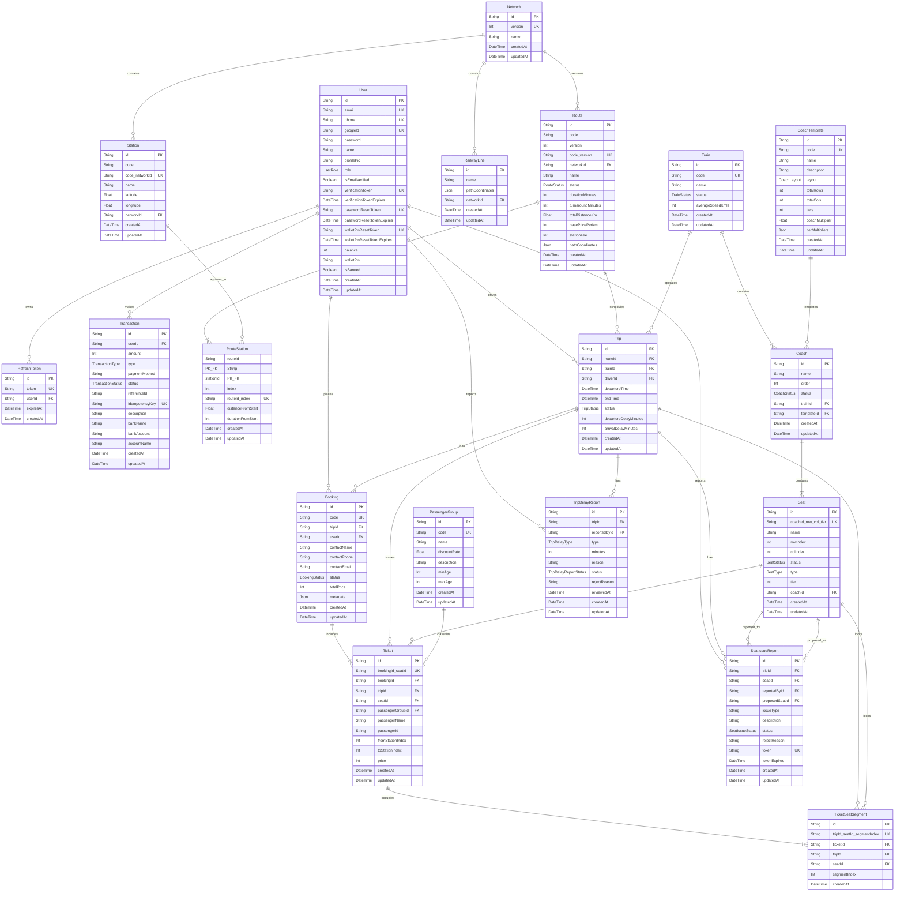

# Entity Relationship Diagram - RailFlow

Tai lieu nay mo ta ERD dang bang bang Mermaid `erDiagram`.
No duoc dong bo voi `api/prisma/schema.prisma` va uu tien de nhin trong bao cao/slide hon so do Chen XML.

## ERD Dang Bang

## Ghi Chu

- `PK`: khoa chinh.
- `FK`: khoa ngoai.
- `UK`: unique key. Cac unique tong hop duoc viet thanh dong dai dien nhu `code_networkId`, `routeId_index`, `tripId_seatId_segmentIndex`.
- `TicketSeatSegment` la bang chan trung ghe theo chang: mot ve di qua nhieu doan thi co nhieu dong segment.
- Cac quan he `Train-Coach-Seat` va `Ticket-TicketSeatSegment` co `onDelete: Cascade` o database theo schema; cac quan he lich su/ve/chuyen dung restrict hoac association de giu toan ven du lieu.
