# Biểu Đồ Tuần Tự (Sequence Diagrams) - 18 Use Cases

Tài liệu này cung cấp biểu đồ tuần tự theo chuẩn **Best Practice** cho 18 Use Cases. Các biểu đồ tập trung vào luồng giao tiếp cốt lõi (Happy Path) giữa các service và các rẽ nhánh nghiệp vụ quan trọng nhất, lược bỏ các logic validation nội bộ để đảm bảo tính dễ đọc khi đưa vào báo cáo.

---

## 1. Khách Hàng (Customer)

### UC-01: Đăng ký tài khoản
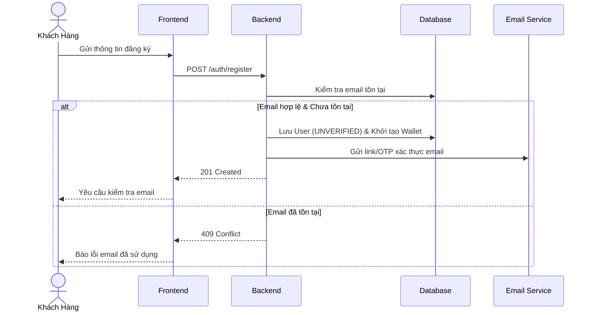

### UC-02: Đăng nhập hệ thống
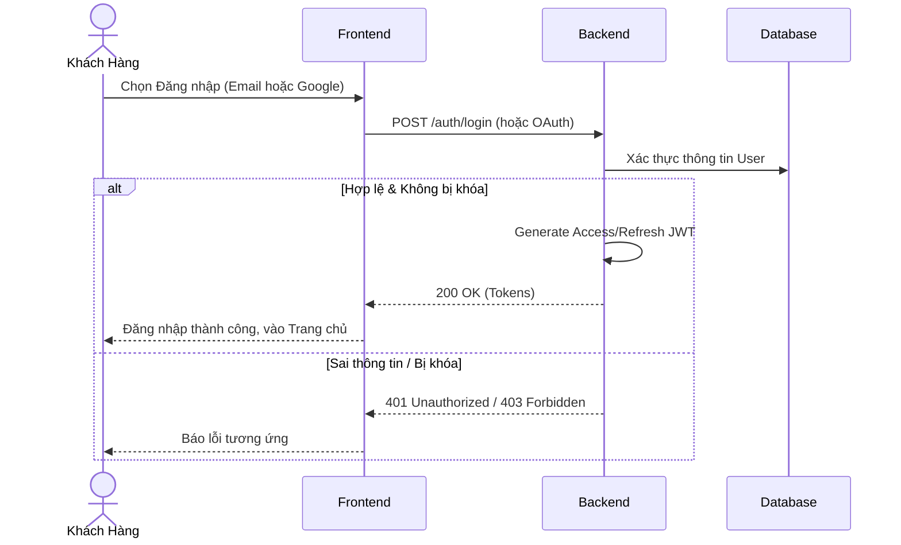

### UC-03: Quản lý hồ sơ
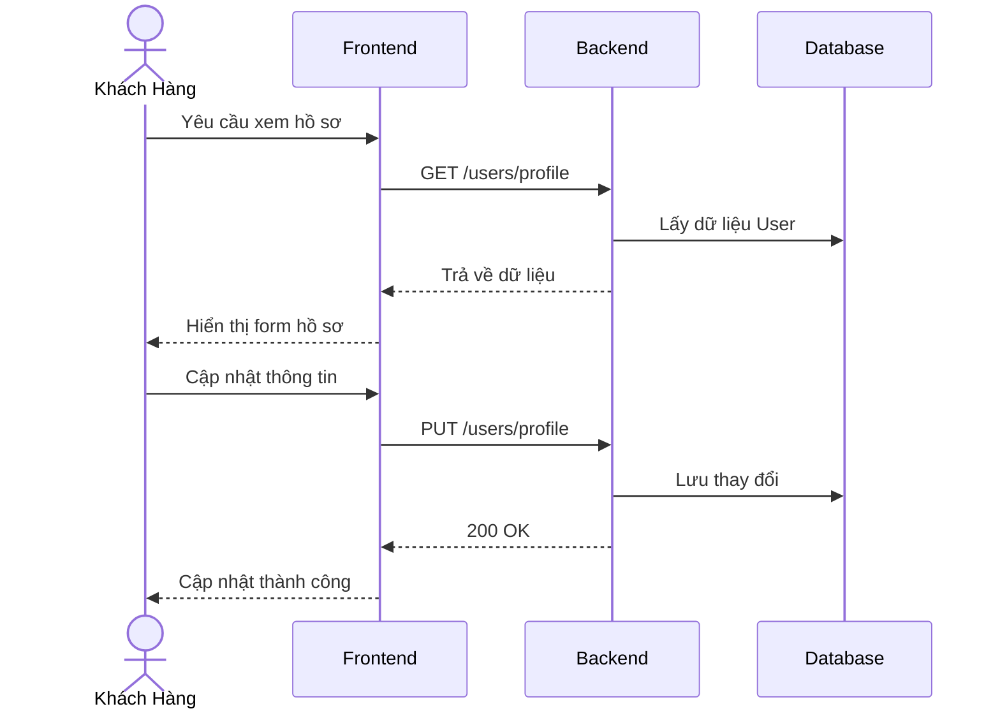

### UC-04: Xác nhận đổi ghế
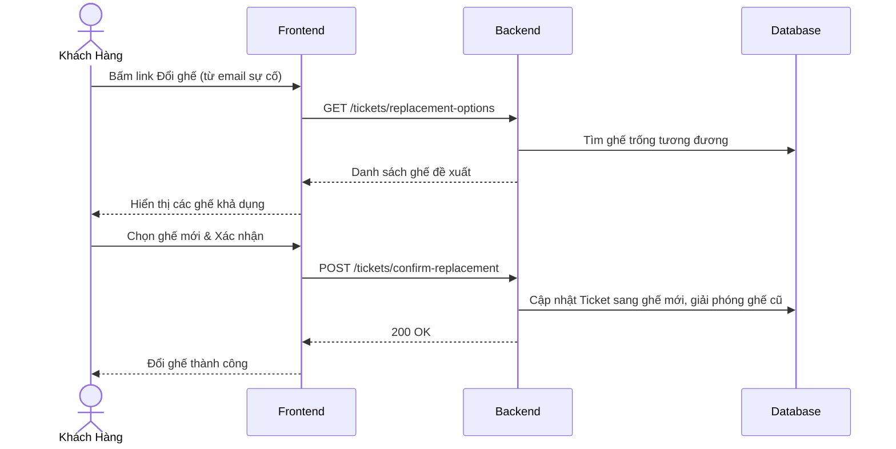

### UC-05: Chat với Chatbot
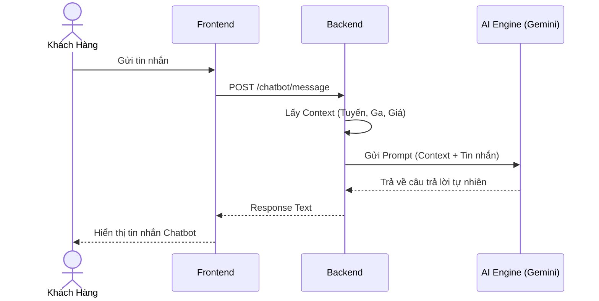

### UC-06: Tìm kiếm chuyến tàu
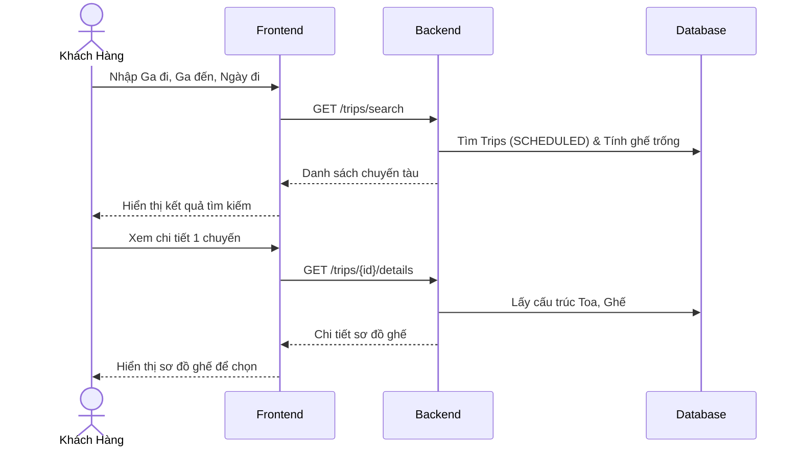

### UC-07: Xem chuyến đang chạy
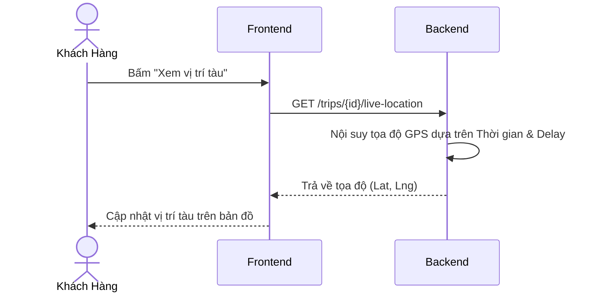

### UC-08: Quản lý ví điện tử
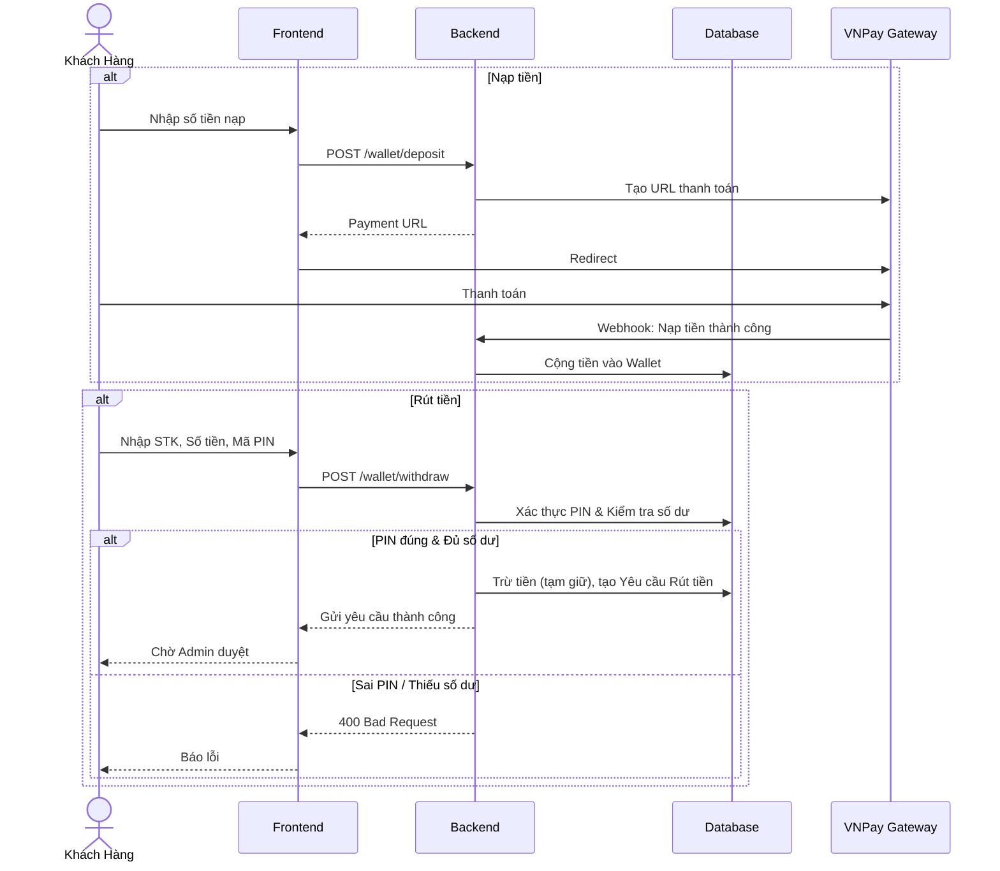

### UC-09: Đặt vé tàu
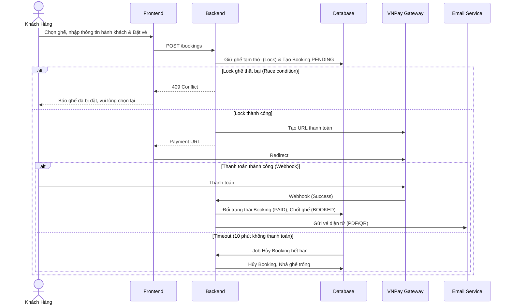

### UC-10: Xem lịch sử đặt vé
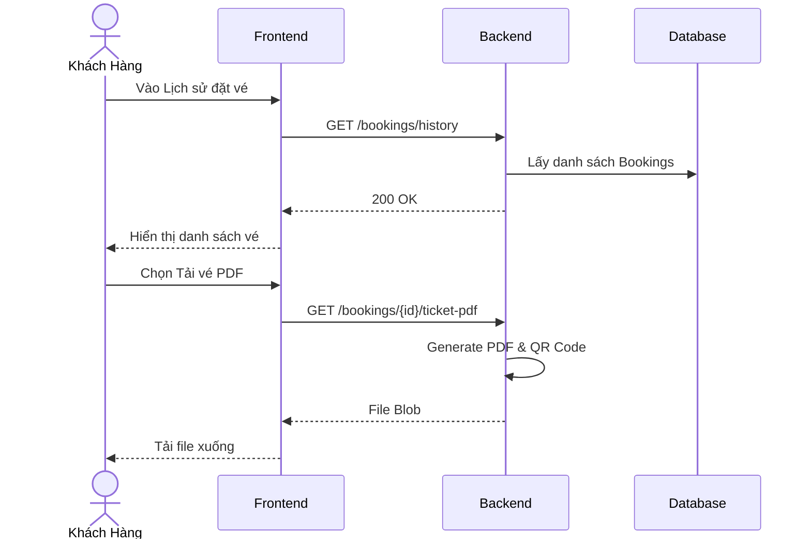

---

## 2. Quản Trị Viên (Admin)

### UC-11: Xem dashboard và báo cáo
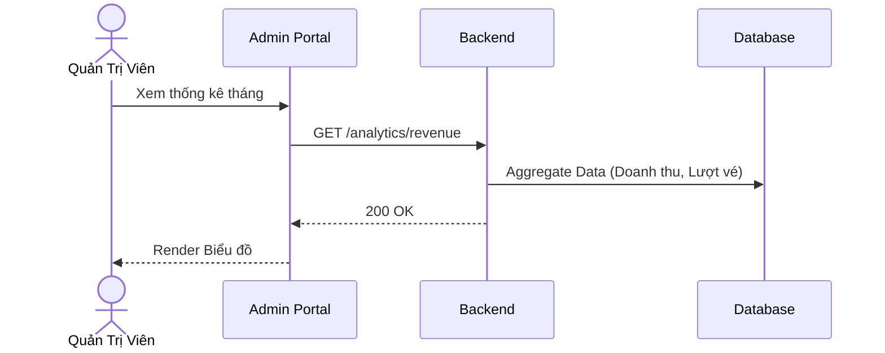

### UC-12: Quản lý người dùng
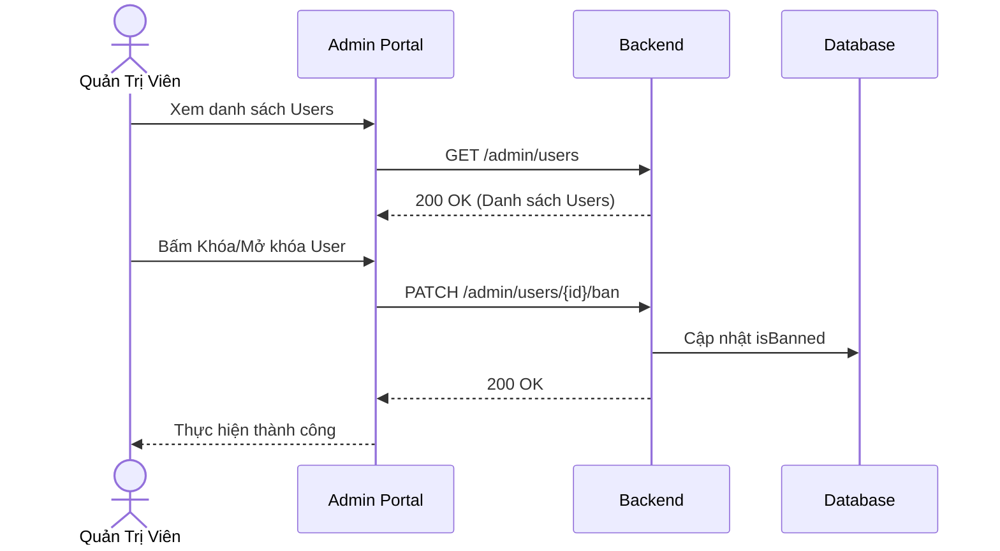

### UC-13: Xử lý ghế hỏng
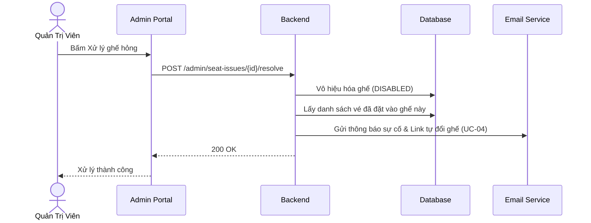

### UC-14: Quản lý tàu
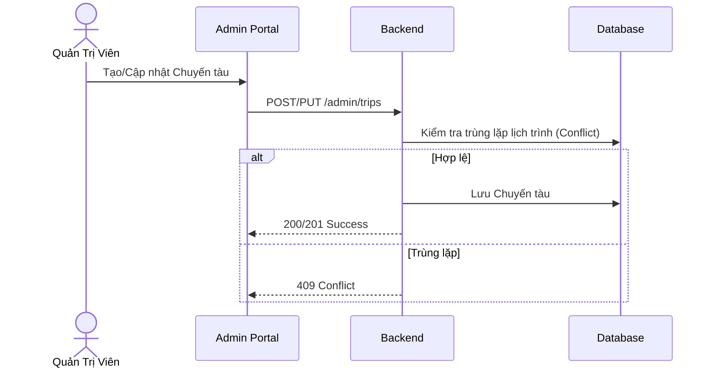

---

## 3. Lái Tàu (Driver)

### UC-15: Yêu cầu hủy chuyến khẩn cấp
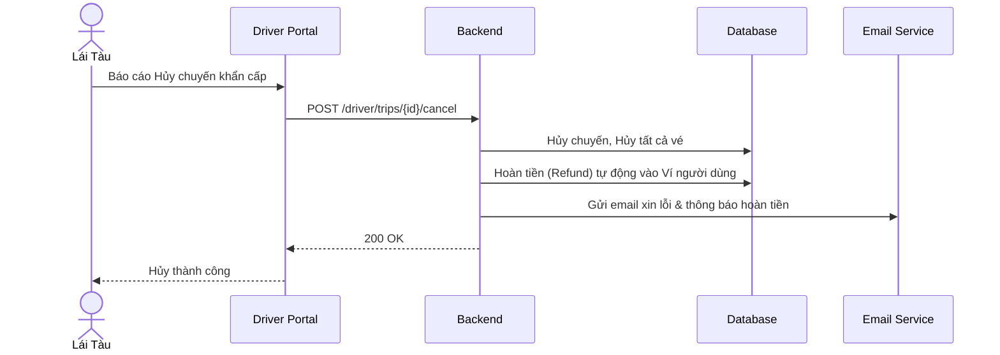

### UC-16: Xem chuyến được phân công
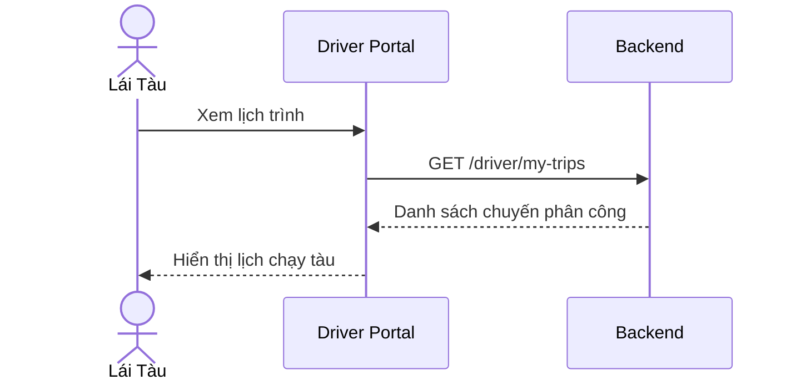

### UC-17: Báo cáo delay
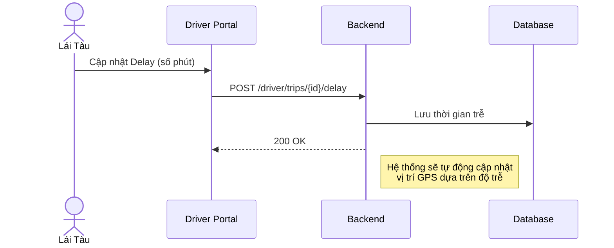

### UC-18: Báo cáo ghế hỏng
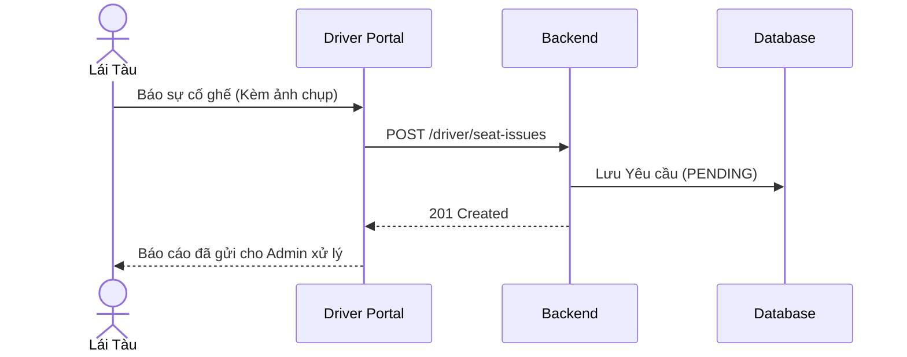

---

## 4. Hệ Thống Tự Động (Cron Job)

Luồng xử lý tự động vòng đời chuyến tàu.

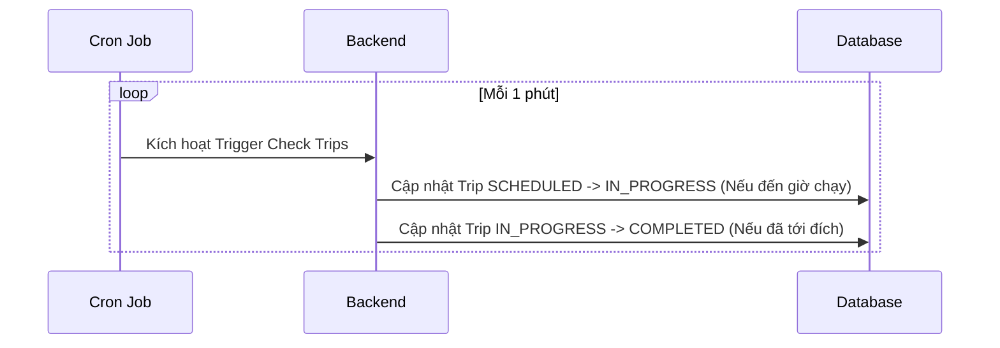
