# Biểu Đồ Tuần Tự (Sequence Diagrams) - 20 Use Cases

Tài liệu này cung cấp biểu đồ tuần tự cho 20 Use Cases. Các biểu đồ tập trung vào luồng giao tiếp cốt lõi giữa người dùng, giao diện và hệ thống; những luồng chưa có module hoàn chỉnh trong project hiện tại được ghi rõ là phạm vi mở rộng.

---

## 1. Khách Hàng (Customer)

### UC-01: Đăng ký tài khoản
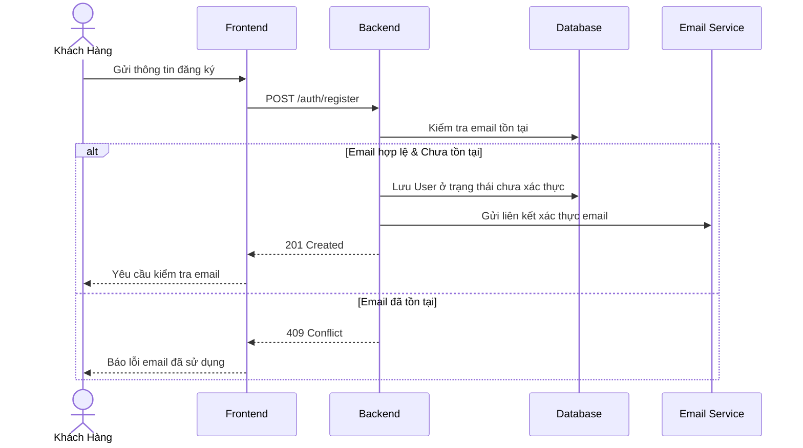
```mermaid
sequenceDiagram
    actor User as Khách Hàng
    participant FE as Frontend
    participant API as Backend
    participant DB as Database
    participant Email as Email Service
    
    User->>FE: Gửi thông tin đăng ký
    FE->>API: POST /auth/register
    API->>DB: Kiểm tra email tồn tại
    alt Email hợp lệ & Chưa tồn tại
        API->>DB: Lưu User ở trạng thái chưa xác thực
        API->>Email: Gửi liên kết xác thực email
        API-->>FE: 201 Created
        FE-->>User: Yêu cầu kiểm tra email
    else Email đã tồn tại
        API-->>FE: 409 Conflict
        FE-->>User: Báo lỗi email đã sử dụng
    end
```

### UC-02: Đăng nhập hệ thống
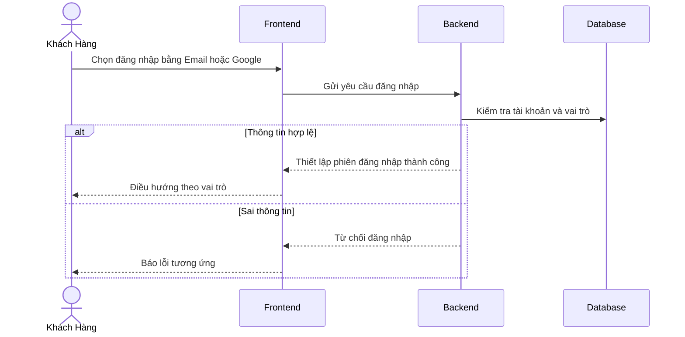
```mermaid
sequenceDiagram
    actor User as Khách Hàng
    participant FE as Frontend
    participant API as Backend
    participant DB as Database
    
    User->>FE: Chọn đăng nhập bằng Email hoặc Google
    FE->>API: Gửi yêu cầu đăng nhập
    API->>DB: Kiểm tra tài khoản và vai trò
    alt Thông tin hợp lệ
        API-->>FE: Thiết lập phiên đăng nhập thành công
        FE-->>User: Điều hướng theo vai trò
    else Sai thông tin
        API-->>FE: Từ chối đăng nhập
        FE-->>User: Báo lỗi tương ứng
    end
```

### UC-03: Quản lý hồ sơ
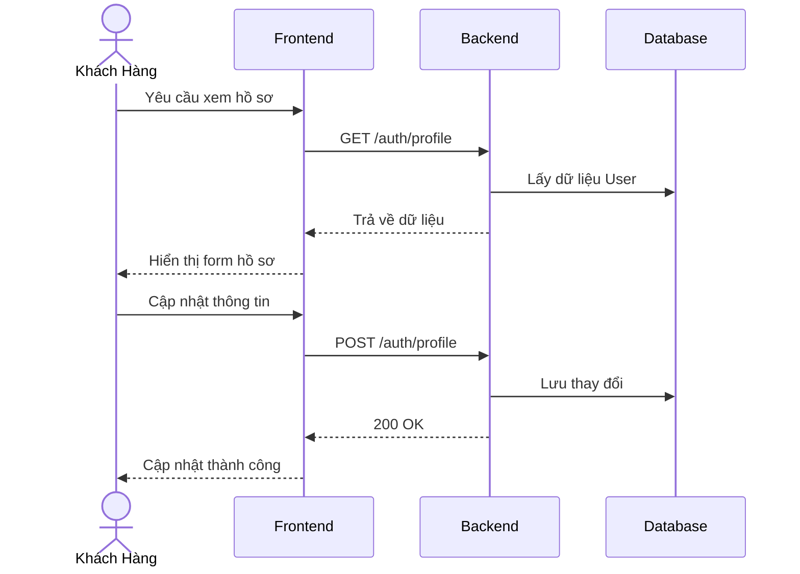
```mermaid
sequenceDiagram
    actor User as Khách Hàng
    participant FE as Frontend
    participant API as Backend
    participant DB as Database
    
    User->>FE: Yêu cầu xem hồ sơ
    FE->>API: GET /auth/profile
    API->>DB: Lấy dữ liệu User
    API-->>FE: Trả về dữ liệu
    FE-->>User: Hiển thị form hồ sơ
    
    User->>FE: Cập nhật thông tin
    FE->>API: POST /auth/profile
    API->>DB: Lưu thay đổi
    API-->>FE: 200 OK
    FE-->>User: Cập nhật thành công
```

### UC-04: Xác nhận đổi ghế
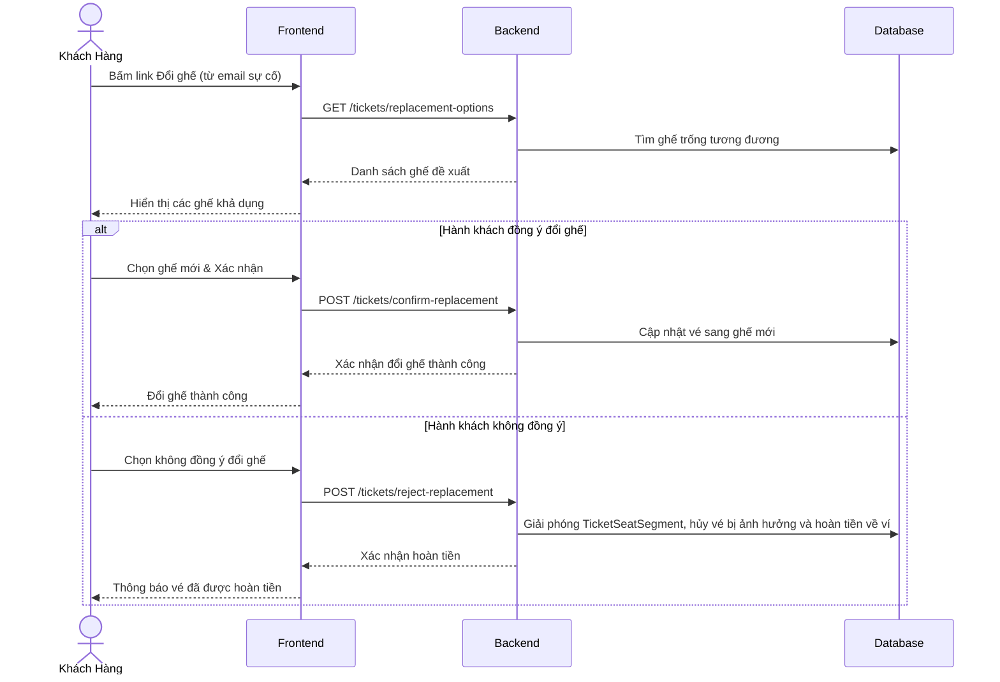
```mermaid
sequenceDiagram
    actor User as Khách Hàng
    participant FE as Frontend
    participant API as Backend
    participant DB as Database
    
    User->>FE: Bấm link Đổi ghế (từ email sự cố)
    FE->>API: GET /tickets/replacement-options
    API->>DB: Tìm ghế trống tương đương
    API-->>FE: Danh sách ghế đề xuất
    FE-->>User: Hiển thị các ghế khả dụng
    
    alt Hành khách đồng ý đổi ghế
        User->>FE: Chọn ghế mới & Xác nhận
        FE->>API: POST /tickets/confirm-replacement
        API->>DB: Cập nhật vé sang ghế mới
        API-->>FE: Xác nhận đổi ghế thành công
        FE-->>User: Đổi ghế thành công
    else Hành khách không đồng ý
        User->>FE: Chọn không đồng ý đổi ghế
        FE->>API: POST /tickets/reject-replacement
        API->>DB: Giải phóng TicketSeatSegment, hủy vé bị ảnh hưởng và hoàn tiền về ví
        API-->>FE: Xác nhận hoàn tiền
        FE-->>User: Thông báo vé đã được hoàn tiền
    end
```

### UC-05: Chat với Chatbot
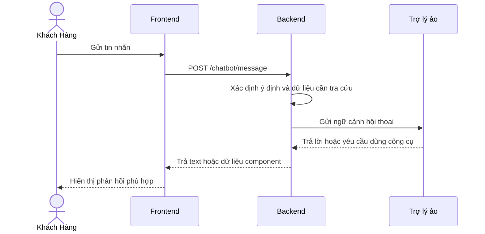
```mermaid
sequenceDiagram
    actor User as Khách Hàng
    participant FE as Frontend
    participant API as Backend
    participant AI as Trợ lý ảo
    
    User->>FE: Gửi tin nhắn
    FE->>API: POST /chatbot/message
    API->>API: Xác định ý định và dữ liệu cần tra cứu
    API->>AI: Gửi ngữ cảnh hội thoại
    AI-->>API: Trả lời hoặc yêu cầu dùng công cụ
    API-->>FE: Trả text hoặc dữ liệu component
    FE-->>User: Hiển thị phản hồi phù hợp
```

### UC-06: Tìm kiếm chuyến tàu
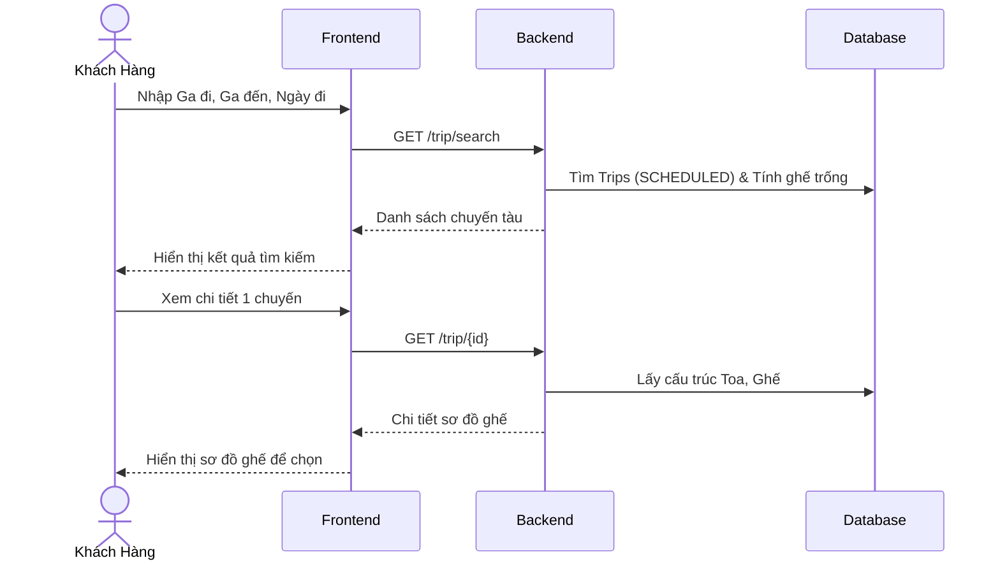
```mermaid
sequenceDiagram
    actor User as Khách Hàng
    participant FE as Frontend
    participant API as Backend
    participant DB as Database
    
    User->>FE: Nhập Ga đi, Ga đến, Ngày đi
    FE->>API: GET /trip/search
    API->>DB: Tìm Trips (SCHEDULED) & Tính ghế trống
    API-->>FE: Danh sách chuyến tàu
    FE-->>User: Hiển thị kết quả tìm kiếm
    
    User->>FE: Xem chi tiết 1 chuyến
    FE->>API: GET /trip/{id}
    API->>DB: Lấy cấu trúc Toa, Ghế
    API-->>FE: Chi tiết sơ đồ ghế
    FE-->>User: Hiển thị sơ đồ ghế để chọn
```

### UC-07: Xem chuyến đang chạy
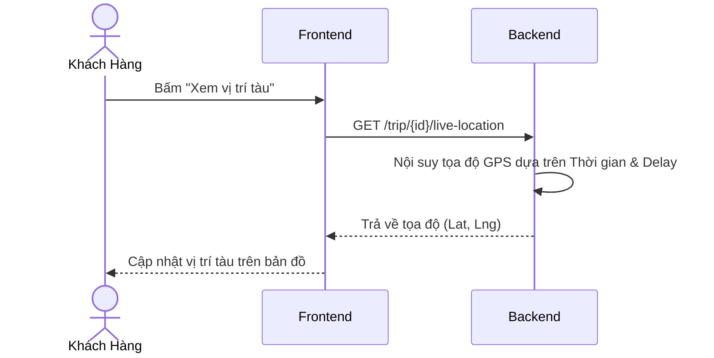
```mermaid
sequenceDiagram
    actor User as Khách Hàng
    participant FE as Frontend
    participant API as Backend
    
    User->>FE: Bấm "Xem vị trí tàu"
    FE->>API: GET /trip/{id}/live-location
    API->>API: Nội suy tọa độ GPS dựa trên Thời gian & Delay
    API-->>FE: Trả về tọa độ (Lat, Lng)
    FE-->>User: Cập nhật vị trí tàu trên bản đồ
```

### UC-08: Quản lý ví điện tử
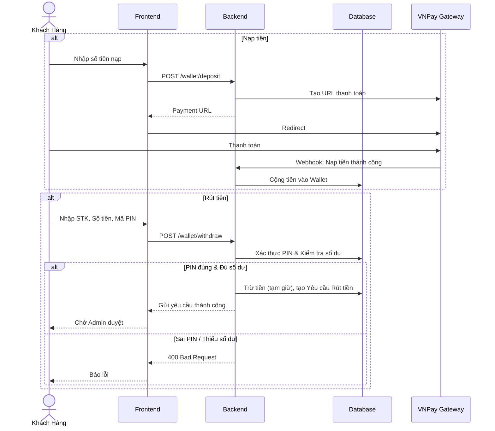
```mermaid
sequenceDiagram
    actor User as Khách Hàng
    participant FE as Frontend
    participant API as Backend
    participant DB as Database
    participant VNPay as VNPay Gateway
    
    %% Nạp tiền
    alt Nạp tiền
        User->>FE: Nhập số tiền nạp
        FE->>API: POST /wallet/deposit
        API->>VNPay: Tạo URL thanh toán
        API-->>FE: Payment URL
        FE->>VNPay: Redirect
        User->>VNPay: Thanh toán
        VNPay->>API: Webhook: Nạp tiền thành công
        API->>DB: Cộng tiền vào Wallet
    end
    
    %% Rút tiền
    alt Rút tiền
        User->>FE: Nhập STK, Số tiền, Mã PIN
        FE->>API: POST /wallet/withdraw
        API->>DB: Xác thực PIN & Kiểm tra số dư
        alt PIN đúng & Đủ số dư
            API->>DB: Trừ tiền (tạm giữ), tạo Yêu cầu Rút tiền
            API-->>FE: Gửi yêu cầu thành công
            FE-->>User: Chờ Admin duyệt
        else Sai PIN / Thiếu số dư
            API-->>FE: 400 Bad Request
            FE-->>User: Báo lỗi
        end
    end
```

### UC-09: Đặt vé tàu
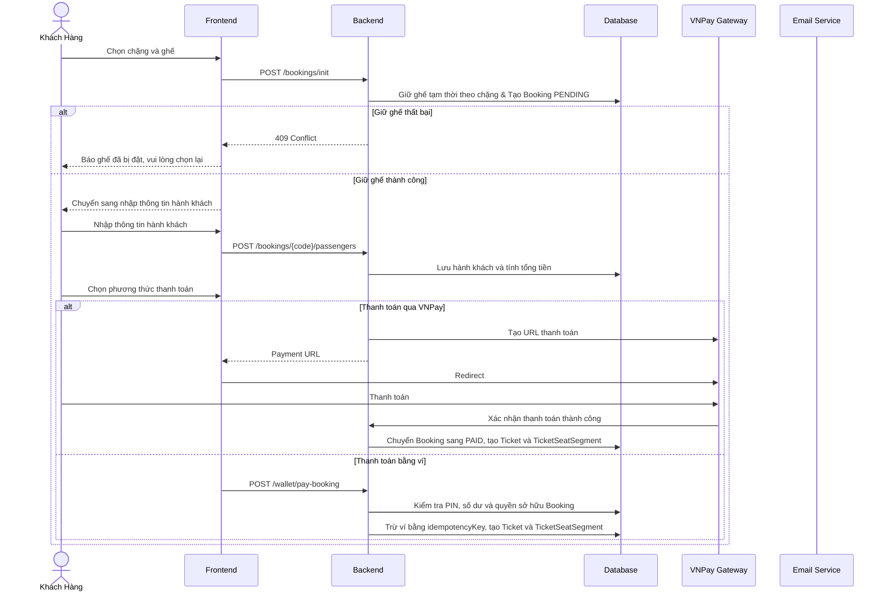
```mermaid
sequenceDiagram
    actor User as Khách Hàng
    participant FE as Frontend
    participant API as Backend
    participant DB as Database
    participant VNPay as VNPay Gateway
    participant Email as Email Service
    
    User->>FE: Chọn chặng và ghế
    FE->>API: POST /bookings/init
    API->>DB: Giữ ghế tạm thời theo chặng & Tạo Booking PENDING
    alt Giữ ghế thất bại
        API-->>FE: 409 Conflict
        FE-->>User: Báo ghế đã bị đặt, vui lòng chọn lại
    else Giữ ghế thành công
        FE-->>User: Chuyển sang nhập thông tin hành khách
        User->>FE: Nhập thông tin hành khách
        FE->>API: POST /bookings/{code}/passengers
        API->>DB: Lưu hành khách và tính tổng tiền
        User->>FE: Chọn phương thức thanh toán
        
        alt Thanh toán qua VNPay
            API->>VNPay: Tạo URL thanh toán
            API-->>FE: Payment URL
            FE->>VNPay: Redirect
            User->>VNPay: Thanh toán
            VNPay->>API: Xác nhận thanh toán thành công
            API->>DB: Chuyển Booking sang PAID, tạo Ticket và TicketSeatSegment
        else Thanh toán bằng ví
            FE->>API: POST /wallet/pay-booking
            API->>DB: Kiểm tra PIN, số dư và quyền sở hữu Booking
            API->>DB: Trừ ví bằng idempotencyKey, tạo Ticket và TicketSeatSegment
        end
    end
```

### UC-10: Xem lịch sử đặt vé
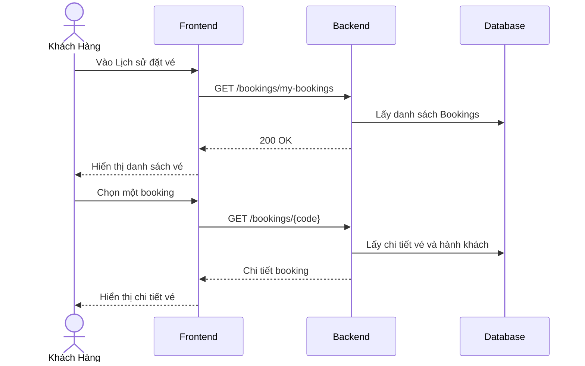
```mermaid
sequenceDiagram
    actor User as Khách Hàng
    participant FE as Frontend
    participant API as Backend
    participant DB as Database
    
    User->>FE: Vào Lịch sử đặt vé
    FE->>API: GET /bookings/my-bookings
    API->>DB: Lấy danh sách Bookings
    API-->>FE: 200 OK
    FE-->>User: Hiển thị danh sách vé
    
    User->>FE: Chọn một booking
    FE->>API: GET /bookings/{code}
    API->>DB: Lấy chi tiết vé và hành khách
    API-->>FE: Chi tiết booking
    FE-->>User: Hiển thị chi tiết vé
```

---

## 2. Quản Trị Viên (Admin)

### UC-11: Xem dashboard và báo cáo
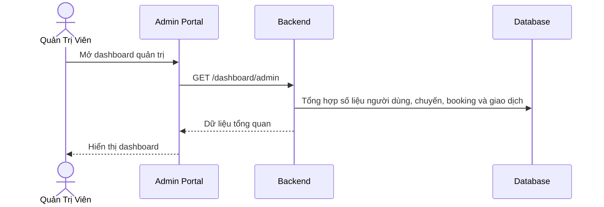
```mermaid
sequenceDiagram
    actor Admin as Quản Trị Viên
    participant FE as Admin Portal
    participant API as Backend
    participant DB as Database
    
    Admin->>FE: Mở dashboard quản trị
    FE->>API: GET /dashboard/admin
    API->>DB: Tổng hợp số liệu người dùng, chuyến, booking và giao dịch
    API-->>FE: Dữ liệu tổng quan
    FE-->>Admin: Hiển thị dashboard
```

### UC-12: Quản lý người dùng
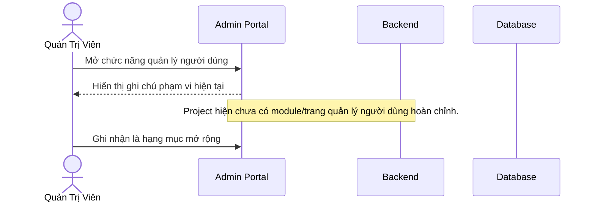
```mermaid
sequenceDiagram
    actor Admin as Quản Trị Viên
    participant FE as Admin Portal
    participant API as Backend
    participant DB as Database
    
    Admin->>FE: Mở chức năng quản lý người dùng
    FE-->>Admin: Hiển thị ghi chú phạm vi hiện tại
    Note over FE,API: Project hiện chưa có module/trang quản lý người dùng hoàn chỉnh.
    Admin->>FE: Ghi nhận là hạng mục mở rộng
```

### UC-13: Quản lý trạng thái ghế
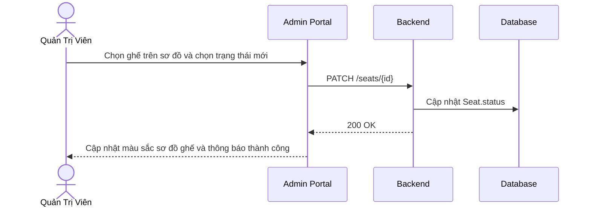
```mermaid
sequenceDiagram
    actor Admin as Quản Trị Viên
    participant FE as Admin Portal
    participant API as Backend
    participant DB as Database

    Admin->>FE: Chọn ghế trên sơ đồ và chọn trạng thái mới
    FE->>API: PATCH /seats/{id}
    API->>DB: Cập nhật Seat.status
    API-->>FE: 200 OK
    FE-->>Admin: Cập nhật màu sắc sơ đồ ghế và thông báo thành công
```

### UC-21: Xử lý sự cố ghế hỏng
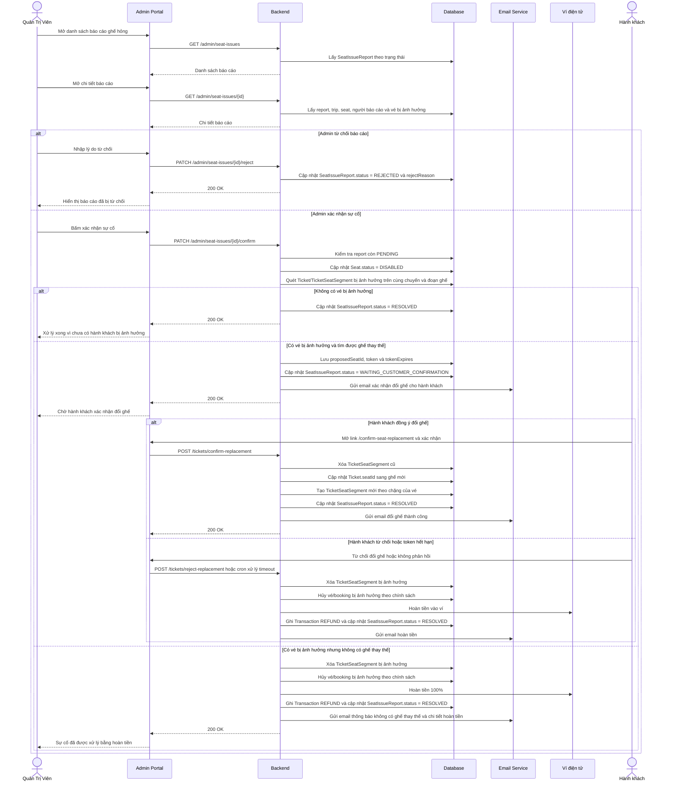
```mermaid
sequenceDiagram
    actor Admin as Quản Trị Viên
    participant FE as Admin Portal
    participant API as Backend
    participant DB as Database
    participant Email as Email Service
    participant Wallet as Ví điện tử
    actor Customer as Hành khách

    Admin->>FE: Mở danh sách báo cáo ghế hỏng
    FE->>API: GET /admin/seat-issues
    API->>DB: Lấy SeatIssueReport theo trạng thái
    API-->>FE: Danh sách báo cáo
    Admin->>FE: Mở chi tiết báo cáo
    FE->>API: GET /admin/seat-issues/{id}
    API->>DB: Lấy report, trip, seat, người báo cáo và vé bị ảnh hưởng
    API-->>FE: Chi tiết báo cáo

    alt Admin từ chối báo cáo
        Admin->>FE: Nhập lý do từ chối
        FE->>API: PATCH /admin/seat-issues/{id}/reject
        API->>DB: Cập nhật SeatIssueReport.status = REJECTED và rejectReason
        API-->>FE: 200 OK
        FE-->>Admin: Hiển thị báo cáo đã bị từ chối
    else Admin xác nhận sự cố
        Admin->>FE: Bấm xác nhận sự cố
        FE->>API: PATCH /admin/seat-issues/{id}/confirm
        API->>DB: Kiểm tra report còn PENDING
        API->>DB: Cập nhật Seat.status = DISABLED
        API->>DB: Quét Ticket/TicketSeatSegment bị ảnh hưởng trên cùng chuyến và đoạn ghế

        alt Không có vé bị ảnh hưởng
            API->>DB: Cập nhật SeatIssueReport.status = RESOLVED
            API-->>FE: 200 OK
            FE-->>Admin: Xử lý xong vì chưa có hành khách bị ảnh hưởng
        else Có vé bị ảnh hưởng và tìm được ghế thay thế
            API->>DB: Lưu proposedSeatId, token và tokenExpires
            API->>DB: Cập nhật SeatIssueReport.status = WAITING_CUSTOMER_CONFIRMATION
            API->>Email: Gửi email xác nhận đổi ghế cho hành khách
            API-->>FE: 200 OK
            FE-->>Admin: Chờ hành khách xác nhận đổi ghế

            alt Hành khách đồng ý đổi ghế
                Customer->>FE: Mở link /confirm-seat-replacement và xác nhận
                FE->>API: POST /tickets/confirm-replacement
                API->>DB: Xóa TicketSeatSegment cũ
                API->>DB: Cập nhật Ticket.seatId sang ghế mới
                API->>DB: Tạo TicketSeatSegment mới theo chặng của vé
                API->>DB: Cập nhật SeatIssueReport.status = RESOLVED
                API->>Email: Gửi email đổi ghế thành công
                API-->>FE: 200 OK
            else Hành khách từ chối hoặc token hết hạn
                Customer->>FE: Từ chối đổi ghế hoặc không phản hồi
                FE->>API: POST /tickets/reject-replacement hoặc cron xử lý timeout
                API->>DB: Xóa TicketSeatSegment bị ảnh hưởng
                API->>DB: Hủy vé/booking bị ảnh hưởng theo chính sách
                API->>Wallet: Hoàn tiền vào ví
                API->>DB: Ghi Transaction REFUND và cập nhật SeatIssueReport.status = RESOLVED
                API->>Email: Gửi email hoàn tiền
            end
        else Có vé bị ảnh hưởng nhưng không có ghế thay thế
            API->>DB: Xóa TicketSeatSegment bị ảnh hưởng
            API->>DB: Hủy vé/booking bị ảnh hưởng theo chính sách
            API->>Wallet: Hoàn tiền 100%
            API->>DB: Ghi Transaction REFUND và cập nhật SeatIssueReport.status = RESOLVED
            API->>Email: Gửi email thông báo không có ghế thay thế và chi tiết hoàn tiền
            API-->>FE: 200 OK
            FE-->>Admin: Sự cố đã được xử lý bằng hoàn tiền
        end
    end
```

### UC-14: Quản lý tàu
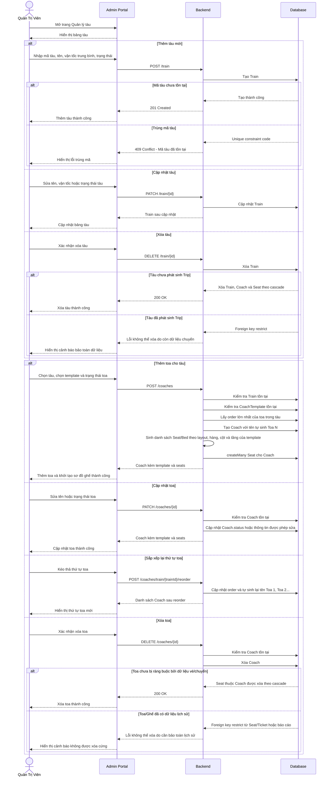
```mermaid
sequenceDiagram
    actor Admin as Quản Trị Viên
    participant FE as Admin Portal
    participant API as Backend
    participant DB as Database

    Admin->>FE: Mở trang Quản lý tàu
    FE-->>Admin: Hiển thị bảng tàu

    alt Thêm tàu mới
        Admin->>FE: Nhập mã tàu, tên, vận tốc trung bình, trạng thái
        FE->>API: POST /train
        API->>DB: Tạo Train
        alt Mã tàu chưa tồn tại
            DB-->>API: Tạo thành công
            API-->>FE: 201 Created
            FE-->>Admin: Thêm tàu thành công
        else Trùng mã tàu
            DB-->>API: Unique constraint code
            API-->>FE: 409 Conflict - Mã tàu đã tồn tại
            FE-->>Admin: Hiển thị lỗi trùng mã
        end
    else Cập nhật tàu
        Admin->>FE: Sửa tên, vận tốc hoặc trạng thái tàu
        FE->>API: PATCH /train/{id}
        API->>DB: Cập nhật Train
        API-->>FE: Train sau cập nhật
        FE-->>Admin: Cập nhật bảng tàu
    else Xóa tàu
        Admin->>FE: Xác nhận xóa tàu
        FE->>API: DELETE /train/{id}
        API->>DB: Xóa Train
        alt Tàu chưa phát sinh Trip
            DB-->>API: Xóa Train, Coach và Seat theo cascade
            API-->>FE: 200 OK
            FE-->>Admin: Xóa tàu thành công
        else Tàu đã phát sinh Trip
            DB-->>API: Foreign key restrict
            API-->>FE: Lỗi không thể xóa do còn dữ liệu chuyến
            FE-->>Admin: Hiển thị cảnh báo bảo toàn dữ liệu
        end
    end

    alt Thêm toa cho tàu
        Admin->>FE: Chọn tàu, chọn template và trạng thái toa
        FE->>API: POST /coaches
        API->>DB: Kiểm tra Train tồn tại
        API->>DB: Kiểm tra CoachTemplate tồn tại
        API->>DB: Lấy order lớn nhất của toa trong tàu
        API->>DB: Tạo Coach với tên tự sinh Toa N
        API->>API: Sinh danh sách Seat/Bed theo layout, hàng, cột và tầng của template
        API->>DB: createMany Seat cho Coach
        API-->>FE: Coach kèm template và seats
        FE-->>Admin: Thêm toa và khởi tạo sơ đồ ghế thành công
    else Cập nhật toa
        Admin->>FE: Sửa tên hoặc trạng thái toa
        FE->>API: PATCH /coaches/{id}
        API->>DB: Kiểm tra Coach tồn tại
        API->>DB: Cập nhật Coach.status hoặc thông tin được phép sửa
        API-->>FE: Coach kèm template và seats
        FE-->>Admin: Cập nhật toa thành công
    else Sắp xếp lại thứ tự toa
        Admin->>FE: Kéo thả thứ tự toa
        FE->>API: POST /coaches/train/{trainId}/reorder
        API->>DB: Cập nhật order và tự sinh lại tên Toa 1, Toa 2...
        API-->>FE: Danh sách Coach sau reorder
        FE-->>Admin: Hiển thị thứ tự toa mới
    else Xóa toa
        Admin->>FE: Xác nhận xóa toa
        FE->>API: DELETE /coaches/{id}
        API->>DB: Kiểm tra Coach tồn tại
        API->>DB: Xóa Coach
        alt Toa chưa bị ràng buộc bởi dữ liệu vé/chuyến
            DB-->>API: Seat thuộc Coach được xóa theo cascade
            API-->>FE: 200 OK
            FE-->>Admin: Xóa toa thành công
        else Toa/Ghế đã có dữ liệu lịch sử
            DB-->>API: Foreign key restrict từ Seat/Ticket hoặc báo cáo
            API-->>FE: Lỗi không thể xóa do cần bảo toàn lịch sử
            FE-->>Admin: Hiển thị cảnh báo không được xóa cứng
        end
    end
```

### UC-19: Quản lý chuyến tàu
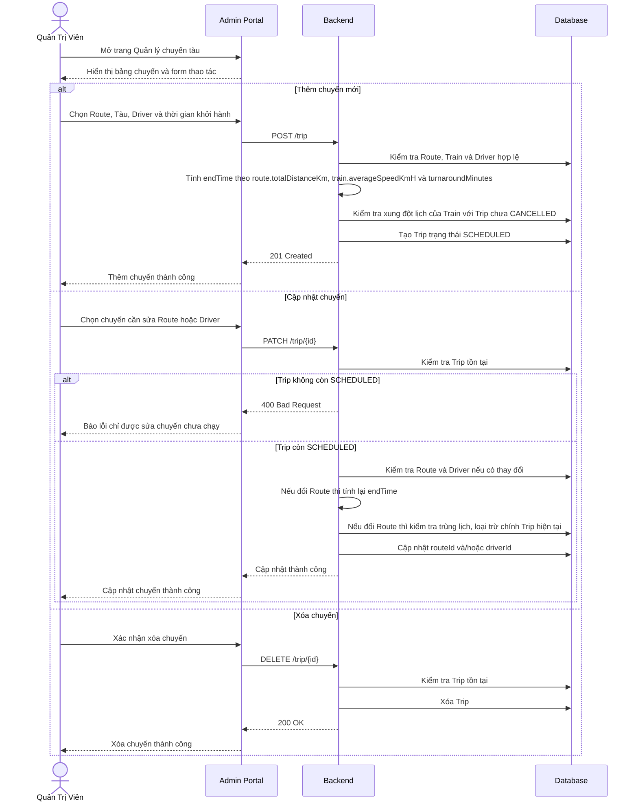
```mermaid
sequenceDiagram
    actor Admin as Quản Trị Viên
    participant FE as Admin Portal
    participant API as Backend
    participant DB as Database
    
    Admin->>FE: Mở trang Quản lý chuyến tàu
    FE-->>Admin: Hiển thị bảng chuyến và form thao tác

    alt Thêm chuyến mới
        Admin->>FE: Chọn Route, Tàu, Driver và thời gian khởi hành
        FE->>API: POST /trip
        API->>DB: Kiểm tra Route, Train và Driver hợp lệ
        API->>API: Tính endTime theo route.totalDistanceKm, train.averageSpeedKmH và turnaroundMinutes
        API->>DB: Kiểm tra xung đột lịch của Train với Trip chưa CANCELLED
        API->>DB: Tạo Trip trạng thái SCHEDULED
        API-->>FE: 201 Created
        FE-->>Admin: Thêm chuyến thành công
    else Cập nhật chuyến
        Admin->>FE: Chọn chuyến cần sửa Route hoặc Driver
        FE->>API: PATCH /trip/{id}
        API->>DB: Kiểm tra Trip tồn tại
        alt Trip không còn SCHEDULED
            API-->>FE: 400 Bad Request
            FE-->>Admin: Báo lỗi chỉ được sửa chuyến chưa chạy
        else Trip còn SCHEDULED
            API->>DB: Kiểm tra Route và Driver nếu có thay đổi
            API->>API: Nếu đổi Route thì tính lại endTime
            API->>DB: Nếu đổi Route thì kiểm tra trùng lịch, loại trừ chính Trip hiện tại
            API->>DB: Cập nhật routeId và/hoặc driverId
            API-->>FE: Cập nhật thành công
            FE-->>Admin: Cập nhật chuyến thành công
        end
    else Xóa chuyến
        Admin->>FE: Xác nhận xóa chuyến
        FE->>API: DELETE /trip/{id}
        API->>DB: Kiểm tra Trip tồn tại
        API->>DB: Xóa Trip
        API-->>FE: 200 OK
        FE-->>Admin: Xóa chuyến thành công
    end
```

### UC-20: Quản lý cơ sở hạ tầng
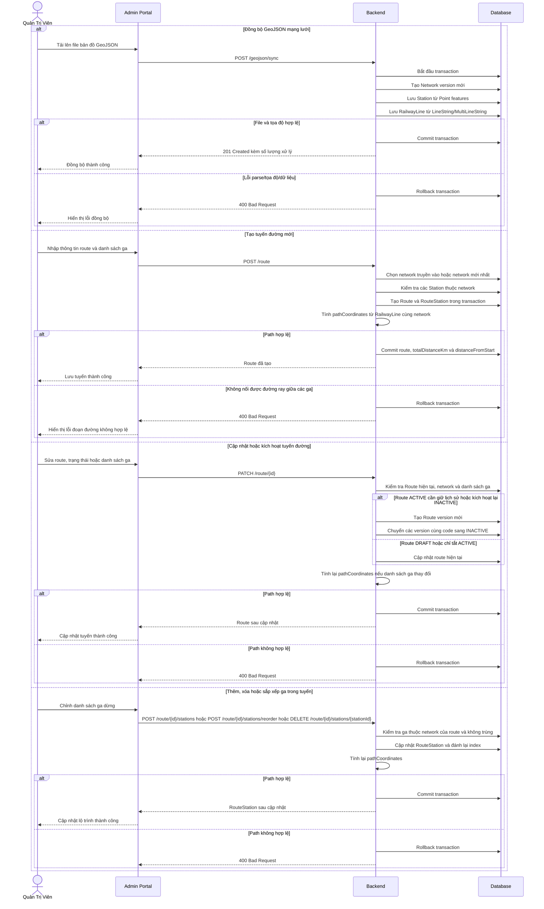
```mermaid
sequenceDiagram
    actor Admin as Quản Trị Viên
    participant FE as Admin Portal
    participant API as Backend
    participant DB as Database
    
    alt Đồng bộ GeoJSON mạng lưới
        Admin->>FE: Tải lên file bản đồ GeoJSON
        FE->>API: POST /geojson/sync
        API->>DB: Bắt đầu transaction
        API->>DB: Tạo Network version mới
        API->>DB: Lưu Station từ Point features
        API->>DB: Lưu RailwayLine từ LineString/MultiLineString
        alt File và tọa độ hợp lệ
            API->>DB: Commit transaction
            API-->>FE: 201 Created kèm số lượng xử lý
            FE-->>Admin: Đồng bộ thành công
        else Lỗi parse/tọa độ/dữ liệu
            API->>DB: Rollback transaction
            API-->>FE: 400 Bad Request
            FE-->>Admin: Hiển thị lỗi đồng bộ
        end
    else Tạo tuyến đường mới
        Admin->>FE: Nhập thông tin route và danh sách ga
        FE->>API: POST /route
        API->>DB: Chọn network truyền vào hoặc network mới nhất
        API->>DB: Kiểm tra các Station thuộc network
        API->>DB: Tạo Route và RouteStation trong transaction
        API->>API: Tính pathCoordinates từ RailwayLine cùng network
        alt Path hợp lệ
            API->>DB: Commit route, totalDistanceKm và distanceFromStart
            API-->>FE: Route đã tạo
            FE-->>Admin: Lưu tuyến thành công
        else Không nối được đường ray giữa các ga
            API->>DB: Rollback transaction
            API-->>FE: 400 Bad Request
            FE-->>Admin: Hiển thị lỗi đoạn đường không hợp lệ
        end
    else Cập nhật hoặc kích hoạt tuyến đường
        Admin->>FE: Sửa route, trạng thái hoặc danh sách ga
        FE->>API: PATCH /route/{id}
        API->>DB: Kiểm tra Route hiện tại, network và danh sách ga
        alt Route ACTIVE cần giữ lịch sử hoặc kích hoạt lại INACTIVE
            API->>DB: Tạo Route version mới
            API->>DB: Chuyển các version cùng code sang INACTIVE
        else Route DRAFT hoặc chỉ tắt ACTIVE
            API->>DB: Cập nhật route hiện tại
        end
        API->>API: Tính lại pathCoordinates nếu danh sách ga thay đổi
        alt Path hợp lệ
            API->>DB: Commit transaction
            API-->>FE: Route sau cập nhật
            FE-->>Admin: Cập nhật tuyến thành công
        else Path không hợp lệ
            API->>DB: Rollback transaction
            API-->>FE: 400 Bad Request
        end
    else Thêm, xóa hoặc sắp xếp ga trong tuyến
        Admin->>FE: Chỉnh danh sách ga dừng
        FE->>API: POST /route/{id}/stations hoặc POST /route/{id}/stations/reorder hoặc DELETE /route/{id}/stations/{stationId}
        API->>DB: Kiểm tra ga thuộc network của route và không trùng
        API->>DB: Cập nhật RouteStation và đánh lại index
        API->>API: Tính lại pathCoordinates
        alt Path hợp lệ
            API->>DB: Commit transaction
            API-->>FE: RouteStation sau cập nhật
            FE-->>Admin: Cập nhật lộ trình thành công
        else Path không hợp lệ
            API->>DB: Rollback transaction
            API-->>FE: 400 Bad Request
        end
    end
```

---

## 3. Lái Tàu (Driver)

### UC-15: Yêu cầu hủy chuyến khẩn cấp
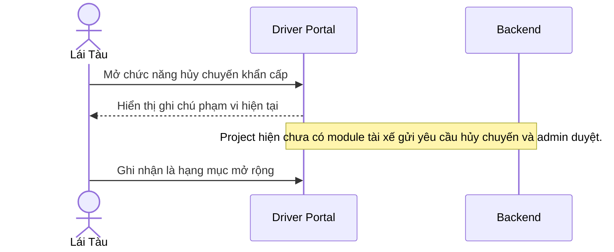
```mermaid
sequenceDiagram
    actor Driver as Lái Tàu
    participant FE as Driver Portal
    participant API as Backend
    
    Driver->>FE: Mở chức năng hủy chuyến khẩn cấp
    FE-->>Driver: Hiển thị ghi chú phạm vi hiện tại
    Note over FE,API: Project hiện chưa có module tài xế gửi yêu cầu hủy chuyến và admin duyệt.
    Driver->>FE: Ghi nhận là hạng mục mở rộng
```

### UC-16: Xem chuyến được phân công
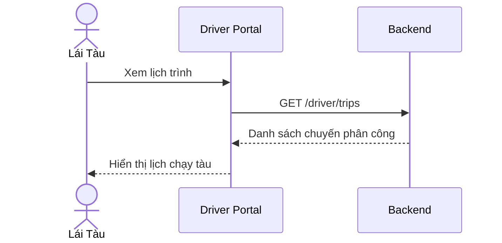
```mermaid
sequenceDiagram
    actor Driver as Lái Tàu
    participant FE as Driver Portal
    participant API as Backend
    
    Driver->>FE: Xem lịch trình
    FE->>API: GET /driver/trips
    API-->>FE: Danh sách chuyến phân công
    FE-->>Driver: Hiển thị lịch chạy tàu
```

### UC-17: Báo cáo delay
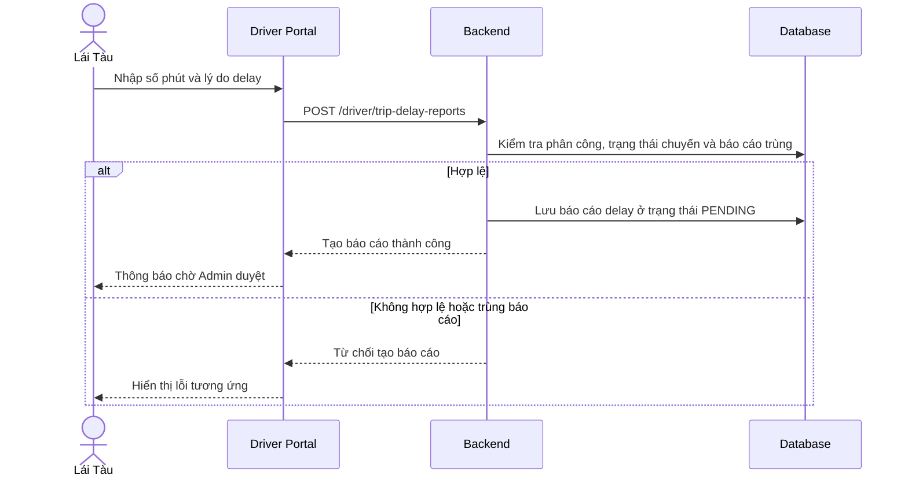
```mermaid
sequenceDiagram
    actor Driver as Lái Tàu
    participant FE as Driver Portal
    participant API as Backend
    participant DB as Database
    
    Driver->>FE: Nhập số phút và lý do delay
    FE->>API: POST /driver/trip-delay-reports
    API->>DB: Kiểm tra phân công, trạng thái chuyến và báo cáo trùng
    alt Hợp lệ
        API->>DB: Lưu báo cáo delay ở trạng thái PENDING
        API-->>FE: Tạo báo cáo thành công
        FE-->>Driver: Thông báo chờ Admin duyệt
    else Không hợp lệ hoặc trùng báo cáo
        API-->>FE: Từ chối tạo báo cáo
        FE-->>Driver: Hiển thị lỗi tương ứng
    end
```

### UC-18: Báo cáo ghế hỏng
```mermaid
sequenceDiagram
    actor Driver as Lái Tàu
    participant FE as Driver Portal
    participant API as Backend
    participant DB as Database
    
    Driver->>FE: Chọn ghế và nhập mô tả sự cố
    FE->>API: POST /driver/seat-issues
    API->>DB: Kiểm tra phân công, trạng thái chuyến, ghế thuộc tàu và báo cáo trùng
    alt Chuyến còn hợp lệ
        API->>DB: Lưu Yêu cầu (PENDING)
        API-->>FE: 201 Created
        FE-->>Driver: Báo cáo đã gửi cho Admin xử lý
    else Chuyến đã kết thúc hoặc không hoạt động
        API-->>FE: 400 Bad Request
        FE-->>Driver: Khóa thao tác báo cáo ghế hỏng
    end
```

---

## 4. Hệ Thống Tự Động

Luồng xử lý tự động vòng đời chuyến tàu.

```mermaid
sequenceDiagram
    participant Auto as Cơ chế tự động
    participant API as Backend
    participant DB as Database
    
    loop Mỗi 1 phút
        Auto->>API: Kiểm tra các chuyến theo thời gian vận hành
        
        %% Chuyển trạng thái
        API->>DB: Cập nhật Trip SCHEDULED -> IN_PROGRESS (Nếu đến giờ chạy)
        API->>DB: Cập nhật Trip IN_PROGRESS -> COMPLETED (Nếu đã tới đích)
    end
```
