# Biểu Đồ Tuần Tự (Sequence Diagrams) - 20 Use Cases

Tài liệu này cung cấp biểu đồ tuần tự cho 20 Use Cases. Các biểu đồ tập trung vào luồng giao tiếp cốt lõi giữa người dùng, giao diện và hệ thống; những luồng chưa có module hoàn chỉnh trong project hiện tại được ghi rõ là phạm vi mở rộng.

---

## 1. Khách Hàng (Customer)

### UC-01: Đăng ký tài khoản
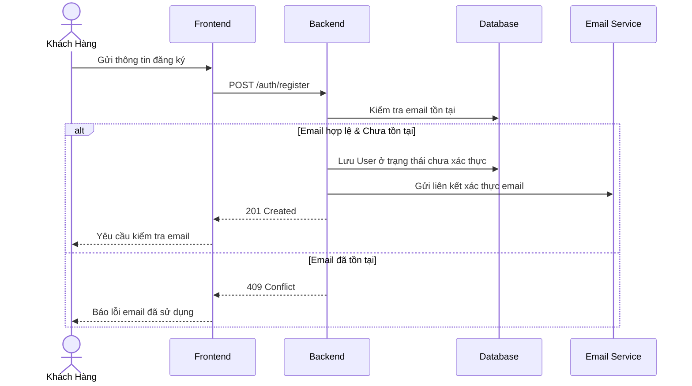
```mermaid
sequenceDiagram
    actor User as Khách Hàng
    participant FE as Frontend
    participant API as Backend
    participant DB as Database
    participant Email as Email Service
    
    User->>FE: Gửi thông tin đăng ký
    FE->>API: POST /auth/register
    API->>DB: Kiểm tra email tồn tại
    alt Email hợp lệ & Chưa tồn tại
        API->>DB: Lưu User ở trạng thái chưa xác thực
        API->>Email: Gửi liên kết xác thực email
        API-->>FE: 201 Created
        FE-->>User: Yêu cầu kiểm tra email
    else Email đã tồn tại
        API-->>FE: 409 Conflict
        FE-->>User: Báo lỗi email đã sử dụng
    end
```

### UC-02: Đăng nhập hệ thống
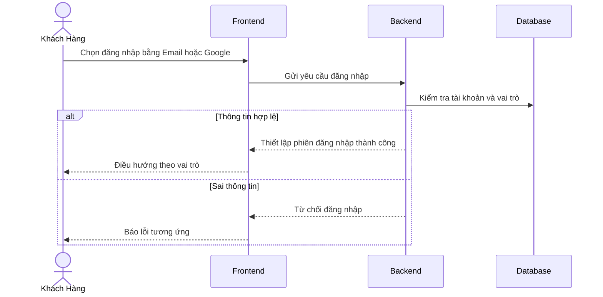
```mermaid
sequenceDiagram
    actor User as Khách Hàng
    participant FE as Frontend
    participant API as Backend
    participant DB as Database
    
    User->>FE: Chọn đăng nhập bằng Email hoặc Google
    FE->>API: Gửi yêu cầu đăng nhập
    API->>DB: Kiểm tra tài khoản và vai trò
    alt Thông tin hợp lệ
        API-->>FE: Thiết lập phiên đăng nhập thành công
        FE-->>User: Điều hướng theo vai trò
    else Sai thông tin
        API-->>FE: Từ chối đăng nhập
        FE-->>User: Báo lỗi tương ứng
    end
```

### UC-03: Quản lý hồ sơ
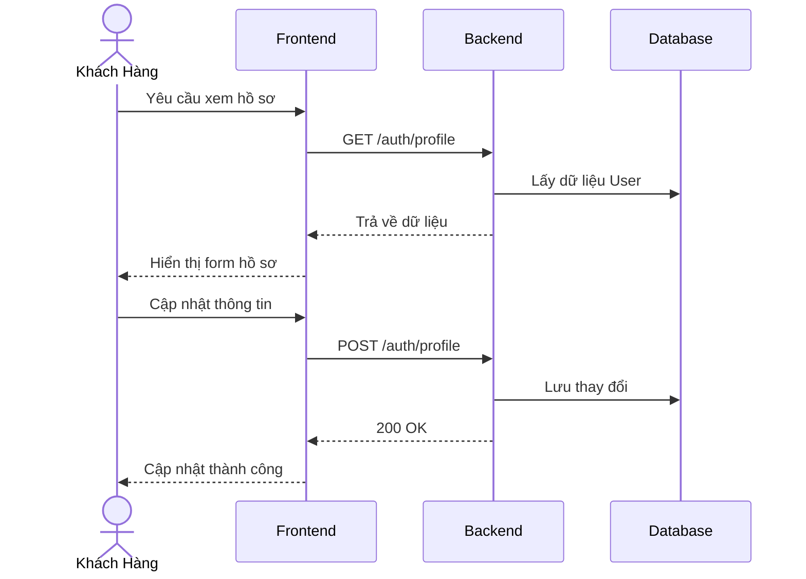
```mermaid
sequenceDiagram
    actor User as Khách Hàng
    participant FE as Frontend
    participant API as Backend
    participant DB as Database
    
    User->>FE: Yêu cầu xem hồ sơ
    FE->>API: GET /auth/profile
    API->>DB: Lấy dữ liệu User
    API-->>FE: Trả về dữ liệu
    FE-->>User: Hiển thị form hồ sơ
    
    User->>FE: Cập nhật thông tin
    FE->>API: POST /auth/profile
    API->>DB: Lưu thay đổi
    API-->>FE: 200 OK
    FE-->>User: Cập nhật thành công
```

### UC-04: Xác nhận đổi ghế
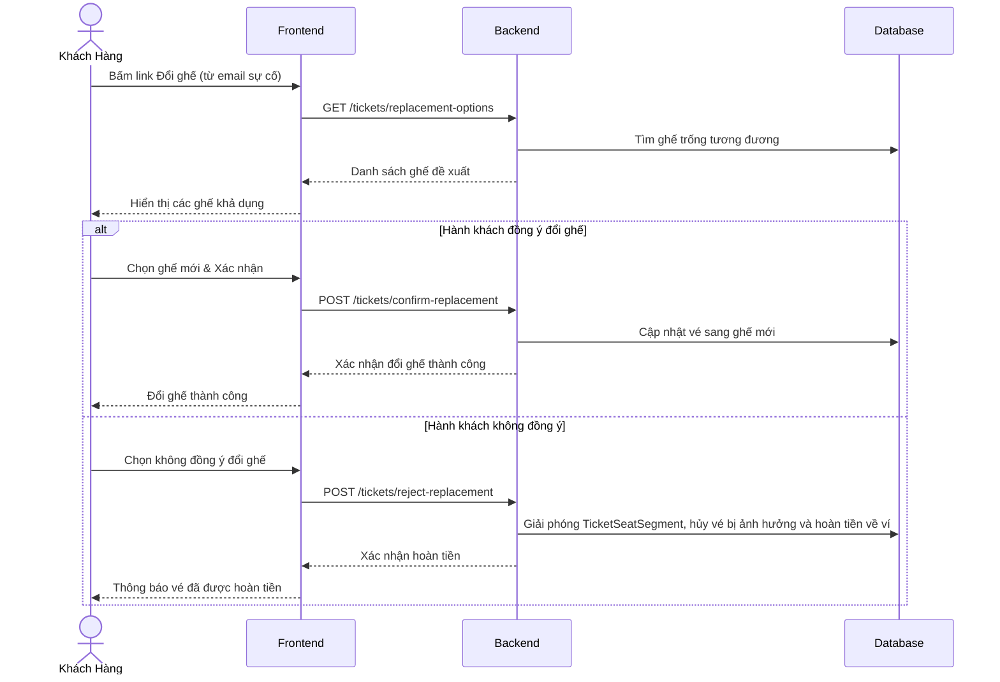
```mermaid
sequenceDiagram
    actor User as Khách Hàng
    participant FE as Frontend
    participant API as Backend
    participant DB as Database
    
    User->>FE: Bấm link Đổi ghế (từ email sự cố)
    FE->>API: GET /tickets/replacement-options
    API->>DB: Tìm ghế trống tương đương
    API-->>FE: Danh sách ghế đề xuất
    FE-->>User: Hiển thị các ghế khả dụng
    
    alt Hành khách đồng ý đổi ghế
        User->>FE: Chọn ghế mới & Xác nhận
        FE->>API: POST /tickets/confirm-replacement
        API->>DB: Cập nhật vé sang ghế mới
        API-->>FE: Xác nhận đổi ghế thành công
        FE-->>User: Đổi ghế thành công
    else Hành khách không đồng ý
        User->>FE: Chọn không đồng ý đổi ghế
        FE->>API: POST /tickets/reject-replacement
        API->>DB: Giải phóng TicketSeatSegment, hủy vé bị ảnh hưởng và hoàn tiền về ví
        API-->>FE: Xác nhận hoàn tiền
        FE-->>User: Thông báo vé đã được hoàn tiền
    end
```

### UC-05: Chat với Chatbot
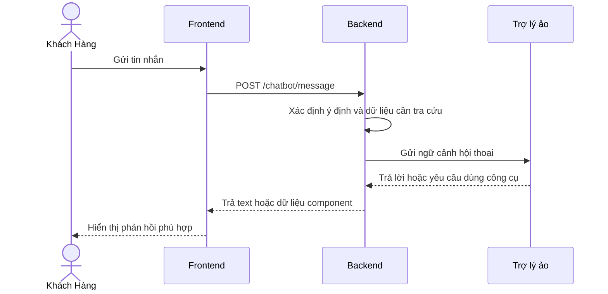
```mermaid
sequenceDiagram
    actor User as Khách Hàng
    participant FE as Frontend
    participant API as Backend
    participant AI as Trợ lý ảo
    
    User->>FE: Gửi tin nhắn
    FE->>API: POST /chatbot/message
    API->>API: Xác định ý định và dữ liệu cần tra cứu
    API->>AI: Gửi ngữ cảnh hội thoại
    AI-->>API: Trả lời hoặc yêu cầu dùng công cụ
    API-->>FE: Trả text hoặc dữ liệu component
    FE-->>User: Hiển thị phản hồi phù hợp
```

### UC-06: Tìm kiếm chuyến tàu
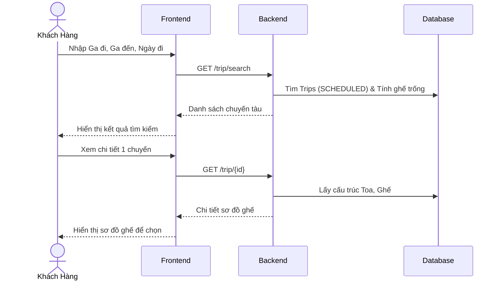
```mermaid
sequenceDiagram
    actor User as Khách Hàng
    participant FE as Frontend
    participant API as Backend
    participant DB as Database
    
    User->>FE: Nhập Ga đi, Ga đến, Ngày đi
    FE->>API: GET /trip/search
    API->>DB: Tìm Trips (SCHEDULED) & Tính ghế trống
    API-->>FE: Danh sách chuyến tàu
    FE-->>User: Hiển thị kết quả tìm kiếm
    
    User->>FE: Xem chi tiết 1 chuyến
    FE->>API: GET /trip/{id}
    API->>DB: Lấy cấu trúc Toa, Ghế
    API-->>FE: Chi tiết sơ đồ ghế
    FE-->>User: Hiển thị sơ đồ ghế để chọn
```

### UC-07: Xem chuyến đang chạy
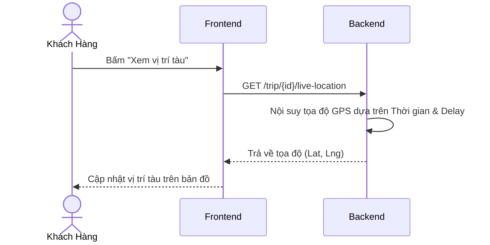
```mermaid
sequenceDiagram
    actor User as Khách Hàng
    participant FE as Frontend
    participant API as Backend
    
    User->>FE: Bấm "Xem vị trí tàu"
    FE->>API: GET /trip/{id}/live-location
    API->>API: Nội suy tọa độ GPS dựa trên Thời gian & Delay
    API-->>FE: Trả về tọa độ (Lat, Lng)
    FE-->>User: Cập nhật vị trí tàu trên bản đồ
```

### UC-08: Quản lý ví điện tử
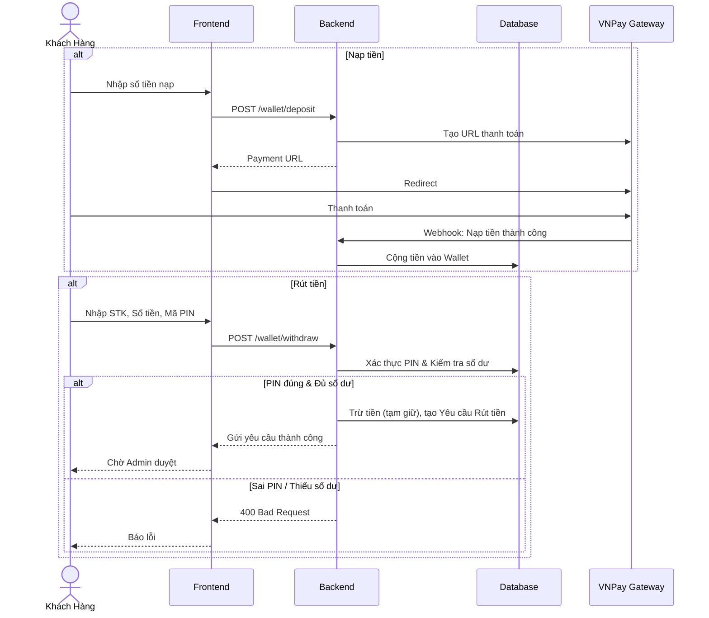
```mermaid
sequenceDiagram
    actor User as Khách Hàng
    participant FE as Frontend
    participant API as Backend
    participant DB as Database
    participant VNPay as VNPay Gateway
    
    %% Nạp tiền
    alt Nạp tiền
        User->>FE: Nhập số tiền nạp
        FE->>API: POST /wallet/deposit
        API->>VNPay: Tạo URL thanh toán
        API-->>FE: Payment URL
        FE->>VNPay: Redirect
        User->>VNPay: Thanh toán
        VNPay->>API: Webhook: Nạp tiền thành công
        API->>DB: Cộng tiền vào Wallet
    end
    
    %% Rút tiền
    alt Rút tiền
        User->>FE: Nhập STK, Số tiền, Mã PIN
        FE->>API: POST /wallet/withdraw
        API->>DB: Xác thực PIN & Kiểm tra số dư
        alt PIN đúng & Đủ số dư
            API->>DB: Trừ tiền (tạm giữ), tạo Yêu cầu Rút tiền
            API-->>FE: Gửi yêu cầu thành công
            FE-->>User: Chờ Admin duyệt
        else Sai PIN / Thiếu số dư
            API-->>FE: 400 Bad Request
            FE-->>User: Báo lỗi
        end
    end
```

### UC-09: Đặt vé tàu
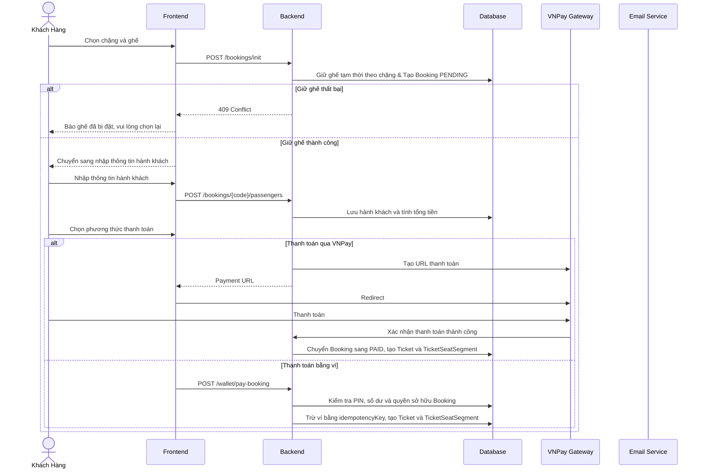
```mermaid
sequenceDiagram
    actor User as Khách Hàng
    participant FE as Frontend
    participant API as Backend
    participant DB as Database
    participant VNPay as VNPay Gateway
    participant Email as Email Service
    
    User->>FE: Chọn chặng và ghế
    FE->>API: POST /bookings/init
    API->>DB: Giữ ghế tạm thời theo chặng & Tạo Booking PENDING
    alt Giữ ghế thất bại
        API-->>FE: 409 Conflict
        FE-->>User: Báo ghế đã bị đặt, vui lòng chọn lại
    else Giữ ghế thành công
        FE-->>User: Chuyển sang nhập thông tin hành khách
        User->>FE: Nhập thông tin hành khách
        FE->>API: POST /bookings/{code}/passengers
        API->>DB: Lưu hành khách và tính tổng tiền
        User->>FE: Chọn phương thức thanh toán
        
        alt Thanh toán qua VNPay
            API->>VNPay: Tạo URL thanh toán
            API-->>FE: Payment URL
            FE->>VNPay: Redirect
            User->>VNPay: Thanh toán
            VNPay->>API: Xác nhận thanh toán thành công
            API->>DB: Chuyển Booking sang PAID, tạo Ticket và TicketSeatSegment
        else Thanh toán bằng ví
            FE->>API: POST /wallet/pay-booking
            API->>DB: Kiểm tra PIN, số dư và quyền sở hữu Booking
            API->>DB: Trừ ví bằng idempotencyKey, tạo Ticket và TicketSeatSegment
        end
    end
```

### UC-10: Xem lịch sử đặt vé
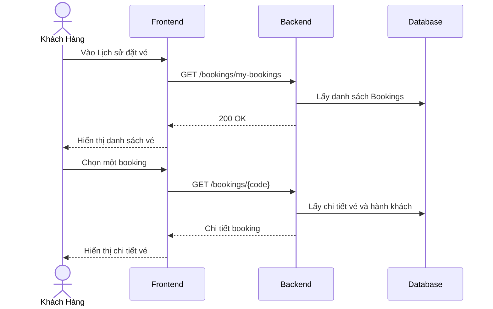
```mermaid
sequenceDiagram
    actor User as Khách Hàng
    participant FE as Frontend
    participant API as Backend
    participant DB as Database
    
    User->>FE: Vào Lịch sử đặt vé
    FE->>API: GET /bookings/my-bookings
    API->>DB: Lấy danh sách Bookings
    API-->>FE: 200 OK
    FE-->>User: Hiển thị danh sách vé
    
    User->>FE: Chọn một booking
    FE->>API: GET /bookings/{code}
    API->>DB: Lấy chi tiết vé và hành khách
    API-->>FE: Chi tiết booking
    FE-->>User: Hiển thị chi tiết vé
```

---

## 2. Quản Trị Viên (Admin)

### UC-11: Xem dashboard và báo cáo
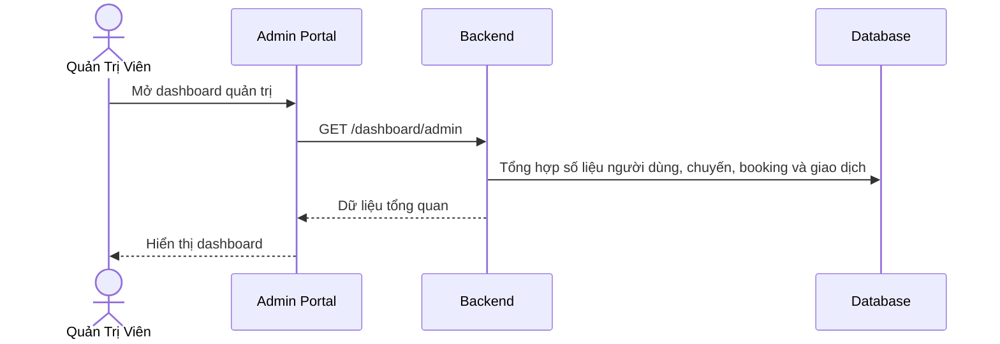
```mermaid
sequenceDiagram
    actor Admin as Quản Trị Viên
    participant FE as Admin Portal
    participant API as Backend
    participant DB as Database
    
    Admin->>FE: Mở dashboard quản trị
    FE->>API: GET /dashboard/admin
    API->>DB: Tổng hợp số liệu người dùng, chuyến, booking và giao dịch
    API-->>FE: Dữ liệu tổng quan
    FE-->>Admin: Hiển thị dashboard
```

### UC-12: Quản lý người dùng
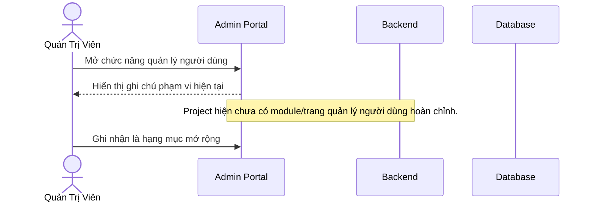
```mermaid
sequenceDiagram
    actor Admin as Quản Trị Viên
    participant FE as Admin Portal
    participant API as Backend
    participant DB as Database
    
    Admin->>FE: Mở chức năng quản lý người dùng
    FE-->>Admin: Hiển thị ghi chú phạm vi hiện tại
    Note over FE,API: Project hiện chưa có module/trang quản lý người dùng hoàn chỉnh.
    Admin->>FE: Ghi nhận là hạng mục mở rộng
```

### UC-13: Quản lý trạng thái ghế
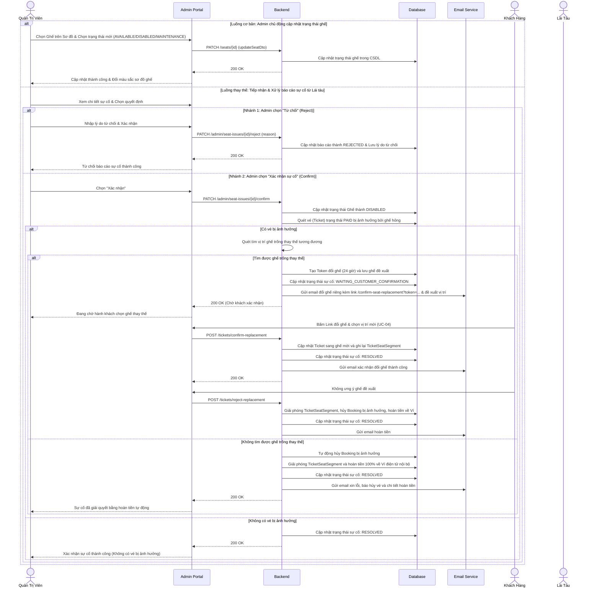
```mermaid
sequenceDiagram
    actor Admin as Quản Trị Viên
    participant FE as Admin Portal
    participant API as Backend
    participant DB as Database
    participant Email as Email Service
    actor Customer as Khách Hàng
    actor Driver as Lái Tàu

    alt Luồng cơ bản: Admin chủ động cập nhật trạng thái ghế
        Admin->>FE: Chọn Ghế trên Sơ đồ & Chọn trạng thái mới (AVAILABLE/DISABLED/MAINTENANCE)
        FE->>API: PATCH /seats/{id} (updateSeatDto)
        API->>DB: Cập nhật trạng thái ghế trong CSDL
        API-->>FE: 200 OK
        FE-->>Admin: Cập nhật thành công & Đổi màu sắc sơ đồ ghế
        
    else Luồng thay thế: Tiếp nhận & Xử lý báo cáo sự cố từ Lái tàu
        Admin->>FE: Xem chi tiết sự cố & Chọn quyết định
        
        alt Nhánh 1: Admin chọn "Từ chối" (Reject)
            Admin->>FE: Nhập lý do từ chối & Xác nhận
            FE->>API: PATCH /admin/seat-issues/{id}/reject (reason)
            API->>DB: Cập nhật báo cáo thành REJECTED & Lưu lý do từ chối
            API-->>FE: 200 OK
            FE-->>Admin: Từ chối báo cáo sự cố thành công
            
        else Nhánh 2: Admin chọn "Xác nhận sự cố" (Confirm)
            Admin->>FE: Chọn "Xác nhận"
            FE->>API: PATCH /admin/seat-issues/{id}/confirm
            API->>DB: Cập nhật trạng thái Ghế thành DISABLED
            API->>DB: Quét vé (Ticket) trạng thái PAID bị ảnh hưởng bởi ghế hỏng
            
            alt Có vé bị ảnh hưởng
                API->>API: Quét tìm vị trí ghế trống thay thế tương đương
                
                alt Tìm được ghế trống thay thế
                    API->>DB: Tạo Token đổi ghế (24 giờ) và lưu ghế đề xuất
                    API->>DB: Cập nhật trạng thái sự cố: WAITING_CUSTOMER_CONFIRMATION
                    API->>Email: Gửi email đổi ghế riêng kèm link /confirm-seat-replacement?token=... & đề xuất vị trí
                    API-->>FE: 200 OK (Chờ khách xác nhận)
                    FE-->>Admin: Đang chờ hành khách chọn ghế thay thế
                    
                    Customer->>FE: Bấm Link đổi ghế & chọn vị trí mới (UC-04)
                    FE->>API: POST /tickets/confirm-replacement
                    API->>DB: Cập nhật Ticket sang ghế mới và ghi lại TicketSeatSegment
                    API->>DB: Cập nhật trạng thái sự cố: RESOLVED
                    API->>Email: Gửi email xác nhận đổi ghế thành công
                    API-->>FE: 200 OK

                    Customer->>FE: Không ưng ý ghế đề xuất
                    FE->>API: POST /tickets/reject-replacement
                    API->>DB: Giải phóng TicketSeatSegment, hủy Booking bị ảnh hưởng, hoàn tiền về Ví
                    API->>DB: Cập nhật trạng thái sự cố: RESOLVED
                    API->>Email: Gửi email hoàn tiền
                    
                else Không tìm được ghế trống thay thế
                    API->>DB: Tự động hủy Booking bị ảnh hưởng
                    API->>DB: Giải phóng TicketSeatSegment và hoàn tiền 100% về Ví điện tử nội bộ
                    API->>DB: Cập nhật trạng thái sự cố: RESOLVED
                    API->>Email: Gửi email xin lỗi, báo hủy vé và chi tiết hoàn tiền
                    API-->>FE: 200 OK
                    FE-->>Admin: Sự cố đã giải quyết bằng hoàn tiền tự động
                end
                
            else Không có vé bị ảnh hưởng
                API->>DB: Cập nhật trạng thái sự cố: RESOLVED
                API-->>FE: 200 OK
                FE-->>Admin: Xác nhận sự cố thành công (Không có vé bị ảnh hưởng)
            end
        end
    end
```

### UC-14: Quản lý tàu
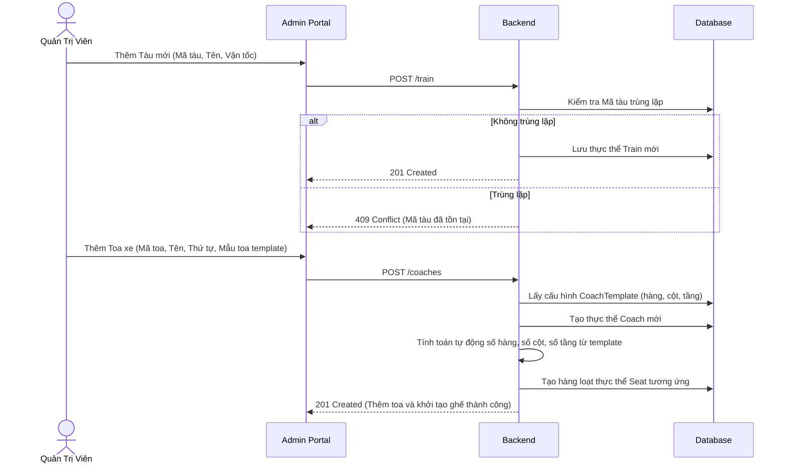
```mermaid
sequenceDiagram
    actor Admin as Quản Trị Viên
    participant FE as Admin Portal
    participant API as Backend
    participant DB as Database
    
    %% Tạo Tàu
    Admin->>FE: Thêm Tàu mới (Mã tàu, Tên, Vận tốc)
    FE->>API: POST /train
    API->>DB: Kiểm tra Mã tàu trùng lặp
    alt Không trùng lặp
        API->>DB: Lưu thực thể Train mới
        API-->>FE: 201 Created
    else Trùng lặp
        API-->>FE: 409 Conflict (Mã tàu đã tồn tại)
    end
    
    %% Thêm Toa và sinh ghế tự động
    Admin->>FE: Thêm Toa xe (Mã toa, Tên, Thứ tự, Mẫu toa template)
    FE->>API: POST /coaches
    API->>DB: Lấy cấu hình CoachTemplate (hàng, cột, tầng)
    API->>DB: Tạo thực thể Coach mới
    API->>API: Tính toán tự động số hàng, số cột, số tầng từ template
    API->>DB: Tạo hàng loạt thực thể Seat tương ứng
    API-->>FE: 201 Created (Thêm toa và khởi tạo ghế thành công)
```

### UC-19: Quản lý chuyến tàu
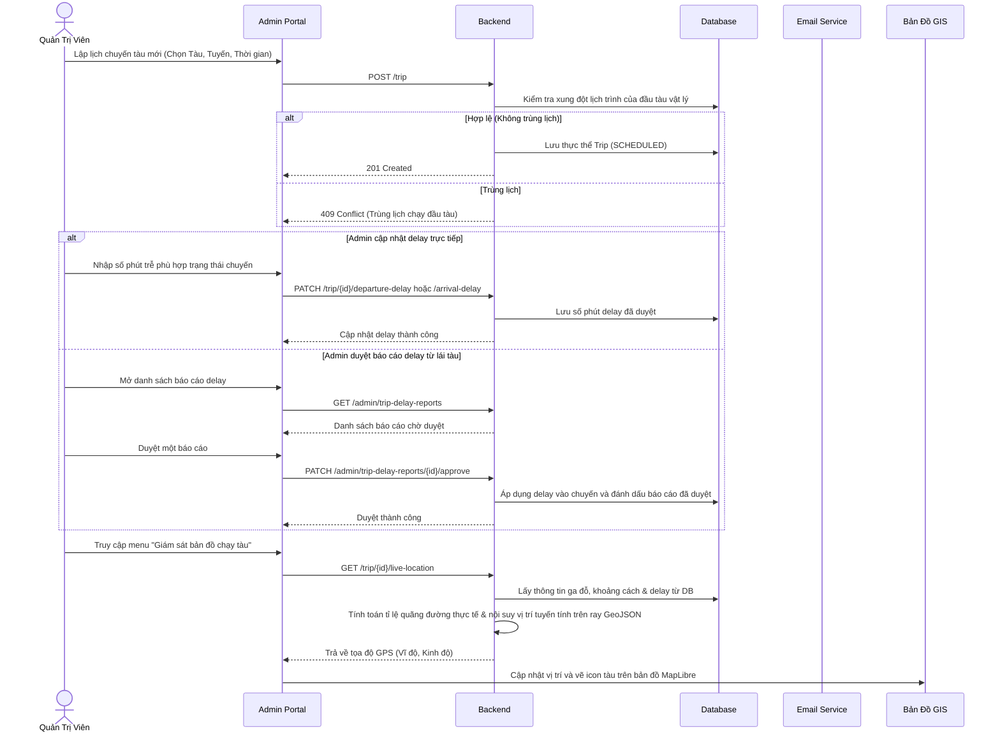
```mermaid
sequenceDiagram
    actor Admin as Quản Trị Viên
    participant FE as Admin Portal
    participant API as Backend
    participant DB as Database
    participant Email as Email Service
    participant Map as Bản Đồ GIS
    
    %% Lập lịch chuyến tàu
    Admin->>FE: Lập lịch chuyến tàu mới (Chọn Tàu, Tuyến, Thời gian)
    FE->>API: POST /trip
    API->>DB: Kiểm tra xung đột lịch trình của đầu tàu vật lý
    alt Hợp lệ (Không trùng lịch)
        API->>DB: Lưu thực thể Trip (SCHEDULED)
        API-->>FE: 201 Created
    else Trùng lịch
        API-->>FE: 409 Conflict (Trùng lịch chạy đầu tàu)
    end
    
    %% Cập nhật delay chuyến tàu
    alt Admin cập nhật delay trực tiếp
        Admin->>FE: Nhập số phút trễ phù hợp trạng thái chuyến
        FE->>API: PATCH /trip/{id}/departure-delay hoặc /arrival-delay
        API->>DB: Lưu số phút delay đã duyệt
        API-->>FE: Cập nhật delay thành công
    else Admin duyệt báo cáo delay từ lái tàu
        Admin->>FE: Mở danh sách báo cáo delay
        FE->>API: GET /admin/trip-delay-reports
        API-->>FE: Danh sách báo cáo chờ duyệt
        Admin->>FE: Duyệt một báo cáo
        FE->>API: PATCH /admin/trip-delay-reports/{id}/approve
        API->>DB: Áp dụng delay vào chuyến và đánh dấu báo cáo đã duyệt
        API-->>FE: Duyệt thành công
    end
    
    %% Giám sát GPS thời gian thực
    Admin->>FE: Truy cập menu "Giám sát bản đồ chạy tàu"
    FE->>API: GET /trip/{id}/live-location
    API->>DB: Lấy thông tin ga đỗ, khoảng cách & delay từ DB
    API->>API: Tính toán tỉ lệ quãng đường thực tế & nội suy vị trí tuyến tính trên ray GeoJSON
    API-->>FE: Trả về tọa độ GPS (Vĩ độ, Kinh độ)
    FE->>Map: Cập nhật vị trí và vẽ icon tàu trên bản đồ MapLibre
```

### UC-20: Quản lý cơ sở hạ tầng
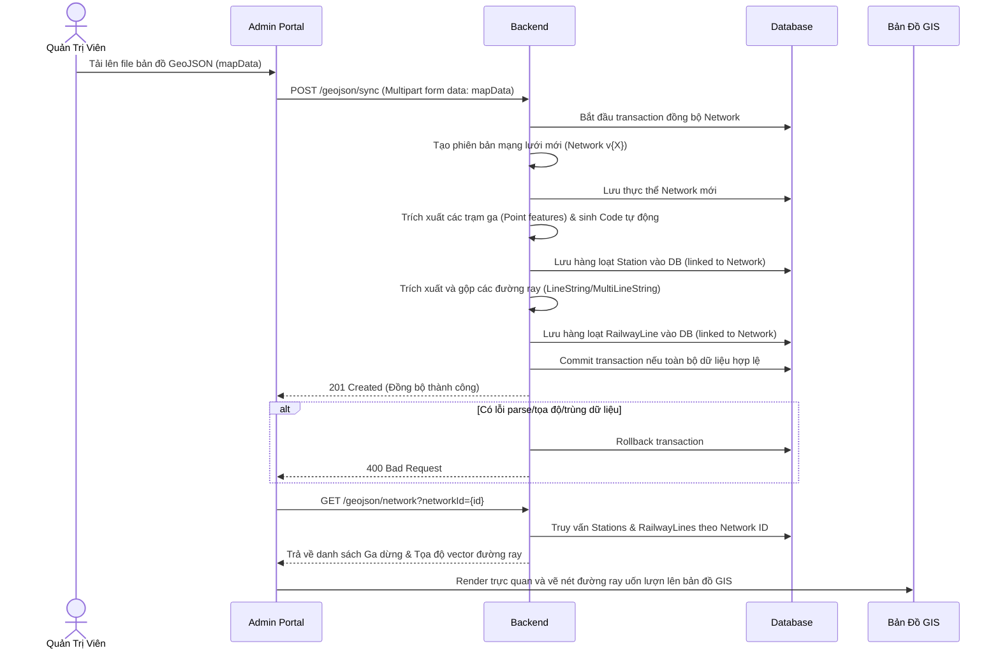
```mermaid
sequenceDiagram
    actor Admin as Quản Trị Viên
    participant FE as Admin Portal
    participant API as Backend
    participant DB as Database
    participant Map as Bản Đồ GIS
    
    %% Đồng bộ GeoJSON
    Admin->>FE: Tải lên file bản đồ GeoJSON (mapData)
    FE->>API: POST /geojson/sync (Multipart form data: mapData)
    API->>DB: Bắt đầu transaction đồng bộ Network
    API->>API: Tạo phiên bản mạng lưới mới (Network v{X})
    API->>DB: Lưu thực thể Network mới
    API->>API: Trích xuất các trạm ga (Point features) & sinh Code tự động
    API->>DB: Lưu hàng loạt Station vào DB (linked to Network)
    API->>API: Trích xuất và gộp các đường ray (LineString/MultiLineString)
    API->>DB: Lưu hàng loạt RailwayLine vào DB (linked to Network)
    API->>DB: Commit transaction nếu toàn bộ dữ liệu hợp lệ
    API-->>FE: 201 Created (Đồng bộ thành công)
    alt Có lỗi parse/tọa độ/trùng dữ liệu
        API->>DB: Rollback transaction
        API-->>FE: 400 Bad Request
    end
    
    %% Hiển thị trên bản đồ GIS
    FE->>API: GET /geojson/network?networkId={id}
    API->>DB: Truy vấn Stations & RailwayLines theo Network ID
    API-->>FE: Trả về danh sách Ga dừng & Tọa độ vector đường ray
    FE->>Map: Render trực quan và vẽ nét đường ray uốn lượn lên bản đồ GIS
```

---

## 3. Lái Tàu (Driver)

### UC-15: Yêu cầu hủy chuyến khẩn cấp
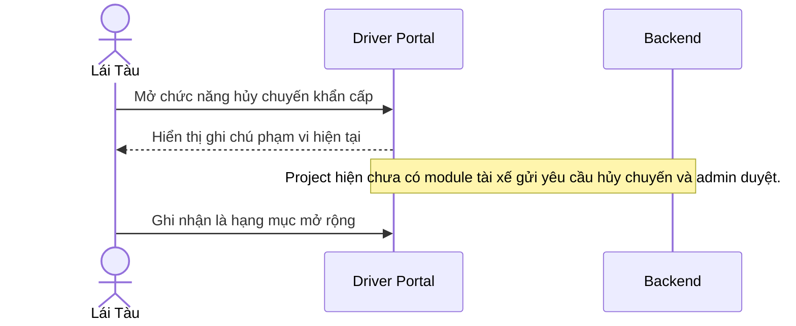
```mermaid
sequenceDiagram
    actor Driver as Lái Tàu
    participant FE as Driver Portal
    participant API as Backend
    
    Driver->>FE: Mở chức năng hủy chuyến khẩn cấp
    FE-->>Driver: Hiển thị ghi chú phạm vi hiện tại
    Note over FE,API: Project hiện chưa có module tài xế gửi yêu cầu hủy chuyến và admin duyệt.
    Driver->>FE: Ghi nhận là hạng mục mở rộng
```

### UC-16: Xem chuyến được phân công
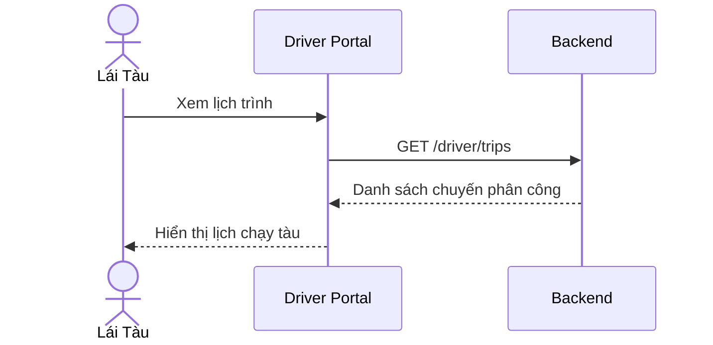
```mermaid
sequenceDiagram
    actor Driver as Lái Tàu
    participant FE as Driver Portal
    participant API as Backend
    
    Driver->>FE: Xem lịch trình
    FE->>API: GET /driver/trips
    API-->>FE: Danh sách chuyến phân công
    FE-->>Driver: Hiển thị lịch chạy tàu
```

### UC-17: Báo cáo delay
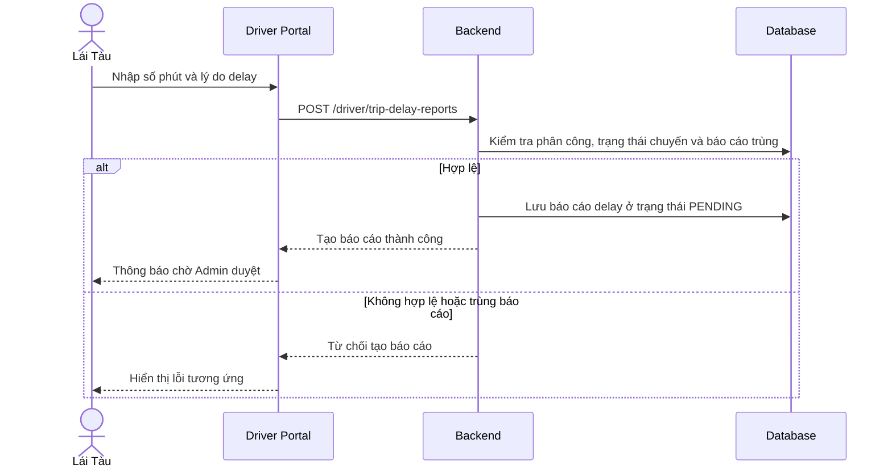
```mermaid
sequenceDiagram
    actor Driver as Lái Tàu
    participant FE as Driver Portal
    participant API as Backend
    participant DB as Database
    
    Driver->>FE: Nhập số phút và lý do delay
    FE->>API: POST /driver/trip-delay-reports
    API->>DB: Kiểm tra phân công, trạng thái chuyến và báo cáo trùng
    alt Hợp lệ
        API->>DB: Lưu báo cáo delay ở trạng thái PENDING
        API-->>FE: Tạo báo cáo thành công
        FE-->>Driver: Thông báo chờ Admin duyệt
    else Không hợp lệ hoặc trùng báo cáo
        API-->>FE: Từ chối tạo báo cáo
        FE-->>Driver: Hiển thị lỗi tương ứng
    end
```

### UC-18: Báo cáo ghế hỏng
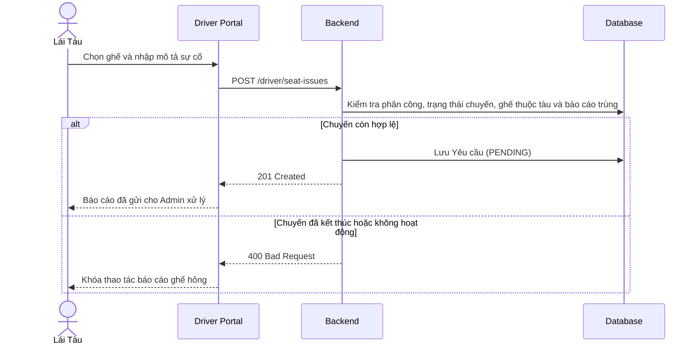
```mermaid
sequenceDiagram
    actor Driver as Lái Tàu
    participant FE as Driver Portal
    participant API as Backend
    participant DB as Database
    
    Driver->>FE: Chọn ghế và nhập mô tả sự cố
    FE->>API: POST /driver/seat-issues
    API->>DB: Kiểm tra phân công, trạng thái chuyến, ghế thuộc tàu và báo cáo trùng
    alt Chuyến còn hợp lệ
        API->>DB: Lưu Yêu cầu (PENDING)
        API-->>FE: 201 Created
        FE-->>Driver: Báo cáo đã gửi cho Admin xử lý
    else Chuyến đã kết thúc hoặc không hoạt động
        API-->>FE: 400 Bad Request
        FE-->>Driver: Khóa thao tác báo cáo ghế hỏng
    end
```

---

## 4. Hệ Thống Tự Động

Luồng xử lý tự động vòng đời chuyến tàu.

```mermaid
sequenceDiagram
    participant Auto as Cơ chế tự động
    participant API as Backend
    participant DB as Database
    
    loop Mỗi 1 phút
        Auto->>API: Kiểm tra các chuyến theo thời gian vận hành
        
        %% Chuyển trạng thái
        API->>DB: Cập nhật Trip SCHEDULED -> IN_PROGRESS (Nếu đến giờ chạy)
        API->>DB: Cập nhật Trip IN_PROGRESS -> COMPLETED (Nếu đã tới đích)
    end
```
