# 3.2.1 Biểu Đồ Use Case Của Khách Hàng

## Mô Tả
Biểu đồ chi tiết 10 use case khái quát mà Khách Hàng (Người Dùng) có thể thực hiện trong hệ thống. Mỗi Use Case này đại diện cho một nhóm chức năng hoàn chỉnh, bên trong có thể chứa nhiều luồng xử lý chi tiết.

## Biểu Đồ

```mermaid
graph TB
    Customer((Người Dùng))
    
    subgraph "Railway Booking System - Customer Portal"
        subgraph "Authentication & Profile"
            UC01[UC-01: Đăng ký tài khoản]
            UC02[UC-02: Đăng nhập hệ thống]
            UC03[UC-03: Quản lý hồ sơ]
        end
        
        subgraph "Trip Search & Booking"
            UC06[UC-06: Tìm kiếm chuyến tàu]
            UC09[UC-09: Đặt vé tàu]
            UC10[UC-10: Xem lịch sử đặt vé]
            UC07[UC-07: Xem chuyến đang chạy]
        end
        
        subgraph "Wallet Management"
            UC08[UC-08: Quản lý ví điện tử]
        end
        
        subgraph "Support"
            UC05[UC-05: Chat với Chatbot]
            UC04[UC-04: Xác nhận đổi ghế]
        end
    end
    
    PaymentGateway((Payment Gateway))
    EmailService((Email Service))
    ChatbotAI((Chatbot AI))
    
    %% Customer to Use Cases
    Customer --> UC01
    Customer --> UC02
    Customer --> UC03
    Customer --> UC04
    Customer --> UC05
    Customer --> UC06
    Customer --> UC07
    Customer --> UC08
    Customer --> UC09
    Customer --> UC10
    
    %% External systems
    UC01 -.-> EmailService
    UC09 -.-> EmailService
    UC09 -.-> PaymentGateway
    UC08 -.-> PaymentGateway
    UC05 -.-> ChatbotAI
    UC04 -.-> EmailService
    
    classDef primaryUC fill:#4fc3f7,stroke:#01579b,stroke-width:3px
    classDef secondaryUC fill:#81d4fa,stroke:#0277bd,stroke-width:2px
    classDef supportUC fill:#b3e5fc,stroke:#0288d1,stroke-width:2px
    classDef externalActor fill:#ffcdd2,stroke:#c62828,stroke-width:2px
    
    class UC06,UC08,UC09 primaryUC
    class UC01,UC02,UC03,UC07,UC10 secondaryUC
    class UC04,UC05 supportUC
    class PaymentGateway,EmailService,ChatbotAI externalActor
```

## Mô Tả Chi Tiết

### 1. Authentication & Profile (Xác thực và Hồ sơ)
- **UC-01: Đăng ký tài khoản**: Bao gồm quá trình nhập email, mật khẩu và xác thực email qua mã OTP/Link.
- **UC-02: Đăng nhập hệ thống**: Bao gồm đăng nhập bằng Email/Password hoặc thông qua Google OAuth. Quên mật khẩu cũng được xử lý trong luồng này.
- **UC-03: Quản lý hồ sơ**: Bao gồm xem thông tin cá nhân, cập nhật thông tin và đổi mật khẩu.

### 2. Trip Search & Booking (Tìm kiếm và Đặt vé)
- **UC-06: Tìm kiếm chuyến tàu**: Tìm kiếm chuyến tàu theo ga đi, ga đến, ngày khởi hành. (Bao gồm cả việc xem chi tiết chuyến tàu, giá, ghế trống).
- **UC-09: Đặt vé tàu**: Quy trình đặt vé hoàn chỉnh, bao gồm chọn ghế, nhập thông tin hành khách và tiến hành thanh toán qua Payment Gateway.
- **UC-10: Xem lịch sử đặt vé**: Xem danh sách các vé đã đặt (thành công, đang chờ, đã hủy), xem chi tiết vé, tải vé điện tử (PDF/QR) và hủy đặt chỗ nếu cần.
- **UC-07: Xem chuyến đang chạy**: Xem danh sách và định vị GPS giả lập của các chuyến tàu đang trong trạng thái IN_PROGRESS.

### 3. Wallet Management (Quản lý Ví)
- **UC-08: Quản lý ví điện tử**: Gom toàn bộ các nghiệp vụ liên quan đến ví bao gồm: xem số dư, xem lịch sử giao dịch, nạp tiền vào ví (qua Payment Gateway), rút tiền từ ví, và thiết lập/đổi mã PIN.

### 4. Support (Hỗ trợ)
- **UC-05: Chat với Chatbot**: Tương tác với Chatbot AI để hỏi đáp, tìm kiếm thông tin tự động.
- **UC-04: Xác nhận đổi ghế**: Khi ghế bị hỏng, khách hàng nhận được email thông báo và có thể xác nhận đổi sang một trong các ghế được đề xuất.

## Tích Hợp Hệ Thống Bên Ngoài
1. **Email Service**: Gửi email xác thực tài khoản (UC-01), xác nhận đặt vé thành công (UC-09), và thông báo đổi ghế do sự cố (UC-04).
2. **Payment Gateway**: Xử lý nạp tiền vào ví (UC-08) và thanh toán vé tàu trực tiếp (UC-09) thông qua VNPay, Momo.
3. **Chatbot AI**: Xử lý logic AI để trả lời tin nhắn của khách hàng (UC-05).

## Ghi Chú Quan Trọng
Mỗi Use Case trên đây là một chức năng cấp độ cao (High-level Use Case). Các bước thực hiện cụ thể (Basic Flow) và các rẽ nhánh (Alternative Flows) đều đã được đặc tả chi tiết trong thư mục `specifications/`.
