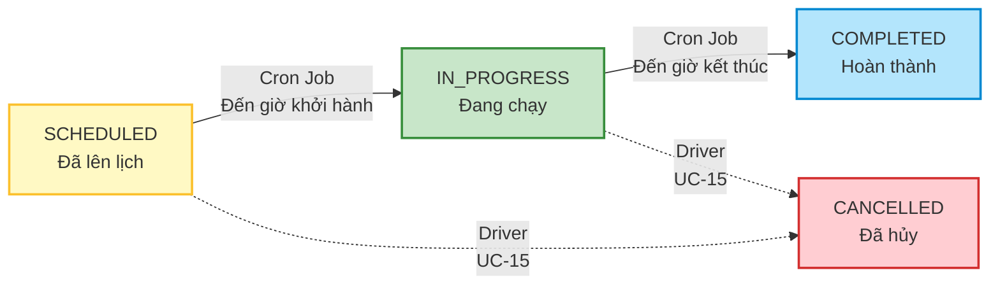

# Hình 2.4: Biểu đồ Use Case phân rã phân hệ Lái tàu

## Mô Tả
Biểu đồ phân rã chi tiết 4 Use Case dành riêng cho vai trò **Lái Tàu (Driver)** phục vụ việc giám sát và báo cáo trạng thái chuyến đi thực tế.

### Kế Thừa Quyền Hạn
- **Kế thừa từ Hành khách (Customer):** Lái Tàu kế thừa tất cả các chức năng từ Hành khách (`Driver --|> Customer`), đồng nghĩa với việc thừa kế toàn bộ quyền của Khách vãng lai. Lái tàu hoàn toàn có thể đăng nhập tài khoản lái tàu của mình, cập nhật thông tin cá nhân, quản lý ví điện tử, nạp tiền hoặc tự đặt vé đi du lịch như một khách hàng thông thường mà không cần vẽ lại liên kết trên biểu đồ.

---

## Biểu Đồ Use Case Phân Rã Lái Tàu

```mermaid
graph TB
    Driver((Lái Tàu))
    Customer((Hành khách))
    
    %% Inheritance
    Driver --|> Customer
    
    subgraph "Railway Booking System - Driver Portal"
        UC16[UC-16: Xem chuyến được phân công]
        UC15[UC-15: Yêu cầu hủy chuyến khẩn cấp]
        UC17[UC-17: Báo cáo delay]
        UC18[UC-18: Báo cáo ghế hỏng]
    end
    
    EmailService((Email Service))
    NotificationService((Notification Service))
    CronJob((Cron Job))
    
    %% Driver connections
    Driver --> UC16
    Driver --> UC15
    Driver --> UC17
    Driver --> UC18
    
    %% Dependencies
    UC16 --> UC15
    UC16 --> UC17
    UC16 --> UC18
    
    %% External systems
    UC15 -.-> EmailService
    UC17 -.-> NotificationService
    UC18 -.-> NotificationService
    
    %% Cron Job (automatic status update)
    CronJob -.auto update.-> TripStatus[Trip Status: SCHEDULED → IN_PROGRESS → COMPLETED]
    
    classDef driverUC fill:#f3e5f5,stroke:#7b1fa2,stroke-width:2px
    classDef externalActor fill:#ffebee,stroke:#b71c1c,stroke-width:2px
    classDef autoSystem fill:#e8f5e9,stroke:#2e7d32,stroke-width:2px
    classDef baseActor fill:#f1f5f9,stroke:#64748b,stroke-width:2px
    
    class UC15,UC16,UC17,UC18 driverUC
    class EmailService,NotificationService externalActor
    class CronJob,TripStatus autoSystem
    class Customer baseActor
```

---

## Mô Tả Chi Tiết Nghiệp Vụ Lái Tàu

### 1. UC-16: Xem chuyến được phân công
- **Mô tả:** Xem danh sách lịch trình điều khiển tàu mà mình được quản trị viên giao phó.
- **Nghiệp vụ chi tiết:** Xem danh sách các chuyến đi (hôm nay, lịch sử chuyến, chuyến sắp tới) kèm theo thông tin chi tiết lộ trình: thời gian xuất phát, danh sách các ga dừng đỗ dọc chặng, thông số tàu xe và số lượng hành khách đã mua vé. Đây là Use Case tiền đề quan trọng, mở đường để lái tàu thực hiện các hoạt động báo cáo tiếp theo.

### 2. UC-15: Yêu cầu hủy chuyến khẩn cấp
- **Mô tả:** Lái tàu yêu cầu hủy bỏ toàn bộ chuyến tàu vì các lý do sự cố bất khả kháng (thiên tai, bão lũ, hỏng hóc máy móc nghiêm trọng trước giờ xuất phát).
- **Nghiệp vụ chi tiết:** Lái tàu gửi yêu cầu hủy kèm lý do giải trình. Hệ thống tự động chuyển trạng thái chuyến tàu sang `CANCELLED`, vô hiệu hóa các vé tàu đã bán của chuyến đó, đồng thời kích hoạt hoàn trả tiền 100% về ví điện tử cá nhân của hành khách và dùng **Email Service** để gửi thư xin lỗi kèm thông báo hoàn tiền tự động.

### 3. UC-17: Báo cáo delay chuyến tàu
- **Mô tả:** Lái tàu báo cáo trạng thái khởi hành muộn hoặc cập bến muộn hơn lịch trình gốc để hệ thống cập nhật cho khách hàng.
- **Nghiệp vụ chi tiết:** Lái tàu nhập số phút delay thực tế khi xuất phát hoặc khi cập ga dừng đỗ. Hệ thống lưu trữ thông số này để tự động tính toán lại vị trí GPS và truyền thông tin cập nhật (qua **Notification Service**) tới các ứng dụng của hành khách và trang giám sát của Admin.

### 4. UC-18: Báo cáo ghế hỏng
- **Mô tả:** Phát hiện và báo cáo các sự cố hư hỏng vật lý của ghế ngồi trên tàu trong quá trình vận chuyển.
- **Nghiệp vụ chi tiết:** Lái tàu chọn cụ thể vị trí ghế bị hỏng trên sơ đồ trực quan của toa, mô tả tình trạng lỗi và tải ảnh chụp hiện trạng sự cố lên hệ thống. Báo cáo này sẽ được chuyển trạng thái `PENDING` và kích hoạt thông báo (qua **Notification Service**) tới Quản trị viên để Admin thực thi quy trình xử lý đổi ghế cho khách hàng (`UC-13`).

---

## Cơ Chế Tự Động Cập Nhật Trạng Thái Chuyến Tàu (Cron Job)
Để tối giản thao tác thủ công của Lái tàu, hệ thống **không yêu cầu** lái tàu phải bấm nút bắt đầu hay kết thúc hành trình. Trạng thái chuyến tàu (`Trip.status`) được luân chuyển hoàn toàn tự động bằng hệ thống **Cron Job** ngầm định:


- **SCHEDULED $\rightarrow$ IN_PROGRESS:** Cron Job tự động quét mỗi phút, khi thời gian thực tế chạm vào giờ khởi hành, trạng thái sẽ đổi sang đang chạy.
- **IN_PROGRESS $\rightarrow$ COMPLETED:** Khi thời gian chạm giờ kết thúc dự kiến (cộng thêm thời gian delay nếu có), trạng thái sẽ tự động chuyển sang hoàn thành.
