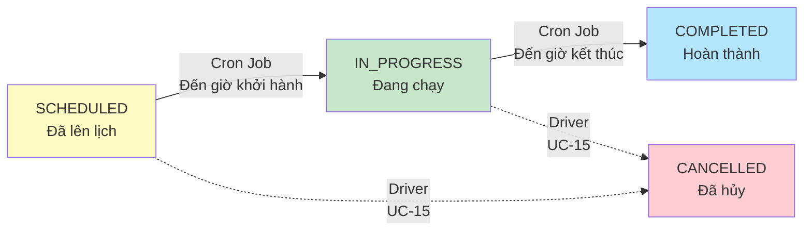

# 3.2.3 Biểu Đồ Use Case Của Lái Tàu

## Mô Tả
Biểu đồ chi tiết 4 use case khái quát mà Lái Tàu (Driver) có thể thực hiện để quản lý chuyến tàu được phân công. Lái Tàu được kế thừa từ Người Dùng, do đó có thể thực hiện mọi thao tác của một người dùng thông thường (Customer).

## Biểu Đồ

```mermaid
graph TB
    Driver((Lái Tàu))
    Customer((Người Dùng))
    
    %% Inheritance
    Driver --|> Customer
    
    subgraph "Railway Booking System - Driver Portal"
        UC16[UC-16: Xem chuyến được phân công]
        UC15[UC-15: Yêu cầu hủy chuyến khẩn cấp]
        UC17[UC-17: Báo cáo delay]
        UC18[UC-18: Báo cáo ghế hỏng]
    end
    
    EmailService((Email Service))
    NotificationService((Notification Service))
    CronJob((Cron Job))
    
    %% Driver connections
    Driver --> UC16
    Driver --> UC15
    Driver --> UC17
    Driver --> UC18
    
    %% Dependencies
    UC16 --> UC15
    UC16 --> UC17
    UC16 --> UC18
    
    %% External systems
    UC15 -.-> EmailService
    UC17 -.-> NotificationService
    UC18 -.-> NotificationService
    
    %% Cron Job (automatic status update)
    CronJob -.auto update.-> TripStatus[Trip Status: SCHEDULED → IN_PROGRESS → COMPLETED]
    
    classDef driverUC fill:#f3e5f5,stroke:#7b1fa2,stroke-width:2px
    classDef externalActor fill:#ffcdd2,stroke:#c62828,stroke-width:2px
    classDef autoSystem fill:#c8e6c9,stroke:#2e7d32,stroke-width:2px
    classDef baseActor fill:#eceff1,stroke:#607d8b,stroke-width:2px
    
    class UC15,UC16,UC17,UC18 driverUC
    class EmailService,NotificationService externalActor
    class CronJob,TripStatus autoSystem
    class Customer baseActor
```

## Mô Tả Chi Tiết

### 1. Kế Thừa (Inheritance)
- **Lái Tàu (Driver) kế thừa Người Dùng (Customer)**: Lái Tàu có thể đăng nhập, xem hồ sơ cá nhân, tìm kiếm và đặt vé đi du lịch như một khách hàng bình thường.

### 2. Driver Functions (Chức Năng Lái Tàu)
- **UC-16: Xem chuyến được phân công**: Xem danh sách các chuyến tàu mà mình được phân công điều khiển (hôm nay, tuần này, lịch sử). Xem chi tiết từng chuyến (tuyến đường, danh sách ga dừng, thời gian chạy, số lượng hành khách). Đây là UC tiên quyết để thực hiện các UC báo cáo khác.
- **UC-15: Yêu cầu hủy chuyến khẩn cấp**: Trong trường hợp có sự cố kỹ thuật nghiêm trọng hoặc thiên tai, Lái tàu có quyền hủy chuyến. Hệ thống sẽ tự động hoàn tiền cho khách và gửi email thông báo.
- **UC-17: Báo cáo delay**: Báo cáo khi chuyến tàu khởi hành muộn hoặc đến ga đích muộn hơn dự kiến do các nguyên nhân khách quan (thời tiết, tắc đường ray, chờ khách). Hệ thống sẽ tự động gửi Notification cho Admin và hành khách.
- **UC-18: Báo cáo ghế hỏng**: Phát hiện ghế hỏng/lỗi trong quá trình chạy tàu và báo cáo về hệ thống (kèm theo chọn vị trí ghế, mô tả lỗi, và upload ảnh). Admin sẽ nhận Notification để tiến hành xử lý (UC-13).

## Trạng Thái Chuyến Tàu Tự Động (Cron Job)

Một điểm quan trọng trong hệ thống là **Lái tàu không cần bấm nút "Bắt đầu chạy" hay "Kết thúc"**. Trạng thái chuyến tàu sẽ được tự động cập nhật bởi hệ thống:



## Ghi Chú Quan Trọng
Mỗi Use Case trên đây là một chức năng cấp độ cao (High-level Use Case). Các thao tác cụ thể đều đã được mô tả chi tiết như các luồng nhánh (Alternative Flows) bên trong tài liệu đặc tả tương ứng (`15`, `16`, `17`, `18`) tại thư mục `specifications/`.
